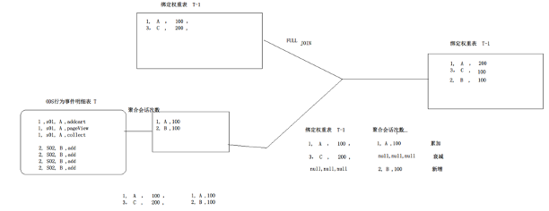

# 08.GUID 生成

## 业务逻辑

核心逻辑：历史有今天有，就增加。历史无今天有，就增加。历史有今天无，就衰减。

## 建表"设备管理表" 

创建设备绑定权重表：

	DROP TABLE IF EXISTS dim.dev_acc_bind_w;
	CREATE TABLE dim.dev_acc_bind_w
	(
		device_id string,
		account string,
		weight double,
		last_login_time bigint
	)
	PARTITIONED BY (dt string)
	STORED AS ORC
	TBLPROPERTIES(
		'orc.compress'='snappy'
	)
	;

## 插入表

	INSERT INTO TABLE dim.dev_acc_bind_w PARTITION (dt='2022-10-06')
	
	SELECT 
		nvl(o1.deviceid, o2.device_id) as device_id,
		nvl(o1.account,o2.account) as account,
		case
			when o1.deviceid is not null and o2.device_id is not null then o1.weight+o2.weight
			when o1.deviceid is not null and o2.device_id is null then o1.weight
			else o2.weight*0.5
		end as weight,
		nvl(o1. last_login_time, o2. last_login_time) as last_login_time		
	FROM

	( --T日行为事件明细会话聚合数据
	SELECT
		deviceid,
		 account,
		 count(distinct sessionid) * 100 as weight,
		 max(`timestamp`) as last_login_time
		
	FROM ods.mall_app_log_dts
	WHERE dt='2022-10-06' AND account is not null AND account!=''
	GROUP BY
		deviceid, account
	) o1
	
	FULL JOIN
	
	( --绑定权重表T-1日数据 
	SELECT
		device_id,
		account,
		weight,
		last_login_time
	FROM dim.dev_acc_bind_w
	WHERE dt= '2022-10-05' 
	) o2
	
	ON o1.deviceid=o2.device_id AND o1.account=o2.account;
	
	
	
## 执行结果

   select * from dim.dev_acc_bind_w limit 20;
	
	
	device_id      account       weight    last_login_time  dt
	---------------------------------------------------------------
	00eMoO1JjtGu    7bib0   		100.0   1665061020802   2022-10-06
	0CSfFgTZwoUU    v8S9H   		100.0   1665061020475   2022-10-06
	0JtskXJKevLC    OkiWCC5E      100.0   1665061020288   2022-10-06
	1TPhUDzhXbLr    WP8p    		100.0   1665060819860   2022-10-06
	1l7IDI5MrX2n    RVZLcN  		200.0   1665061019801   2022-10-06
	4CQqK1CqmNuW    fdlc8TRO      300.0   1665061020902   2022-10-06
	4FnRvjkqX8cD    csKUd83 		200.0   1665061020287   2022-10-06
	4ltzhDq4ZdwA    q1OTH3G 		100.0   1665061021250   2022-10-06
	51nWyKADIUFm    MtpZ2lV 		100.0   1665061021445   2022-10-06
	7zCDDxKrY9a1    kcK3At  		100.0   1665061018725   2022-10-06
	8IeMsqeY6OEM    ufM1CsM 		100.0   1665060976249   2022-10-06
	8L2jsFHf3TGa    GpcBJas 		100.0   1665061020301   2022-10-06
	8RsV9aweSxzS    kcK3At  		100.0   1665061018265   2022-10-06
	8WDj85hc9YLQ    fdlc8TRO      100.0   1665054947149   2022-10-06
	8kp3EsvhMEI4    DxL36Dom      100.0   1665061021482   2022-10-06
	8lVBfedZX0UR    NB95    		200.0   1665061001957   2022-10-06
	9WSMP2kHVN5t    kAgvPSDn      100.0   1665061021709   2022-10-06
	9aMdt8raeVQg    H4Ah5ryT      300.0   1665061020301   2022-10-06
	9gLL2y6rHHKX    ufM1CsM 		100.0   1665061020274   2022-10-06
	A2IcyhBLot9E    7rjmtsp 		100.0   1665061021255   2022-10-06

## 报错解决

报错：

	return code 2 from org.apache.hadoop.hive.ql.exec.mr.MapRedTask
	
原因：

内存不足或消耗过大：

	
	set mapred.map.child.java.opts=-Xmx4096m；
	
