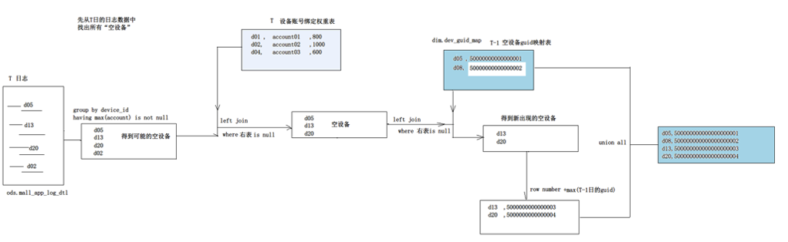

# 08.空账号设备GUID映射表

## 处理逻辑

left join 能join上的，表示是有账号的，空账号的进入处理逻辑（row number  + max(T-1)的guid）

## 开发

###建表

	-- 建表  ：空设备 <---> user_id 映射表
	create table dws.mall_app_device_tmpid(
	   `user_id`     bigint,
	   `device_id`   string
	)
	partitioned by (dt string)
	stored as orc
	tblproperties(
	 'orc.compress'='snappy'
	)
	;

###  插入数据

	-- 最终结果插入到 T日“空设备-userid映射表”
	insert into table dws.mall_app_device_tmpid partition(dt='2022-09-17')
	
	SELECT
	    -- 5.为这些新的空设备，生成在前日最大id基础上，递增的user_id
	    row_number() over() + o5.max_userid  as user_id,
	    trim(o4.device_id) as device_id
	FROM 
	(
	   SELECT
	     o1.device_id
	   FROM 
	   (  -- 1.从T日的行为日志中，找出完全不带任何account的设备id
	      SELECT
	         deviceid as device_id 
	      FROM ods.mall_app_log_dts
	      WHERE dt='2022-09-17'
	      group by deviceid
	      having max(if(trim(account)='',null,account)) is null
	   ) o1
	   
	   -- 2.拿着这些设备id去关联 T日“设备-账号绑定表”，留下关联不上的
	   LEFT JOIN 
	   ( 
	      SELECT
	         device_id
	      FROM dws.mall_app_device_account_bind
	      WHERE dt='2022-09-17'
	   ) o2
	   
	   ON o1.device_id=o2.device_id
	   
	   -- 3.拿着上一步筛选出来的设备id 关联  T-1日“空设备-userid映射表”，留下关联不上的
	   LEFT JOIN 
	   
	   (
	      SELECT
	        device_id
	      FROM dws.mall_app_device_tmpid 
	      WHERE dt='2022-09-16'
	   ) o3
	   
	   ON o1.device_id=o3.device_id
	   
	   WHERE o2.device_id is null and o3.device_id is null
	) o4 
	-- 4.给每个新的空设备关联上 前日的空设备最大ID
	JOIN 
	(
	   SELECT  
	       max(device_id) as max_userid
	   FROM dws.mall_app_device_tmpid 
	   WHERE dt='2022-09-16'
	) o5
	;

## 结果

	user_id    device_id    dt
	------------------------------
	NULL    zvWWlggXj6zJ    2022-09-17
	NULL    zkySLrXf9OSf    2022-09-17
	NULL    zkdaLNgUPHTs    2022-09-17
	NULL    zgUwvv43SMNS    2022-09-17
	NULL    zV59kIBWn8kR    2022-09-17
	NULL    yy47EENUX4nU    2022-09-17
	NULL    ydAkkCIxkp3r    2022-09-17
	NULL    yaH2Oi5lbTPi    2022-09-17
	NULL    tn3RkSDWPoEV    2022-09-17
	NULL    tUBIqdwNxMJy    2022-09-17
	NULL    sM15GGPeTpoU    2022-09-17
	NULL    rNfCddMFYypQ    2022-09-17
	NULL    rB2NSu7k1jdz    2022-09-17
	NULL    r0cMPE9KhMwA    2022-09-17
	NULL    qkezJgVp9uFp    2022-09-17
	NULL    pHsYbv9Hq5Ud    2022-09-17