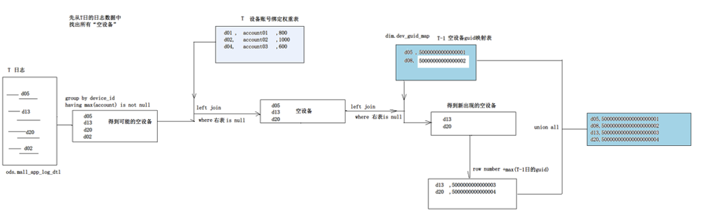

# 09.空账号设备GUID映射表

## 处理逻辑

## sql开发

###建表

	create table dim.dev_guid_map(
	   device_id string,
	   guid bigint,
	   first_login bigint,
	   `last_login` bigint
	)
	partitioned by (dt string)
	stored as orc
	tblproperties(
	 'orc.compress'='snappy'
	)
	;

###  插入数据

	-- 找出当日的空设备
	
	WITH TMP AS(
		SELECT 
			o1.device_id,
			o1.first_login,
			o1.last_login
		FROM
		(
		SELECT
			deviceid as device_id,
			min(`timestamp`) as first_login,
			max(`timestamp`) as last_login
		FROM ods.mall_app_log_dts
		WHERE dt='2022-10-06'
		GROUP BY deviceid
		HAVING max( if(trim(account)='',null,account))is null
		) o1
		
		LEFT JOIN
		
		(
		SELECT 
			device_id
		FROM dim.dev_acc_bind_w
		WHERE dt='2022-10-06'
		) o2
		
		ON o1.device_id=o2.device_id
		WHERE o2.device_id is NULL
	)

	
	-- 为上面找到的空设备去映射GUID
	INSERT INTO TABLE dim.dev_guid_map PARTITION (dt='2022-10-06')
	SELECT 
		o1.device_id,
		row_number() over() + o2.old_max  as guid,
		o1.first_login,
		o1.last_login

	FROM
	(
		-- 真正的空设备
		SELECT
			tmp.device_id,
			tmp.first_login,
			tmp.last_login
		FROM tmp
		
		LEFT JOIN 
		(
			SELECT
				device_id	
			FROM dim.dev_guid_map
			WHERE dt='2022-10-06' 
		) o
		ON tmp.device_id=o.device_id
		WHERE o.device_id is NULL
	)  o1
	
	JOIN 
	(
	SELECT nvl (max(guid) , 1000000000 ) as old_max from dim.dev_guid_map WHERE dt='2022-10-06'
	) o2
	
	UNION ALL
	
	SELECT
		device_id,
		guid,
		first_login,
		last_login 
	FROM dim.dev_guid_map 
	WHERE dt='2022-10-06';
	

## 结果

	select * from dim.dev_guid_map limit 20;

结果

	device_id         guid          first_login      last_login      dt
	--------------------------------------------------------------------------
	xabRhXRxXHRK    1000000001      1665060814194   1665060915973   2022-10-06
	xTBiDwqCyX9v    1000000002      1665060769799   1665060978201   2022-10-06
	v4prrKq8O85S    1000000003      1665054932436   1665054947508   2022-10-06
	qpXGbJwGmfWQ    1000000004      1665060826981   1665061020421   2022-10-06
	qZ2gUYDTdguL    1000000005      1665060929746   1665061017679   2022-10-06
	q1XFfWTW2P4o    1000000006      1665060822428   1665060954515   2022-10-06
	py86p4G85X5t    1000000007      1665060779361   1665061018663   2022-10-06
	plJmdYvTXeA0    1000000008      1665060753864   1665061021514   2022-10-06
	lhxEHOMoanv9    1000000009      1665060885568   1665061019745   2022-10-06
	joaWXoPpNZl0    1000000010      1665060845776   1665060863367   2022-10-06
	iGq52xsgAZAx    1000000011      1665060741265   1665061019468   2022-10-06
	hMuu0LsbWPSe    1000000012      1665060935256   1665061021219   2022-10-06
	fOEzF4NcBART    1000000013      1665060922506   1665061021646   2022-10-06
	f2A4yBN6gyES    1000000014      1665060943353   1665061020111   2022-10-06
	bmYluOxuX152    1000000015      1665060736823   1665060884470   2022-10-06
	b9fnm9LLEFJ2    1000000016      1665061008822   1665061021637   2022-10-06
	aeEFpXeOXPco    1000000017      1665060918746   1665061020037   2022-10-06
	a7IPDBcoC6SI    1000000018      1665060940514   1665060953178   2022-10-06
	YFT9689fqME3    1000000019      1665054944743   1665054947552   2022-10-06
	XyEe8RHA921j    1000000020      1665060952713   1665061018592   2022-10-06