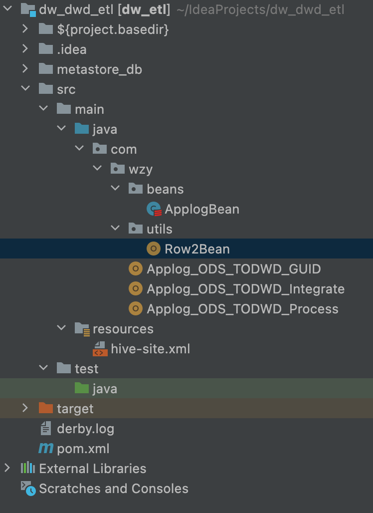

# 09. DWD ETL 开发流程

## 开发目的

* 清洗过滤，格式转换，数据规范化
* 切割对话（可选）
* 维度退化
* 集成地理信息，GUID

## 执行顺序

* Applog_ODS_TODWD_Process
* Applog_ODS_TODWD_Integrate
* Applog_ODS_TODWD_GUID

## 准备工作

### 模拟生成业务库中的用户注册信息表
思路：从行为日志ODS表数据中，捞出所有的account，然后打行号作为userid

	CREATE TABLE dim.user_info
	AS
	SELECT
		account,
		row_number() over() as user_id
	FROM ods.mall_app_log_dts
	GROUP BY account;

查看：

 	select * from dim.user_info limit 10;
 
 	account        id
 	------------------
	zZ1Qp9SZ4       1
	yITQmE  		2
	xq1Nlaaop       3
	xRyxN063S       4
	wWRAho9y        5
	v8S9H   		6
	ufM1CsM 		7
	q1OTH3G 		8
	kcK3At  		9
	kAgvPSDn        10

### dwd 建表

	CREATE DATABASE dwd;

	CREATE TABLE dwd.mall_app_event_dtl(
	 account string,
	 appid string,
	 appversion string,
	 carrier string,
	 deviceid string,
	 devicetype string,
	 eventid string,
	 ip string,
	 latitude double,
	 longitude double,
	 nettype string,
	 osname string,
	 osversion string,
	 properties map<string,string>,
	 releasechannel string,
	 resolution string,
	 sessionid string,
	 ts string,
	 splitSessionId string,
	 province string,
	 city string,
	 district string,
	 guid bigint
	) 
	PARTITIONED BY(dt string)
	STORED AS ORC
	tblproperties('orc.compress'='snappy');

## 项目代码结构

## 文件

### ApplogBean
	package com.wzy.beans
	
	case class ApplogBean(
	
	                       account: String,
	                       appid: String,
	                       appversion: String,
	                       carrier: String,
	                       deviceid: String,
	                       devicetype: String,
	                       eventid: String,
	                       ip: String,
	                       latitude: Double,
	                       longitude: Double,
	                       nettype: String,
	                       osname: String,
	                       osversion: String,
	                       properties: Map[String,String],
	                       releasechannel:String,
	                       resolution:String,
	                       sessionid: String,
	                       timestamp: Long,
	                       dt:String,
	                       //新增一个切分之后的session id
	                       var splitSessionId: String="",
	                       //维度退化后，新增省市区
	                       var province:String="",
	                       var city:String="",
	                       var district:String=""
	                     )

### Applog_ODS_TODWD_Integrate

	package com.wzy
	
	import com.wzy.beans.ApplogBean
	import org.apache.spark.sql.{DataFrame, Dataset, Row, SparkSession}
	import ch.hsr.geohash.GeoHash
	
	//维度退化
	//集成地理位置，GUID
	object Applog_ODS_TODWD_Integrate {
	
	  def main(args: Array[String]): Unit = {
	
	    val spark = SparkSession.builder()
	      .appName("dimension degeneration and GUID process from ods to dwd")
	      .master("spark://192.168.2.113:7077")
	      .enableHiveSupport()
	      //本地测试运行需要加这一句话，部署在生产环境则删除
	      .config("spark.jars","/Users/zheyiwang/IdeaProjects/dw_dwd_etl/target/dw_etl-1.0-SNAPSHOT-jar-with-dependencies.jar")
	      .getOrCreate()
	    import spark.implicits._
	
	
	    //读取Applog_ODS_TODWD_Process 保存的文件
	    val ds = spark.read.parquet("hdfs://192.168.2.111:9000/tmp/split/20201006/").as[ApplogBean]
	
	    val geoDataFrame:DataFrame = spark.read.table("dim.geo_area")
	
	    val geoMap = geoDataFrame.rdd.map({
	      case Row(province:String, city:String,district:String,geohash:String) => Some(geohash,(province,city,district))
	      case _ => None
	    }).filter(_.isDefined)
	      .map(_.get)
	      .collectAsMap()
	
	    //广播
	    val bc1= spark.sparkContext.broadcast(geoMap)
	
	    //集成地理位置信息（如果有geohash值，查询市区）
	    val areaIntegrated: Dataset[ApplogBean] =ds.rdd.mapPartitions(iter =>{
	
	      val geoDict = bc1.value
	
	      iter.map( bean =>{
	
	        var province = "未知省"
	        var city = "未知市"
	        var district = "未知区"
	
	        val lng = bean.longitude
	        val lat = bean.latitude
	
	        if(lng !=null && lat !=null) {
	          val geoCode = GeoHash.geoHashStringWithCharacterPrecision(lat, lng, 6)
	
	          val area: Option[(String, String, String)] = geoDict.get(geoCode)
	
	          if (area.isDefined) {
	            province = area.get._1
	            city = area.get._2
	            district = area.get._3
	          }
	        }
	
	        bean.province = province
	        bean.city = city
	        bean.district = district
	
	        bean
	      })
	    }).toDS()
	
	
	    areaIntegrated.show(10,false)
	    
	    areaIntegrated.write.parquet("/tmp/areaIntegrated/20201006")
	
	  }
	
	}

### Applog_ODS_TODWD_Process

	package com.wzy
	
	import com.wzy.beans.ApplogBean
	import com.wzy.utils.Row2Bean
	import org.apache.commons.lang.time.DateFormatUtils
	import org.apache.spark.sql.SparkSession
	
	import java.util.{TimeZone, UUID}
	
	
	// 清洗过滤
	// 格式转换
	// 数据规范化
	object Applog_ODS_TODWD_Process {
	  def main(args: Array[String]): Unit = {
	
	    val spark = SparkSession.builder()
	      .appName("app log process from ods to dwd")
	      .master("spark://192.168.2.113:7077")
	      .enableHiveSupport()
	      //本地测试运行需要加这一句话，部署在生产环境则删除
	      .config("spark.jars","/Users/zheyiwang/IdeaProjects/dw_dwd_etl/target/dw_etl-1.0-SNAPSHOT-jar-with-dependencies.jar")
	      .getOrCreate()
	    import spark.implicits._
	
	
	
	    //读ods表
	    val odsTable = spark.read.table("ods.mall_app_log_dts").where("dt='2022-10-06'")
	
	    //注册临时视图
	    odsTable.createTempView("dtl")
	
	    //时间转换UDF
	    val toTimestamp = (ts:Long) =>{
	      DateFormatUtils.format(ts, "yyyy-MM-dd HH:mm:ss.SSS", TimeZone.getTimeZone("GMT+8"))
	    }
	    spark.udf.register("toTimestamp",toTimestamp)
	
	
	    //过滤空字段，限定时间
	    val cleaned = spark.sql(
	      """
	        |
	        |select
	        |
	        |*
	        |
	        |from dtl
	        |
	        |where
	        | deviceid is not null and
	        | properties is not null and
	        | eventid is not null and
	        | sessionid is not null and
	        | toTimestamp(`timestamp`) >='2022-09-01 00:00:00.000' and
	        | toTimestamp(`timestamp`) <= '2022-12-01 00:00:00.000'
	        |
	        |""".stripMargin)
	
	    //省略特征工程
	
	
	    //省略数据规范化
	
	
	    //会话切割
	    val sessionSplit = cleaned.rdd
	      .map(Row2Bean
	        .applogRow2Bean)
	      .filter(_.isDefined)
	      .map(_.get)
	      .groupBy(_.sessionid) //原始id分组
	      .flatMap(tp=>{
	        val actions:List[ApplogBean] = tp._2.toList.sortBy(_.timestamp)
	
	        var newSessionId = UUID.randomUUID().toString
	
	        for( i <- 0 until actions.size){
	          actions(i).splitSessionId = newSessionId
	          //如果时间相差30分钟，就重新生成一个新sessionid
	          if( i < actions.size-1 && (actions(i+1).timestamp - actions(i).timestamp>30*60*1000)){
	            newSessionId = UUID.randomUUID().toString
	          }
	        }
	        actions
	      }).toDF()
	
	    sessionSplit.show(10,false)
	
	    sessionSplit.write
	      .option("encoding", "UTF-8")
	      .option("charset", "UTF-8")
	      .parquet("hdfs://192.168.2.111:9000/tmp/split/20201006")
	
	
	    spark.close()
	
	  }
	}

### Row2Bean

	package com.wzy.utils
	
	import com.wzy.beans.ApplogBean
	import org.apache.spark.sql.Row
	
	object Row2Bean {
	
	    def  applogRow2Bean(row:Row)={
	
	      row match {
	        case Row(
	          account: String,
	          appid: String,
	          appversion: String,
	          carrier: String,
	          deviceid: String,
	          devicetype: String,
	          eventid: String,
	          ip: String,
	          latitude: Double,
	          longitude: Double,
	          nettype: String,
	          osname: String,
	          osversion: String,
	          properties:Map[String,String],
	          releasechannel:String,
	          resolution:String,
	          sessionid: String,
	          timestamp: Long,
	          dt:String
	        )=>Some(
	          ApplogBean(
	          account,
	          appid,
	          appversion,
	          carrier,
	          deviceid,
	          devicetype,
	          eventid,
	          ip,
	          latitude,
	          longitude,
	          nettype,
	          osname,
	          osversion,
	          properties,
	          releasechannel,
	          resolution,
	          sessionid,
	          timestamp,
	          dt
	        ))
	
	        //必需写，否则如果出现空值，整个过程就会报错
	        case _ => None
	      }
	    }
	
	}

### hive-site.xml

		<configuration>
		    <property>
		        <name>hive.metastore.uris</name>
		        <value>thrift://192.168.2.114:9083</value>
		    </property>
		
		    <property>
		        <name>hive.metastore.warehouse.dir</name>
		        <value>/user/hive/warehouse</value>
		        <description>location of default database for the warehouse</description>
		    </property>
		
		</configuration>
	
	
### pom.xml
	
	<?xml version="1.0" encoding="UTF-8"?>
	<project xmlns="http://maven.apache.org/POM/4.0.0"
	         xmlns:xsi="http://www.w3.org/2001/XMLSchema-instance"
	         xsi:schemaLocation="http://maven.apache.org/POM/4.0.0 http://maven.apache.org/xsd/maven-4.0.0.xsd">
	    <modelVersion>4.0.0</modelVersion>
	
	    <groupId>org.example</groupId>
	    <artifactId>dw_etl</artifactId>
	    <version>1.0-SNAPSHOT</version>
	
	    <properties>
	        <maven.compiler.source>8</maven.compiler.source>
	        <maven.compiler.target>8</maven.compiler.target>
	    </properties>
	
	
	    <dependencies>
	
	        <dependency>
	            <groupId>org.apache.hadoop</groupId>
	            <artifactId>hadoop-client</artifactId>
	            <version>3.3.4</version>
	        </dependency>
	
	        <dependency>
	            <groupId>org.apache.spark</groupId>
	            <artifactId>spark-core_2.12</artifactId>
	            <version>3.1.3</version>
	        </dependency>
	
	        <dependency>
	            <groupId>org.scala-lang</groupId>
	            <artifactId>scala-library</artifactId>
	            <version>2.12.10</version>
	        </dependency>
	
	        <dependency>
	            <groupId>org.apache.spark</groupId>
	            <artifactId>spark-sql_2.12</artifactId>
	            <version>3.1.3</version>
	        </dependency>
	
	        <dependency>
	            <groupId>org.apache.spark</groupId>
	            <artifactId>spark-hive_2.12</artifactId>
	            <version>3.1.3</version>
	        </dependency>
	
	        <dependency>
	            <groupId>mysql</groupId>
	            <artifactId>mysql-connector-java</artifactId>
	            <version>8.0.17</version>
	        </dependency>
	
	        <dependency>
	            <groupId>org.apache.hive.hcatalog</groupId>
	            <artifactId>hive-hcatalog-core</artifactId>
	            <version>3.1.3</version>
	        </dependency>
	
	        <dependency>
	            <groupId>ch.hsr</groupId>
	            <artifactId>geohash</artifactId>
	            <version>1.3.0</version>
	        </dependency>
	
	    </dependencies>
	
	
	    <repositories>
	        <repository>
	            <id>nexus-aliyun</id>
	            <name>Nexus aliyun</name>
	            <layout>default</layout>
	            <url>http://maven.aliyun.com/nexus/content/groups/public</url>
	            <snapshots>
	                <enabled>false</enabled>
	                <updatePolicy>never</updatePolicy>
	            </snapshots>
	            <releases>
	                <enabled>true</enabled>
	                <updatePolicy>never</updatePolicy>
	            </releases>
	        </repository>
	
	    </repositories>
	
	    <pluginRepositories>
	        <pluginRepository>
	            <id>ali-plugin</id>
	            <url>http://maven.aliyun.com/nexus/content/groups/public/</url>
	            <snapshots>
	                <enabled>false</enabled>
	                <updatePolicy>never</updatePolicy>
	            </snapshots>
	            <releases>
	                <enabled>true</enabled>
	                <updatePolicy>never</updatePolicy>
	            </releases>
	        </pluginRepository>
	    </pluginRepositories>
	
	    <build>
	        <plugins>
	            <!-- 指定编译java的插件 -->
	            <plugin>
	                <groupId>org.apache.maven.plugins</groupId>
	                <artifactId>maven-compiler-plugin</artifactId>
	                <version>3.5.1</version>
	                <configuration>
	                    <source>1.8</source>
	                    <target>1.8</target>
	                </configuration>
	            </plugin>
	
	            <!-- 指定编译scala的插件 -->
	            <plugin>
	                <groupId>net.alchim31.maven</groupId>
	                <artifactId>scala-maven-plugin</artifactId>
	                <version>3.2.2</version>
	                <executions>
	                    <execution>
	                        <goals>
	                            <goal>compile</goal>
	                            <goal>testCompile</goal>
	                        </goals>
	                        <configuration>
	                            <args>
	                                <arg>-dependencyfile</arg>
	                                <arg>${project.build.directory}/.scala_dependencies</arg>
	                            </args>
	                        </configuration>
	                    </execution>
	                </executions>
	            </plugin>
	
	
	            <!--  把依赖jar中的用到的类，提取到自己的jar中 -->
	            <plugin>
	                <groupId>org.apache.maven.plugins</groupId>
	                <artifactId>maven-assembly-plugin</artifactId>
	                <version>2.6</version>
	                <configuration>
	                    <archive>
	                        <manifest>
	                            <mainClass></mainClass>
	                        </manifest>
	                    </archive>
	                    <descriptorRefs>
	                        <descriptorRef>jar-with-dependencies</descriptorRef>
	                    </descriptorRefs>
	                </configuration>
	                <!--下面是为了使用 mvn package命令，如果不加则使用mvn assembly-->
	                <executions>
	                    <execution>
	                        <id>make-assemble</id>
	                        <phase>package</phase>
	                        <goals>
	                            <goal>single</goal>
	                        </goals>
	                    </execution>
	                </executions>
	            </plugin>
	        </plugins>
	    </build>
	
	</project>

## 输出结果

### Applog_ODS_TODWD_Process

	+-------+---------------+----------+--------+------------+----------+-----------+--------------+----------------+------------------+-------+-------+---------+--------------------------------------------------------------------------------------------------------------------------+--------------+----------+-----------+-------------+----------+------------------------------------+--------+----+--------+
	|account|appid          |appversion|carrier |deviceid    |devicetype|eventid    |ip            |latitude        |longitude         |nettype|osname |osversion|properties                                                                                                                |releasechannel|resolution|sessionid  |timestamp    |dt        |splitSessionId                      |province|city|district|
	+-------+---------------+----------+--------+------------+----------+-----------+--------------+----------------+------------------+-------+-------+---------+--------------------------------------------------------------------------------------------------------------------------+--------------+----------+-----------+-------------+----------+------------------------------------+--------+----+--------+
	|csKUd83|cn.doitedu.app1|2.0       |中国联通|QrClsKUTwHgm|LEPHONE-5 |adClick    |171.235.45.218|44.1295956651577|123.29448880330628|3G     |android|7.5      |{adCampain -> 8, adId -> 17, adLocation -> 6, pageId -> 90}                                                               |爱吾游戏宝盒  |1024*768  |tanGAaOwsre|1665060853407|2022-10-06|5b3c2591-5a70-4e5d-b696-f01633b32faf|        |    |        |
	|csKUd83|cn.doitedu.app1|2.0       |中国联通|QrClsKUTwHgm|LEPHONE-5 |collect    |171.235.45.218|44.1295956651577|123.29448880330628|3G     |android|7.5      |{pageId -> 660, productId -> 524, title -> VRx XEH dZK, url -> Yjx/UYH}                                                   |爱吾游戏宝盒  |1024*768  |tanGAaOwsre|1665060858203|2022-10-06|5b3c2591-5a70-4e5d-b696-f01633b32faf|        |    |        |
	|csKUd83|cn.doitedu.app1|2.0       |中国联通|QrClsKUTwHgm|LEPHONE-5 |addCart    |171.235.45.218|44.1295956651577|123.29448880330628|3G     |android|7.5      |{url -> dNy/Oyv, refUrl -> JWP/slj, pageId -> 918, productId -> 379, productNumb -> 8}                                    |爱吾游戏宝盒  |1024*768  |tanGAaOwsre|1665060862191|2022-10-06|5b3c2591-5a70-4e5d-b696-f01633b32faf|        |    |        |
	|csKUd83|cn.doitedu.app1|2.0       |中国联通|QrClsKUTwHgm|LEPHONE-5 |adShow     |171.235.45.218|44.1295956651577|123.29448880330628|3G     |android|7.5      |{adCampain -> 20, adId -> 15, adLocation -> 5, pageId -> 4}                                                               |爱吾游戏宝盒  |1024*768  |tanGAaOwsre|1665060867038|2022-10-06|5b3c2591-5a70-4e5d-b696-f01633b32faf|        |    |        |
	|csKUd83|cn.doitedu.app1|2.0       |中国联通|QrClsKUTwHgm|LEPHONE-5 |addCart    |171.235.45.218|44.1295956651577|123.29448880330628|3G     |android|7.5      |{url -> JId/FdG, refUrl -> RJC/ZzX, pageId -> 349, productId -> 486, productNumb -> 1}                                    |爱吾游戏宝盒  |1024*768  |tanGAaOwsre|1665060870748|2022-10-06|5b3c2591-5a70-4e5d-b696-f01633b32faf|        |    |        |
	|csKUd83|cn.doitedu.app1|2.0       |中国联通|QrClsKUTwHgm|LEPHONE-5 |fetchCoupon|171.235.45.218|44.1295956651577|123.29448880330628|3G     |android|7.5      |{couponId -> 19, pageId -> 147}                                                                                           |爱吾游戏宝盒  |1024*768  |tanGAaOwsre|1665060873854|2022-10-06|5b3c2591-5a70-4e5d-b696-f01633b32faf|        |    |        |
	|csKUd83|cn.doitedu.app1|2.0       |中国联通|QrClsKUTwHgm|LEPHONE-5 |pageView   |171.235.45.218|44.1295956651577|123.29448880330628|3G     |android|7.5      |{utm_source -> 1, utm_loctype -> 4, url -> zdk/WeQ, refUrl -> 569, pageId -> 247, title -> jnh nTK Xbl, utm_campain -> 17}|爱吾游戏宝盒  |1024*768  |tanGAaOwsre|1665060878150|2022-10-06|5b3c2591-5a70-4e5d-b696-f01633b32faf|        |    |        |
	|csKUd83|cn.doitedu.app1|2.0       |中国联通|QrClsKUTwHgm|LEPHONE-5 |share      |171.235.45.218|44.1295956651577|123.29448880330628|3G     |android|7.5      |{url -> Kpq/ztZ, pageId -> 68, productId -> 921, shareMethod -> 微博, title -> Luy gbg vQd}                               |爱吾游戏宝盒  |1024*768  |tanGAaOwsre|1665060882440|2022-10-06|5b3c2591-5a70-4e5d-b696-f01633b32faf|        |    |        |
	|csKUd83|cn.doitedu.app1|2.0       |中国联通|QrClsKUTwHgm|LEPHONE-5 |addCart    |171.235.45.218|44.1295956651577|123.29448880330628|3G     |android|7.5      |{url -> bJh/xPe, refUrl -> nPR/nZw, pageId -> 309, productId -> 654, productNumb -> 6}                                    |爱吾游戏宝盒  |1024*768  |tanGAaOwsre|1665060886319|2022-10-06|5b3c2591-5a70-4e5d-b696-f01633b32faf|        |    |        |
	|csKUd83|cn.doitedu.app1|2.0       |中国联通|QrClsKUTwHgm|LEPHONE-5 |adClick    |171.235.45.218|44.1295956651577|123.29448880330628|3G     |android|7.5      |{adCampain -> 11, adId -> 12, adLocation -> 4, pageId -> 561}                                                             |爱吾游戏宝盒  |1024*768  |tanGAaOwsre|1665060891069|2022-10-06|5b3c2591-5a70-4e5d-b696-f01633b32faf|        |    |        |
	+-------+---------------+----------+--------+------------+----------+-----------+--------------+----------------+------------------+-------+-------+---------+--------------------------------------------------------------------------------------------------------------------------+--------------+----------+-----------+-------------+----------+------------------------------------+--------+----+--------+

### Applog_ODS_TODWD_Integrate

	+-------+---------------+----------+--------+------------+----------+-----------+--------------+-----------------+------------------+-------+-------+---------+---------------------------------------------------------------------------------------------------------------------------------------------------------+--------------+----------+-----------+-------------+----------+------------------------------------+--------+------+--------+
	|account|appid          |appversion|carrier |deviceid    |devicetype|eventid    |ip            |latitude         |longitude         |nettype|osname |osversion|properties                                                                                                                                               |releasechannel|resolution|sessionid  |timestamp    |dt        |splitSessionId                      |province|city  |district|
	+-------+---------------+----------+--------+------------+----------+-----------+--------------+-----------------+------------------+-------+-------+---------+---------------------------------------------------------------------------------------------------------------------------------------------------------+--------------+----------+-----------+-------------+----------+------------------------------------+--------+------+--------+
	|       |cn.doitedu.app1|3.2       |小米移动|VjP3S6e8ybwl|MI-9      |adShow     |197.99.109.210|36.58392387799594|113.39696581074543|3G     |android|7.7      |{adCampain -> 6, adId -> 1, adLocation -> 3, pageId -> 385}                                                                                              |安智宝        |1024*768  |B41DToJd7X7|1665060834115|2022-10-06|88655142-3335-4101-ade5-fe0975bf72d4|山西省  |长治市|黎城县  |
	|       |cn.doitedu.app1|3.2       |小米移动|VjP3S6e8ybwl|MI-9      |productView|197.99.109.210|36.58392387799594|113.39696581074543|3G     |android|7.7      |{utm_source -> 6, utm_loctype -> 4, url -> Zwx/dpi, refType -> 1, refUrl -> 419, pageId -> 765, productId -> 884, title -> Bmv WgT CJm, utm_campain -> 5}|安智宝        |1024*768  |B41DToJd7X7|1665060835969|2022-10-06|88655142-3335-4101-ade5-fe0975bf72d4|山西省  |长治市|黎城县  |
	|       |cn.doitedu.app1|3.2       |小米移动|VjP3S6e8ybwl|MI-9      |fetchCoupon|197.99.109.210|36.58392387799594|113.39696581074543|3G     |android|7.7      |{couponId -> 8, pageId -> 218}                                                                                                                           |安智宝        |1024*768  |B41DToJd7X7|1665060838166|2022-10-06|88655142-3335-4101-ade5-fe0975bf72d4|山西省  |长治市|黎城县  |
	|       |cn.doitedu.app1|3.2       |小米移动|VjP3S6e8ybwl|MI-9      |thumbup    |197.99.109.210|36.58392387799594|113.39696581074543|3G     |android|7.7      |{pageId -> 134, productId -> 650, title -> aON rMW wvw, url -> WuN/foq}                                                                                  |安智宝        |1024*768  |B41DToJd7X7|1665060841357|2022-10-06|88655142-3335-4101-ade5-fe0975bf72d4|山西省  |长治市|黎城县  |
	|       |cn.doitedu.app1|3.2       |小米移动|VjP3S6e8ybwl|MI-9      |adClick    |197.99.109.210|36.58392387799594|113.39696581074543|3G     |android|7.7      |{adCampain -> 4, adId -> 16, adLocation -> 9, pageId -> 140}                                                                                             |安智宝        |1024*768  |B41DToJd7X7|1665060844720|2022-10-06|88655142-3335-4101-ade5-fe0975bf72d4|山西省  |长治市|黎城县  |
	|       |cn.doitedu.app1|3.2       |小米移动|VjP3S6e8ybwl|MI-9      |adClick    |197.99.109.210|36.58392387799594|113.39696581074543|3G     |android|7.7      |{adCampain -> 14, adId -> 16, adLocation -> 1, pageId -> 47}                                                                                             |安智宝        |1024*768  |B41DToJd7X7|1665060849588|2022-10-06|88655142-3335-4101-ade5-fe0975bf72d4|山西省  |长治市|黎城县  |
	|       |cn.doitedu.app1|3.2       |小米移动|VjP3S6e8ybwl|MI-9      |search     |197.99.109.210|36.58392387799594|113.39696581074543|3G     |android|7.7      |{keywords -> unI oQ}                                                                                                                                     |安智宝        |1024*768  |B41DToJd7X7|1665060853779|2022-10-06|88655142-3335-4101-ade5-fe0975bf72d4|山西省  |长治市|黎城县  |
	|       |cn.doitedu.app1|3.2       |小米移动|VjP3S6e8ybwl|MI-9      |search     |197.99.109.210|36.58392387799594|113.39696581074543|3G     |android|7.7      |{keywords -> ToXK JhCx}                                                                                                                                  |安智宝        |1024*768  |B41DToJd7X7|1665060856849|2022-10-06|88655142-3335-4101-ade5-fe0975bf72d4|山西省  |长治市|黎城县  |
	|       |cn.doitedu.app1|3.2       |小米移动|VjP3S6e8ybwl|MI-9      |collect    |197.99.109.210|36.58392387799594|113.39696581074543|3G     |android|7.7      |{pageId -> 551, productId -> 664, title -> KQT rdb ino, url -> iPt/ftZ}                                                                                  |安智宝        |1024*768  |B41DToJd7X7|1665060858866|2022-10-06|88655142-3335-4101-ade5-fe0975bf72d4|山西省  |长治市|黎城县  |
	|       |cn.doitedu.app1|3.2       |小米移动|VjP3S6e8ybwl|MI-9      |share      |197.99.109.210|36.58392387799594|113.39696581074543|3G     |android|7.7      |{url -> pFz/pqV, pageId -> 615, productId -> 732, shareMethod -> 微博, title -> vua HwM jla}                                                             |安智宝        |1024*768  |B41DToJd7X7|1665060862847|2022-10-06|88655142-3335-4101-ade5-fe0975bf72d4|山西省  |长治市|黎城县  |
	+-------+---------------+----------+--------+------------+----------+-----------+--------------+-----------------+------------------+-------+-------+---------+---------------------------------------------------------------------------------------------------------------------------------------------------------+--------------+----------+-----------+-------------+----------+------------------------------------+--------+------+--------+

## 报错解决

### 错误1

	Caused by: java.lang.ClassCastException: cannot assign instance of java.lang.invoke.SerializedLambda to field org.apache.spark.rdd.MapPartitionsRDD.f of type scala.Function3 in instance 
	
解决方法：

用命令行执行

	mvn clean package

  