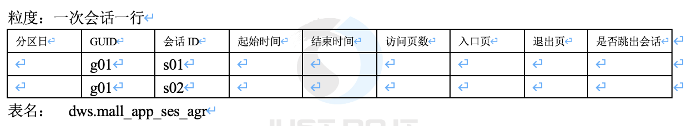
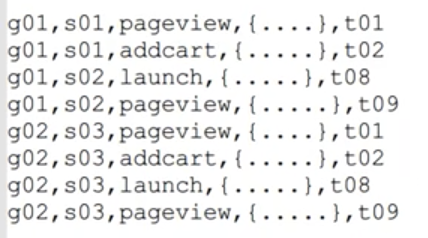
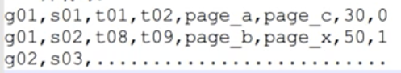

# 14. 数据域会话聚合信息表

## 流量分析

### 创建会话聚合信息表

DWS: 数据汇总层，聚合性质，一般是宽表

####建库：

	CREATE DATABASE dws;

####建表：(session_aggregate)

	CREATE TABLE dws.mall_app_ses_agr(
		guid                 string,
		session_id           string,
		ses_start_time       bigint,
		ses_end_time         bigint,
		ses_pv_cnt           int,
		ses_enter_page_id       string,
		ses_enter_page_url      string,
		ses_exit_page_id       string,
		ses_exit_page_url       string,
		ses_is_jump          int    --1：跳出了会话 0:没有跳出会话
	) 
	PARTITIONED BY (dt string) 
	STORED AS orc 
	TBLPROPERTIES(
    'orc.compress'='snappy'
	)
	;
	
### 计算

#### 逻辑

基于app行为事件明细表：

* g01: guid
* s01: sessionid
* pageview: 业务逻辑
* t01: time

预计生成的数据格式：

* g01: guid
* s01: 会话sessionid
* t01: 起始时间
* t02: 结束时间
* page_a: 访问入口页面的id
* page_b: 访问最后一个页面的id
* 30：访问总页面数
* 0：是否是跳出了会话

#### 导入信息到表中 

	insert into table dws.mall_app_ses_agr partition (dt='2022-10-25')
	select 
	
	guid,
	sessionid,
	min (ts) as ses_start_time,
	max (ts) as ses_end_time,
	count(if(eventid='pageView',1,null)) as ses_pv_cnt,
	split( min(if(eventid ='pageView', ts || '_' || properties['pageId'] || '_' || properties['url'], null)), '_') [1]  as ses_enter_page_id,
	split( min(if(eventid ='pageView', ts || '_' || properties['pageId'] || '_' || properties['url'], null)),  '_') [2]  as ses_enter_page_url,
	split( max(if(eventid ='pageView', ts || '_' || properties['pageId'] || '_' || properties['url'], null)), '_') [1]  as ses_exit_page_id,
	split( max(if(eventid ='pageView', ts || '_' || properties['pageId'] || '_' || properties['url'], null)),  '_') [2]  as ses_exit_page_url,
	if( count ( if (eventid ='pageView', 1, null))<1, 1, 0) as ses_is_jump
	
	from dwd.mall_app_event_DTL
	where dt = '2022-10-25'
	group by guid, sessionid
	;

#### 验证

	select * from dws.mall_app_ses_agr limit 10;
	

	---------------------------------------------------------------------------
	1000000001      ufquvbub        1666627222751   1666627278073   0       NULL    NULL    NULL    NULL    1       2022-10-25
	1000000002      pcuurmqg        1666627227621   1666627324219   1       ite0546 /items/ite0546.html     ite0546 /items/ite0546.html     0       2022-10-25
	1000000003      xshcaoko        1666627219750   1666627354678   0       NULL    NULL    NULL    NULL    1       2022-10-25
	1000000004      zgtcsmok        1666627229411   1666627311919   0       NULL    NULL    NULL    NULL    1       2022-10-25
	1000000005      aydcwwaa        1666627211010   1666627247204   0       NULL    NULL    NULL    NULL    1       2022-10-25
	1000000006      kiygxpvh        1666627233506   1666627322714   0       NULL    NULL    NULL    NULL    1       2022-10-25
	1000000007      qvtmtdti        1666627234009   1666627468124   1       c016    /courses/linux/c016.html        c016    /courses/linux/c016.html        0       2022-10-25
	1000000008      qxvdubsp        1666627219208   1666627293854   0       NULL    NULL    NULL    NULL    1       2022-10-25
	1000000008      ulmmgrjc        1666627212813   1666627212813   0       NULL    NULL    NULL    NULL    1       2022-10-25
	1000000009      egzblqgz        1666627209185   1666627370295   0       NULL    NULL    NULL    NULL    1       2022-10-25
	
	
	desc dws.mall_app_ses_agr;
	OK
	guid                    string                                      
	session_id              string                                      
	ses_start_time          bigint                                      
	ses_end_time            bigint                                      
	ses_pv_cnt              int                                         
	ses_enter_page_id       string                                      
	ses_enter_page_url      string                                      
	ses_exit_page_id        string                                      
	ses_exit_page_url       string                                      
	ses_is_jump             int                                         
	dt                      string   

