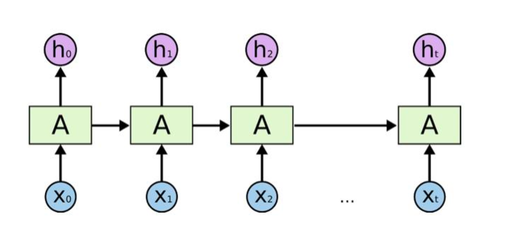
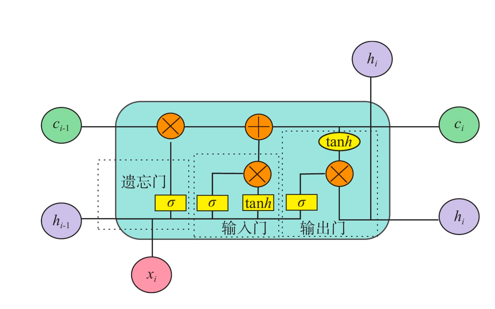
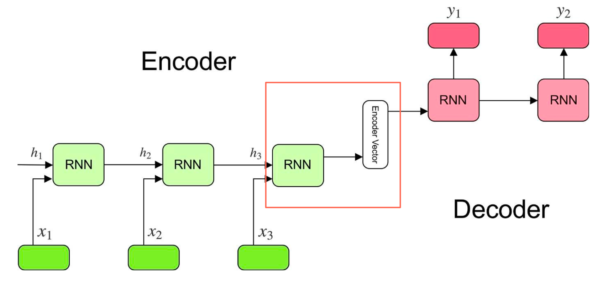
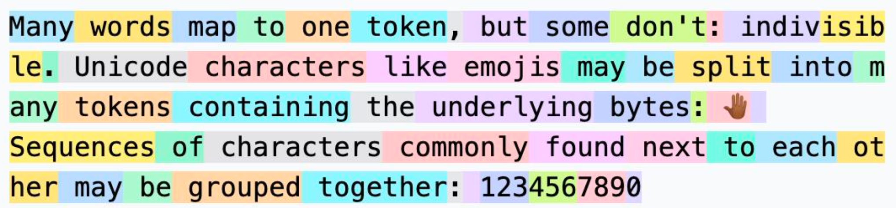

# 05 DNN 基础及预训练&迁移学习 


## 深度神经网络


**对于图像的理解，人类不是一个一个像素看的。**

传统监督学习的局限：当模型追求准确性的时候，可能会学到“表明相关性”。比如在训练集中，大部分“猫”的图片都带有特定的水印，所以模型将“水印”识别为猫的特征。


构建深度学习的真正力量是：构建高效的“表示空间”，将高维、冗余的原始输入，投影到一个更低纬、结构化的流影上。语义相似的数据点在几何上互相靠近，语义不同的数据点则互相远离。


### CNN

CNN的核心目标：一种为解决图像这类高度结构化数据的表示学习问题而设计的专用架构。

物理世界的特点：**物质空间是连续的，实体本身也是连续的**。因此**边缘**是最重要的视觉特征。


- **设计基石：图像的“局部相关性” (Locality)**

-  **图像特性：** 相邻像素间高度相关，共同构成有意义的局部模式（如边缘、角点、纹理）。
-  **识别逻辑：** 对物体的理解，依赖于对其**局部模式的组合**，而非对全局像素位置的记忆。
-  **CNN 策略：** 将学习过程聚焦于识别这些局部模式，再通过堆叠组合成全局概念


表示体系：

- **底层卷积层 (Low-level Layers):**

  - [ ]  **功能：** 检测图像中最基本的视觉元素。

  - [ ]  **示例：** 边缘、线条、方向变化、颜色块。

  - [ ] **感受野 (Receptive Field):** 小

- **中层卷积层 (Mid-level Layers):**

  - [ ]  **功能：** 组合低级模式，构成更复杂的局部结构。

  - [ ]  **示例：** 角点、形状、纹理块、物体部件（如“眼睛”、“车轮”）。

  - [ ] **感受野:** 中

- **高层卷积层 (High-level Layers):**

  - [ ]  **功能：** 聚合中层信息，提取出具有**明确语义**的区域或整体特征。

  - [ ]  **示例：** “动物面部”、“汽车轮廓”等完整概念。

  - [ ]  **感受野:** 大


**关键机制：** 随着网络加深，模型的**感受野**（Receptive Field）不断扩大，使得网络能够综合越来越大的图像区域信息，最终形成适用于分类、检测等复杂任务的**高层语义表示**。


### ResNet

传统的CNN层数越多，效果可能更差。

- **理论上：** 更深的网络拥有更大的函数空间，应具备更强的表示能力，效果应该更好或至少不差。

-  **实践中：** 在CNN研究中发现，简单地堆叠网络层数，当深度达到一定程度后，模型性能会急剧下降。

  

原因是：**梯度消失 (Vanishing Gradients):**

-  **原因：** 在反向传播过程中，梯度通过链式法则逐层传递。当网络过深，**多个小于1的梯度值连乘**，会导致传递至浅层网络的梯度信号极其微弱，近乎于零。


##### 形象的比喻

假设你写作文，每一版都是上一版的改进：

- 普通网络：每次都“从头写一篇新作文”
- ResNet：在旧作文上“只改错误的地方”


残差块（Residual Block）包含两种类型：

-  **恒等块 (Identity Block):**

  - [ ] **用途：** 当输入与输出的维度**完全相同**时。

  - [ ]  **捷径路径：** 直接的恒等连接，将输入 x 原封不动地加到输出上。

-  **投影块 (Projection Block):**

  - [ ]  **用途：** 当主路径的卷积操作改变了输入的空间维度（如步长为2）或通道数时。

  - [ ]  **捷径路径：** 通过一个 **1x1 卷积**对输入 x 进行线性投影，使其维度与主路径的输出匹配，然后再相加。


## 视觉模型预训练与迁移学习

**迁移学习（Transfer Learning）**指的是：将模型在一个大规模、通用任务（源任务）上学到的知识，迁移并适配到一个新的、具体但相关的任务（目标任务）上。


**本质理解：**

迁移学习的价值，并不在于“复用一个模型”，

而在于复用其在大规模任务中学到的**高质量表示能力**（Representation Power）。


| 阶段   | 角色                                | 功能                                                         |
| ------ | ----------------------------------- | ------------------------------------------------------------ |
| Step 1 | 表示学习（Representation Learning） | 构建“知识字典”：将复杂输入转化为可泛化的特征向量（Embedding） |
| Step 2 | 迁移学习（Transfer Learning）       | 在下游任务中调⽤已有特征，少量数据即可⾼效适配               |


 **迁移学习两段式结构**：

-  **1**️ **表示主干（Embedding Backbone）**  ：  通常是一个**预训练好的大模型**，  负责 **提炼通用语义**，比如 ResNet、ViT、CLIP、BERT 
-  **2**️ **任务头（Task-Specific Head）**：              类似“把通用能力转成具体任务输出”， 负责 **适配具体任务**


表示主干通常是【冻结】的，不参与训练，不回传梯度，只负责抽取特征。它就是一个通用特征提取器。

任务头通常是小网络，1-2层全连接层，将Embedding特征向量映射到特定任务空间。


迁移学习的三重收益：

- **模块化复用**：结构清晰、组合灵活。 以前的做法：每个任务训练一套模型。现在的做法：像搭积木一样。
- **主干网络** ： 标准化特征提取引擎。只要保证：Backbone 不轻易改，任务头随业务变化微调，系统稳定性就非常高。
- **新任务** ： 只需接入对应 Task Head。不用重新训练整套网络，只需要：加一个小头，少量样本微调，立刻上线。


所以支持“多任务、多场景”的一体化研发流程。数据和算力需求大幅度降低。


## 语言表示和循环神经网络

如果 embedding 在图像中很好用，那么到了 NLP 里，会遇到什么新挑战？


图像 → Embedding：空间压缩 + 多层语义抽象。在图像任务里：用 CNN / ResNet 做的事情是：把一张二维像素图，压缩到一个固定维度的向量（Embedding）信息包括边缘结构，纹理模式，形状结构，高层语义（物体、场景、类别）。


但当问题转向语言——本质发生变化：我们不再处理像素阵列，而是需要理解由词语组成的线性序列。图像是一个二维空间对象，语言是一个时间 / 顺序 驱动的序列对象。

| 领域 | 输入结构    | 模型重点             |
| ---- | ----------- | -------------------- |
| 图像 | 2D 像素矩阵 | 空间结构、层级抽象   |
| 语言 | 词语序列    | 语序、依存、语境关系 |


传统的神经网络难以胜任时序序列结构的文本，而循环神经网络（RNN）应运而生。RNN不仅要理解当前词语，还必须保留并更新对先前语境的理解。RNN解决了语言任务的两大关键问题： **顺序建模（Sequential Modeling）与记忆表达（Memory Representation）**。其机制可以概况为三步：

- 每一步输入一个词向量
- 同时维护一个隐藏状态，作为上下文的压缩记忆
- 当前输入依赖于当前词于过去状态的组合


RNN的局限性：记忆容量有限，在较长的序列中，前部词语的影响必须跨越多个时间步才能作用到当前。导致早期输入的监督信号被削弱甚至丢失，模型遗忘了前文关键信息。




要想构建长期记忆能力，RNN需要改进，引入门控机制（比如LSTM）:



- **遗忘门（Forget Gate）**。作用：从旧记忆里删掉不重要的部分
- **输入门（Input Gate）**。作用： 决定当前输入中有多少新信息写入记忆
- **输出门（Output Gate）**。作用： 控制当前时刻暴露多少内部记忆给外部使用

通过门控机制，能够将一个序列的上下文信息“记住”在模型的内部状态中，并在后续预测中加以利用。


## 语言模型预训练与监督学习

LSTM 可以把一句完整的话，压缩成一个向量（Embedding）。LSTM 把一句完整的话读完以后，最后时刻的隐藏状态= 整句语义的 embedding 向量。



 #### Encoder / Decoder 的解释

-  Encoder（编码器） = 负责“读句子 → 形成语义总结”。
- Decoder（解码器）= 根据这个总结重新生成一句话（比如翻译后的句子）


- 📦 Encoder：把句子压缩成一张摘要卡片
-  📤 Decoder：根据摘要卡片重新讲一遍


为什么“最后一个隐藏状态”，就能代表整个句子？原因是：LSTM 在**每一步**都会吸收新词， 更新语义，融入上下文。

 **传统 LSTM 的“句向量表示”，本质上是从监督学习中被训练出来的**，这种表示方式“对标签过度依赖”，因此不适合做通用语义表示。


##### 一句话总结

在情感分析 / 文本分类这类监督任务中，LSTM 学到的“句向量”，不是通用语义向量， 而是“为了分类任务而训练出来的向量”。因此不适合做“**通用语义表示**”。


监督式 LSTM 表示：
 🟡 有效，但局部
 🔴 无法支撑通用语言理解


一个自然的问题是：是否可以不依赖标签，仅仅通过语言自身的结构规律，训练LSTM自动学习通用的语言表示？


### 自监督学习

从 **监督式 LSTM 语义表示**，过渡到 **自监督预训练 + 语言模型表示**。Causal Language Modeling（CLM，自回归语言建模）是一种最基础也最常用的语言建模范式。不再依赖人工标签，语言模型通过“预测下一个词”，在海量文本中 **自动学习语义结构**。


#####  什么是“自回归语言建模（CLM）？

给定一段前文，预测 下一个最可能出现的词。比如“我今天心情很 ___”，大概率接：“好”。为什么这是“自监督学习”，因为：训练数据来自原始文本，不需要人工标签，目标标签 = 文本中后面的词。模型在训练过程中，不只是预测词， 同时 **被迫学习**：

- 语法结构

- 语义依存

- 上下文关系

- 共现模式

- 主题与风格

  

这就形成了：

👉 **语义表示能力**


| 方式               | 表示来源           | 覆盖能力               |
| ------------------ | ------------------ | ---------------------- |
| 监督学习           | 依赖人工标签       | 只适合单任务           |
| 语言模型（自监督） | 从大规模语料中学习 | 泛化能力强，语义覆盖广 |


##### 1.标记化层（Embedding Layer）

输入：一个由离散 token 组成的序列，通常通过分词器（Tokenizer）将文本切分为词（word）、子词（subword）或字符级 token。每个 token 对应词典（Vocabulary）中的一个唯一索引。




##### 2.LSTM 网络主体

- 顺序处理每个词向量，逐步更新隐藏状态 h_t
- 隐藏状态携带到当前位置为止的全部上下文语义


```python
#第一步 —— 定义 LSTM
lstm = nn.LSTM(
    input_size=64,   # 每个词的 embedding 维度
    hidden_size=128, # 隐状态（语义表示）维度
    batch_first=True # batch 维度放在最前面 (B, T, D)
)

#第二步 —— 把序列喂进去
output, (hn, cn) = lstm(embedded)
```


##### **3. 输出层（Softmax 分类头）**

-  将当前隐藏状态 h_t 映射为一个与词表等长的 logits 向量
- 通过 Softmax 计算每个词作为下一个词的概率


```python
# 第一步：把 hidden state 转成“词表空间”
linear = nn.Linear(128, len(vocab))
logits = linear(output)

#第二步：Softmax 得到“下一个词概率分布”
pred_prob = torch.softmax(logits, dim=-1)

# 第三步：计算训练损失（核心）
loss_fn = nn.CrossEntropyLoss()

loss = loss_fn(
    logits.view(-1, vocab_size),
    targets.view(-1)
)
```

