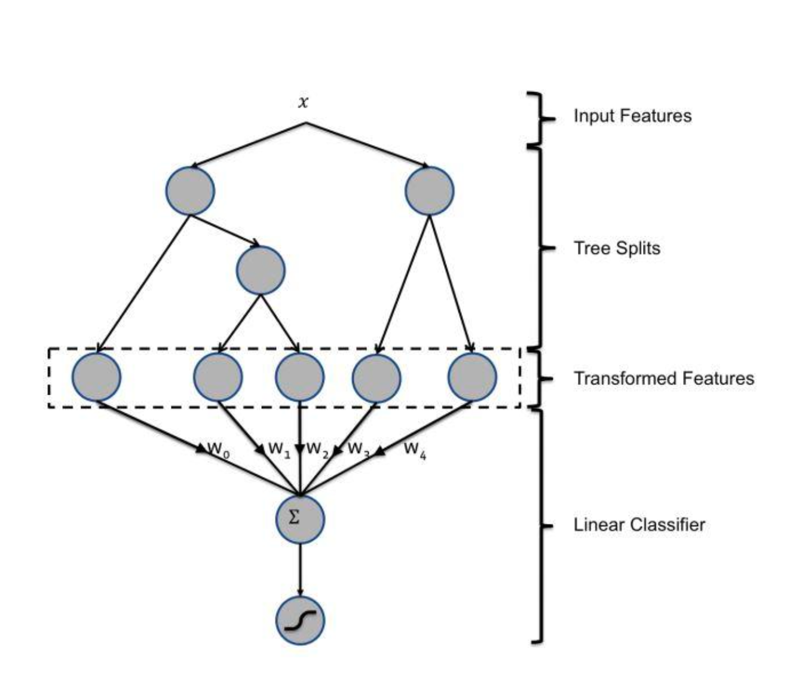
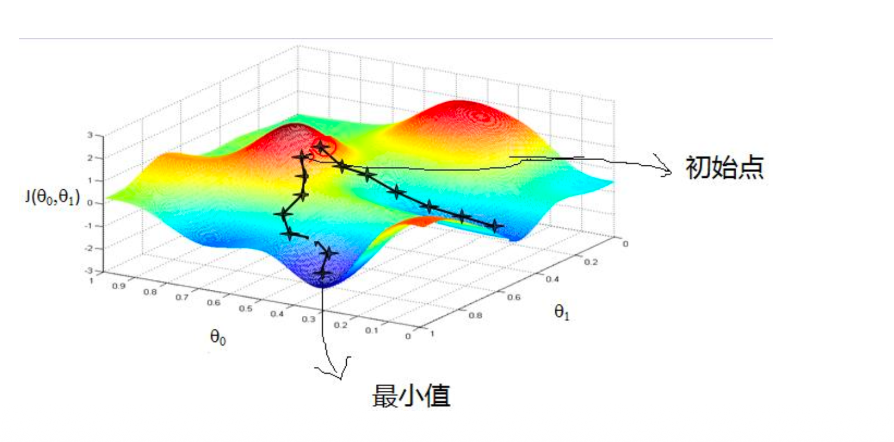
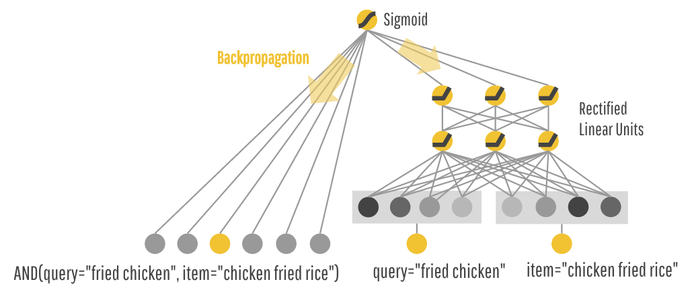
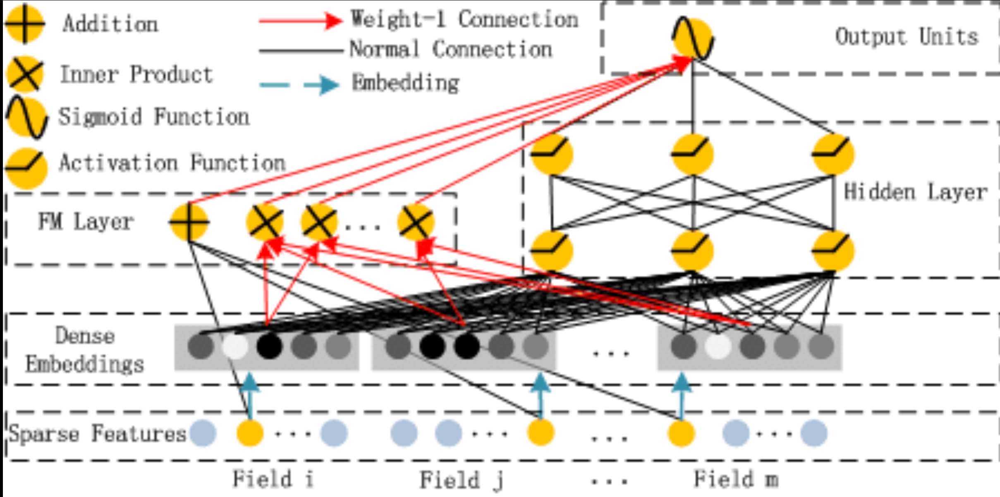

# 0.4 感知机与浅层网络

## 协同过滤

协同过滤的本质：发现品味相似的人或物。

传统协同过滤的优缺点:

- **权重完全隔离**：各行其道的参数更新

- **模型形式**：  
  $P(y = 1 \mid x) = \sigma(w_1 x_1 + w_2 x_2 + b)$

- **优点**：
  - 训练快速，易部署
  - 权重可解释，每个特征贡献清晰

- **局限（关键）**：

- **线性叠加假设**：
  - 特征被当作相互独立，模型仅学习加法组合

- **协同贡献难以评估**：
  - 只能度量 **单一维度行为** 对点击率的加性影响

### 显式权重复用：规则&GBDT的低成本套路

#### GBDT + LR 

2014年，Facebook发表了一篇具有里程碑意义的论文，详细介绍了一种巧妙的机器学习模型-GBDT+LR：

- GBDT：自动生成组合特征（“制造逻辑”）
- LR：对组合特征加权（“分配权重”）

## MLP（Multi-Layer Perceptron）的“端到端”隐式特征交叉

#### 陷入了“局部最优解”怎么解决？

##### 为什么深度学习会陷入“局部最优”

更准确地说，更多是鞍点（Saddle Point）和平坦区域，而不只是简单的局部最小值。

1️⃣ 非凸损失函数

深度神经网络的损失函数是高度非凸的：

- 多层叠加
- 非线性激活
- 参数维度极高

→ 存在大量 局部极小值、鞍点、平坦谷

2️⃣ 梯度消失 / 梯度爆炸

- 梯度过小：参数几乎不更新 → 卡死

- 梯度过大：训练震荡 → 无法收敛

3️⃣ 不良初始化

- 权重过大 / 过小

- 各层尺度不一致

→ 一开始就走进“坏区域”

4️⃣ 优化器能力不足

- 纯 SGD 对复杂地形不友好

- 容易在噪声不足时被困住

##### 解决思路

核心思想：让优化器“有能力 + 有噪声 + 有视野”

① 更好的参数初始化

**目标**：保持前后层方差稳定

- Xavier / Glorot（tanh, sigmoid）
- He Initialization（ReLU 系）

② 使用更强的优化器

| 优化器   | 作用                     |
| -------- | ------------------------ |
| Momentum | 帮助冲出局部洼地         |
| Adam     | 自适应学习率 + 动量      |
| AdamW    | 解耦权重衰减（强烈推荐） |

③ 引入“噪声”帮助跳出局部最优
✅ Mini-batch SGD

- Batch 不要太大（32～512）

- 小 batch = 天然噪声

#### ✅ 学习率策略

- 较大的初始 LR
- Cosine Annealing / OneCycle

④ BatchNorm / LayerNorm

- 平滑损失面
- 减少鞍点影响
- 允许更大学习率

> 没有 BN/LN 的深网，更容易“卡死”

⑤ 激活函数选择

| 激活             | 问题     | 改进 |
| ---------------- | -------- | ---- |
| Sigmoid          | 梯度消失 | ❌    |
| Tanh             | 饱和     | ⚠️    |
| ReLU             | 死神经元 |      |
| LeakyReLU / GELU | ✅ 推荐   |      |

⑥ 正则化反而有助于跳出局部最优

- Dropout

- Weight Decay

- Label Smoothing

### MLP的现实挑战：当特征是“海量ID”时

在真实世界的模型中，最具价值的特征往往是**类别型（Categorical）**的，例如user_id,item_id等。问题是我们怎么将这些高基数类别型特征有效放入MLP中？

- 独热码（one-hot Encoding）：最早，但是计算速度上跟不上。
- Embedding：可行的低维

#### 早期解决方案： Wide & Deep记忆与泛化的协同建模

**Wide & Deep** 是一种**融合记忆（Memorization）与泛化（Generalization）**的模型结构，最早由 **Google** 在 2016 年提出，用于推荐系统（如 App 推荐、广告 CTR 预估）

##### Wide部分（线性模型）：负责记忆

它直接处理高维稀疏特征（如One-Hot 编码的ID及基于先验知识进行人工设计的交叉特征），通过一个简单的线性模型，快速、直接地学习那些显而易见的、重要的低阶规则。例如：它可以记住 user_id=张三与item_id=手机A这个组合有极强的关联。

##### Deep部分（神经网络）：负责泛化

它利用Embedding将高维特征转化为低纬稠密向量，然后探索挖掘这些特征之间潜在的、从未见过的高阶交互关系。。例如：它可以发现“年轻数码爱好者”和“新发布的旗舰手机”之间存在潜在的、更抽象的兴趣关联。

| 能力       | Wide | Deep | Wide & Deep |
| ---------- | ---- | ---- | ----------- |
| 记住规则   | ✅    | ❌    | ✅           |
| 泛化新组合 | ❌    | ✅    | ✅           |
| 冷启动稳定 | ✅    | ❌    | ✅           |
| 高阶非线性 | ❌    | ✅    | ✅           |

#### 局限性

Wide部分严重依赖于“人工特征交叉”，所有需要高昂的人力成本，泛化性受限，维护困难。这些痛点驱动下一代明星模型：DeepFM。

### DeepFM

**DeepFM（Deep Factorization Machine）** 是一种 **端到端的 CTR / 推荐模型**，核心目标只有一句话：

> **不靠人工特征交叉，同时学到低阶 + 高阶特征组合。**

Input → Embedding → 
        ├─ FM（二阶特征交叉）
        └─ Deep（高阶非线性交叉）

##### 核心创新

- 核心创新1：用FM组件替代Wide组件，告别手动，实现特征交叉的自动化学习。
- 核心创新2：共享Embedding层，连接低阶和高阶，实现信息利用的最大化

FM 和 Deep 共用同一套 Embedding:

| 好处     | 说明                      |
| -------- | ------------------------- |
| 参数更少 | 比 Wide&Deep 更轻         |
| 收敛更快 | 两个目标同时优化          |
| 特征一致 | 不会 Wide / Deep 各学一套 |

##### FM 在干嘛？

FM（Factorization Machine）显式建模 **二阶特征交叉**

直觉理解：

- 每个特征一个 embedding 向量
- 两两内积 → 自动学：

用户=学生 × 商品=廉价
用户=亲子 × 景点=游乐园

##### Deep 在干嘛？

- 使用 **同一套 embedding**
- 拼接后送入多层 MLP
- 学习高阶、非线性特征关系

用户画像 + 历史行为 + POI embedding
→ “喜欢小众 + 偏文化 + 非周末”

## 深度学习的本质

- **特征的表示（Feature Representation）**

- **深度学习 = 针对场景需求的“表示设计”**

  

主要依赖的工具是 反向传播（Backpropagation） 和 梯度下降 (Gradient Descent)。一个完整的学习周期

1. **初始状态**：**混沌的连接**，网络刚被创建时，内部数百万的连接权重是随机的。
2. **前向传播**：**接受刺激，产生误差**，给网络输入一个信号（例如，一张猫的图片），由于连接时混乱的，网络可能会输出一个错误的结果（例如，识别为了一条狗），我们将这个预测结果与真实标签进行比较，计算出误差的大小。
3. **反向传播：追溯责任，分配贡献**。反向传播算法从最终的误差出发，逐层往后追溯，它会精确地计算出网络中的每一个连接（权重），对这次的最终错误贡献了多少责任。这个责任在数学书就是梯度（Graddient）
4. **梯度下降：实施重塑，**微调连接梯度下降算法，根据责任大小，对每一个连接的强度进行一次微笑的，能让总误差减少的调整。核心更新公式是： 新梯度= 旧权重 - 学习率*梯度
5. **循环往复：千万次的雕刻**，这个”预测 -> 犯错 -> 追责 -> 微调“的过程，在整个数据集上重复进行了亿万次后，整个网络的链接权重就逐渐重塑为一个能完成任务的结构。