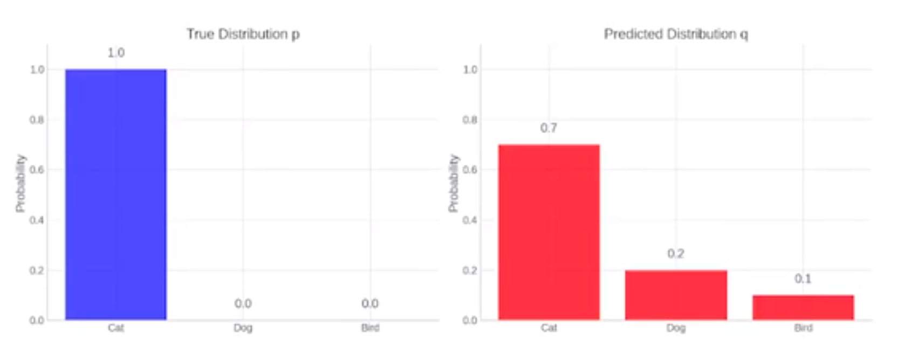
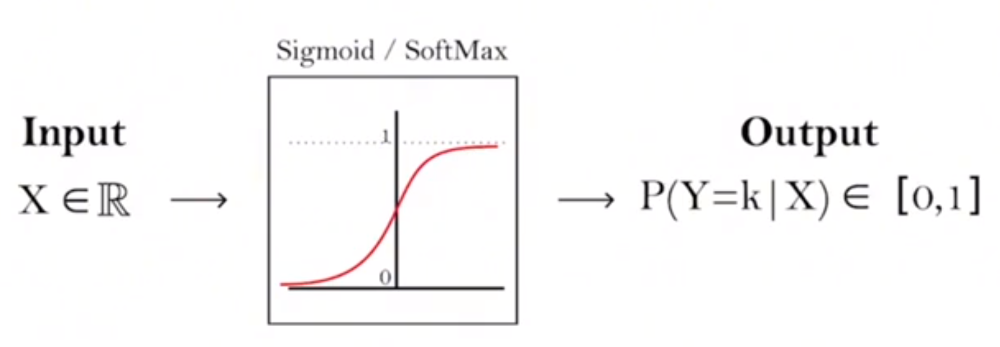
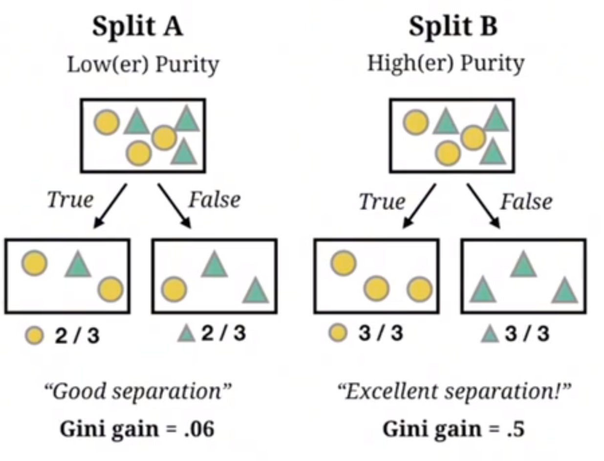

# 01. 机器学习

## 基础

### Loss Function

**残差**（residual） **= 真实值 − 预测值**。

### MAE

**平均绝对误差MAE（Mean Absolute Error）** 是衡量模型预测误差最常用的指标之一。

$$
\mathrm{MAE} = \frac{1}{n} \sum_{i=1}^{n} \left| y_i - \hat{y}_i \right|
$$

- $y_i$：真实值  
- $\hat{y}_i$：预测值  

- $|y_i - \hat{y}_i|$：每个样本的绝对误差（不看正负，只看错了多少）

### MSE

**均方误差 MSE（Mean Squared Error）**是衡量模型预测误差最常用的指标之一，尤其常用于回归任务。

$$
\mathrm{MSE} = \frac{1}{n} \sum_{i=1}^{n} (y_i - \hat{y}_i)^2
$$

- $y_i$：真实值  
- $\hat{y}_i$：预测值  
- $(y_i - \hat{y}_i)^2$：每个样本误差的平方（将大误差放大惩罚）

### KL散度

**KL 散度（Kullback–Leibler Divergence）** 是一个用来衡量 **两个概率分布之间差异** 的数学工具，也叫做**相对熵**。

可以把它理解为一种特殊的距离：

- 它专门用用衡量两个概率分布之间有多么的不相似
- 当两个分布一模一样的时候，它们的KL散度就等于0
- 两个分布差异越大，KL散度就越大

## 线性模型

### 两阶段工作范式

解决分类问题的主流范式是两阶段学习：

##### 阶段1：表示学习（Representation Learning）

目标：利用强大的预训练模型（如BERT处理语言、ResNet处理图像），讲原始、非结构化的数据（如文本、图像）转换为高质量的特征向量h，即语义空间中的“坐标点”，

##### 阶段2：任务决策（Task Decision）

目标：将这个信息量巨大的特征向量h（内容提要），输入到一个更简单、专门针对下游任务的模型中，来完成最终的分类或回归。

类比：小模型就像一位高效决策者，只需要精准内容提要h，就能快速决策。

**这个“大模型负责深度理解，小模型负责快速决策”的模式，是当今AI领域最高效、最普遍的工作流。**

线性模型（逻辑回归）的目标就是为阶段1中的模型的每一个维度去找到对应的权重。

### 概率映射

为了方便损失函数计算分布差异（KL散度、交叉熵），我们通常会用到Sigmoid函数，把任意实数输入，压缩到（0，1）区间，来表示概率：

- 加权求和 + Singmoid函数整体结构，就是著名的逻辑回归（Logistic Regression）模型：
- p表示“正类”发生的概率，1-p就是“负类”的概率。

### 深度学习 CTR 模型的典型工作流程

 让我们来看一个经典且极具代表性的深度学习 CTR 模型的工作流程。 它清晰地展示了模型是如何解决**特征交叉问题**的。

- **输入与嵌入（Embedding）**
   将所有离散特征（如城市、品类、品牌等）通过 **Embedding 层**，转化为低维、稠密的语义向量。

  比如：

  - **“北京”** →0.32,−0.15,0.89,…,−0.410.32, −0.15, 0.89, …, −0.410.32,−0.15,0.89,…,−0.41（一个 **1024 维的稠密向量**）
  - **“上海”** → 0.35,−0.11,0.92,…,−0.380.35, −0.11, 0.92, …, −0.380.35,−0.11,0.92,…,−0.38 （一个与“北京”**语义上非常相似**的稠密向量）

- **拼接与堆叠（Concatenation）**
   来自不同特征的 Embedding 向量会被**拼接在一起**，形成一个更长、更宽的向量。这个向量就是送入深度网络的“原材料”。

- **学习（Learning）**
   通过更新网络中的线性权重，使来自不同特征的 Embedding 信息能够被充分地、自动地学习到各种贡献关系。

- **输出（Output）**
   最终经过 **Sigmoid 函数**，得到预测的 **CTR（点击率）**。

## 决策树

学习的核心：如何进行“最优分裂”。

下面例子解释「决策树是如何选问题（特征）」的**，核心关键词只有一个：**纯度（Purity）**，以及由它引出的 **Gini Gain（基尼增益）**。

决策树用的越来越少了，因为决策树存在致命的缺陷：

（1）**过拟合**。如果不加限制，决策树会倾向于生长得极其繁茂、复杂，知道能完美解释训练数据的每一个样本。它会把数据中的“噪声”和偶然性也当成是普适的规律来学习。

（2）**不稳定性**。训练数据中一个微小的变动（比如删除或增加几个样本），都可能导致最终学习到的决策树结构发生明显变化。

现在决策树的最重要的场景是：**集成学习（EnsembleLearning）**

## 无监督学习

#### 与监督学习的根本区别

在**监督学习**中，每个学习任务都有一个明确的“老师”——**标签（y）**，而在**无监督学习**中，没有标准答案，我们拥有的，只有数据本身 **X**

无监督学习的目标 **不再是预测一个标签**，而是 **从数据内部发现隐藏的、有趣的、有价值的结构（Structure）**

#### 无监督学习的典型任务

（1）聚类（Clustering）：根据相似性，把数据自动分组。常用于用户画像、行为分群、异常发现等。

（2）降维（Dimensionality Reduction）：压缩特征维度，保留主要信息、去除冗余和噪声，常用于可视化、特征工程、加速模型训练

（3）关联规则（Association Rule）：发现数据中**经常同时出现的模式**，常用于推荐系统、商品组合分析

## 模型评估

#### 回归模型（Regression）

##### MAE（Mean Absolute Error，平均绝对误差）

$ MAE = \frac{1}{n} \sum_{i=1}^{n} |y_i - \hat{y}_i| $

#####  MSE（Mean Squared Error，均方误差）

$ MSE = \frac{1}{n} \sum_{i=1}^{n} (y_i - \hat{y}_i)^2 $

##### RMSE（Root Mean Squared Error，均方根误差）

$ RMSE = \sqrt{ \frac{1}{n} \sum_{i=1}^{n} (y_i - \hat{y}_i)^2 } $

##### $R^2$（决定系数）

$ R^2 = 1 - \frac{\sum_{i=1}^{n} (y_i - \hat{y}_i)^2}{\sum_{i=1}^{n} (y_i - \bar{y})^2} $

#### 分类模型（Classification）

设混淆矩阵中：

- $TP$：True Positive
- $TN$：True Negative
- $FP$：False Positive
- $FN$：False Negative

#####  Accuracy（准确率）

$ Accuracy = \frac{TP + TN}{TP + TN + FP + FN} $

##### Precision（精确率）

$ Precision = \frac{TP}{TP + FP} $

##### Recall（召回率 / 灵敏度）

$ Recall = \frac{TP}{TP + FN} $

#####  F1-score

$ F1 = \frac{2 \cdot Precision \cdot Recall}{Precision + Recall} $

##### Specificity（特异度）

$ Specificity = \frac{TN}{TN + FP} $

#### 概率 / 排序相关指标

##### Log Loss / Cross Entropy（二分类）

$ LogLoss = -\frac{1}{n} \sum_{i=1}^{n} \left[ y_i \log(p_i) + (1 - y_i)\log(1 - p_i) \right] $

##### AUC（ROC 曲线下面积）

$ AUC = \int_0^1 TPR(FPR) \, d(FPR) $

#### 聚类模型

##### SSE（Sum of Squared Errors）

$ SSE = \sum_{i=1}^{k} \sum_{x \in C_i} ||x - \mu_i||^2 $

##### Silhouette Score（轮廓系数）

$ s(i) = \frac{b(i) - a(i)}{\max(a(i), b(i))} $

##### Davies–Bouldin Index（DBI）

$ DBI = \frac{1}{k} \sum_{i=1}^{k} \max_{j \ne i} \left( \frac{s_i + s_j}{d_{ij}} \right) $

#### 决策树 / 信息论

##### Entropy（信息熵）

$ H(X) = - \sum_{i=1}^{n} p_i \log_2 p_i $

##### Information Gain（信息增益）

$ IG = H(Parent) - \sum_{k} \frac{|D_k|}{|D|} H(D_k) $

##### Gini Impurity

$ Gini = 1 - \sum_{i=1}^{n} p_i^2 $

