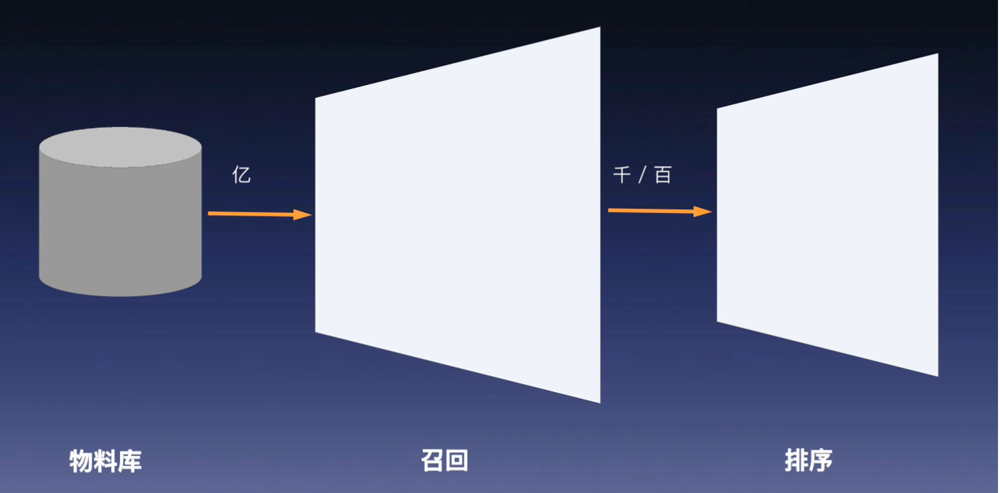

# 02. 知识表示与检索

## 符号表示与知识库

### 倒排索引：将文本变为可索引的单元

#### 分词（Tokenization）

将自然语言句子拆分为词元（Token）序列。

文档1： ["大", "语言", "模型", "是", "人工智能", "的", "未来"]

文档2：["语言", "是", "人类", "沟通", "的", "桥梁"]

文档3：["深度学习", "模型", "驱动", "了", "人工智能", "的", "发展"]

在完成分词之后，我们可以建立 **“词元（Token） → 文档 ID 列表”** 的映射关系，这种数据结构称为 **倒排索引（Inverted Index Table）**。

| Token（词元） | Posting List（文档 ID 列表） |
| ------------- | ---------------------------- |
| 语言          | [文档1, 文档2]               |
| 模型          | [文档1, 文档3]               |
| 人工智能      | [文档1, 文档3]               |
| 深度学习      | [文档3]                      |
| 沟通          | [文档2]                      |
| 桥梁          | [文档2]                      |
| 未来          | [文档1]                      |
| 驱动          | [文档3]                      |
| 发展          | [文档3]                      |

**挑战：当包含关键词的文档成千上万，哪个文档应该排在前面？哪个才更符合用户的真实意图？**

### 现代检索系统的主流范式： 召回+排序

#### 召回Recall Stage）

• 使用高性能的检索算法（如倒排索引、向量召回等）

• 从数百万甚至数亿候选文档中**快速筛选出一个 Top-K 的初选集合**（通常几百到几千条）

• 目标：高覆盖、高召回率、低延迟

• 特点：粗粒度过滤，牺牲准确率换取速度和范围

####  排序阶段（Ranking Stage）

• 对召回得到的候选文档进行更精细的特征计算与相关性打分，使用排序模型进行最终打分排序

• 目标：精准判断用户意图匹配度

• 特点：精模型、慢计算、小规模、高准确率

• **这种分层结构将“找得全”和“排得准”解耦，**

• **是搜索、推荐、问答系统中的通用工程架构模板。**

#### 经典算法 ：**TF-IDF 排序（Term Frequency – Inverse Document Frequency）**

**TF-IDF = 词频 × 逆文档频率**

核心思想只有一句话：**一个词的重要性，取决于它在这篇文档中的“特殊性”**

- 出现频率高 → 说明对该文档重要；
- 出现得“越稀有” → 区分度越强，信息量越大。

#####  TF：Term Frequency（词频）

-  **目的：为关键词在文档中的出现次数增加权重。**
-  **直觉：**一个词在**某篇文档中出现得越多**，这篇文档就**越有可能和它相关**。
-  **例子：**如果一篇文章反复出现“乔布斯”
- 它很可能是在谈论苹果公司或乔布斯的传记。

##### IDF：Inverse Document Frequency（逆文档频率）

- **目的：** 当用户查询被分词成多个关键词时，**哪个查询词更重要、更有“区分力”**
- 对排序贡献更大。
- **直觉：**如果一个词在**所有文档中都很常见**，那它信息量低（而如果一个词在全库中**很少出现**，那它更能体现一篇文档的独特性。
- **例子：**“人工智能”比“技术”更稀有，因此在一篇文章中出现时，其区分度更高。

| 情况                          | TF   | IDF  | TF-IDF   |
| ----------------------------- | ---- | ---- | -------- |
| 文档中出现很多 & 全库中很少   | 高   | 高   | ⭐⭐⭐⭐⭐    |
| 文档中出现很多 & 全库中很常见 | 高   | 低   | ⭐⭐       |
| 文档中出现很少 & 全库中很少   | 低   | 高   | ⭐        |
| 停用词（如“的”）              | 高   | 极低 | ❌ 接近 0 |

##### TF-IDF局限性

- 时效性
- 权威性
- 用户偏好

### 排序系统的现代工作流程

##### （1）第一步：特征提取

对召回阶段找到的Top1000个候选网页，系统为每个网页构造一组多维特征（权威性、时效性、用户行为、页面结果等），把每个网页变成一个高维特征向量。

##### （2）第二步：CRT预测

将每个网页的特征向量输入到训练好的逻辑回归模型中

#####   (3)  第三步：排序并展示

对候选网页按CTR值从高到低排序

### 跨越语义鸿沟的关键技术 Embedding

| 维度       | 标签匹配（Tag / Keyword Matching） | 向量嵌入匹配（Embedding Matching） |
| ---------- | ---------------------------------- | ---------------------------------- |
| 匹配方式   | 离散、精确匹配                     | 连续、模糊匹配（可容忍表达差异）   |
| 语义理解   | 无法理解相似标签                   | 可自动“感知”语义相似性             |
| 数据依赖   | 强依赖人工标注                     | 可通过大规模行为数据端到端学习     |
| 泛化能力   | 弱，规则固定                       | 强，向量空间可迁移泛化             |
| 冷启动问题 | 冷启动严重、稀疏性突出             | 向量可迁移，弱化稀疏性             |
| 扩展性     | 新标签需人工维护                   | 新概念可通过语义自然扩展           |

### 多路召回：让不同策略各展所长的系统化协同机制

既然**每种召回方式**都有其独特的优势与局限， 最有效的做法并不是简单地“二选一”，而是：取长补短，兼收并蓄，构建一个「多通道协同」的召回体系。

**工业级推荐系统的召回层**通常采用：

> **多路召回（Multi-channel Recall）**

在真实的大规模系统中，召回层往往由**多个策略通道并行工作**， 形成一个 **稳定、高覆盖、强泛化** 的组合机制，为后续排序与重排序提供充足、高质量的候选集。

常见的召回通道及功能分工：

| 通道类型         | 功能定位与技术特点                                           |
| ---------------- | ------------------------------------------------------------ |
| **向量召回**     | 主力召回方式，负责兴趣泛化与语义匹配，擅长发现长尾好物       |
| **用户画像召回** | 基于静态标签与兴趣分面，提供可解释性与多样性保障             |
| **热门召回**     | 基于全站热榜，作为新用户冷启动时的“兜底通道”，确保有内容可看 |
| **地理召回**     | 针对本地场景（如外卖、商圈、出行），推送附近相关内容，提高相关性与转化率 |
| **规则策略召回** | 由运营策略驱动（如活动、手动推品），具备强可控性与精准定向能力 |

## 标准的RAG流程

#### 检索（Retrieve）

- 将用户问题视为查询（Query），利用向量搜索等手段，从**外部知识库**中找出相关文档片段。

- 例如，从技术文档、百科资料、API 手册中找出与 **“Transformer 原理”** 最相关的段落。

  

#### 生成（Generate）

- 将检索到的文档片段，作为**“辅助信息”**拼接到用户原始问题之前，形成一个包含背景知识的**扩展提示语**：
   **背景材料 + 问题 → 输入给 LLM**。
- 此时的 LLM 不再是“凭记忆答题”，而是被要求：
  - “请基于提供的材料来回答问题”；
  - “只在你看到的上下文内进行合理生成”。
- 这大幅减少了幻觉现象，提升了输出内容的**可验证性、事实性与可追溯性**。

流程：

##### （1）知识库切分(Chunking)

将原始知识源（如PDF，Word，网页等）进行预处理，按照语义边界或固定长度切分为独立的文本块（Chunk）

##### (2)嵌入建库（Embedding & Indexing）

使用一个嵌入模型（如BGE，OpenAI Embedding）将每个文本转换为向量表示，将向量写入向量数据库（如Faiss，Milvus）并建立索引结构（如HNSW、IVF等）以支持高效检索。

##### （3）查询向量化（Query Embedding）

当用户提问时，系统使用同一个嵌入模型将其转换为查询向量

##### （4）向量召回（Vector Recall）

以向量q为检索关键，系统在向量库中执行一次“向量搜索量”的ANN检索，找出与之**语义最接近的Top-K个文本块**作为上下文注入LLM。

#### 技术观察：RAG与推荐系统是同一个骨架

| 推荐系统                   | RAG 系统                      |
| -------------------------- | ----------------------------- |
| 用户向量（User Vector）    | 问题向量（Query Vector）      |
| 物品向量（Item Embedding） | 知识块向量（Chunk Embedding） |
| 召回候选物品               | 召回候选文本块                |
| 用户-物品相似度召回        | 问题-知识块语义相似度召回     |

#### RAG的瓶颈

当问题需要**多步推理、多实体关联、复杂关系挖掘**时，RAG 往往力不从心。

- ❓ 思考两个真实的复杂查询
- “《流浪地球》导演的妻子主演过哪些电影？”
- “开发了 BGE 模型的机构的 CEO 是谁？”

这类问题不再是“查一个块能回答”的事实类问题，而是需要**跨块拼接 + 关系链推理**。

##### （1）知识割裂

- RAG 的知识库是由非结构化文档切分后的**碎片化文本块（Chunk）**构成：
  - **Chunk A**：“郭帆是《流浪地球》的导演。”
  - **Chunk B**：“吴京主演了《战狼2》。”
  - **Chunk C**：“吴京和谢楠结婚了。”
- 这些文本块之间是**彼此独立的**，缺乏显式结构与连接方式。
   同时，向量检索机制无法保证我们找到**所有回答问题所必要的片段**。

##### （2）跨块推理难

- 标准 RAG 的检索器是**“以查询向量找语义近邻”**：
- 它可能找到了 **Chunk A** 或 **Chunk B**，
- 甚至找到了 **Chunk C**，但即便如此，也**无法明确三者之间存在一条可组合的关系链**。
- 缺乏**“结构意识”**的检索器，无法对**“隐式的多步逻辑路径”**做出有效拼接。
- 最终生成结果容易：
   **忽略关键信息、逻辑跳步、幻觉补全（猜测关系）**。

**本质问题：在结构化任务中使用非结构化（分块数据）检索，是一种低维错配。**

这正引出了下一阶段的技术趋势：

- ✅ 如何将**结构化知识**引入 RAG？
- ✅ 如何构建由**“图结构”**、**“三元组”**、**“知识库”**驱动的增强检索？
- ✅ 如何让 LLM 从**“阅读段落”**进化为**“操控知识图谱”**

知识图谱增强RAG的本质：语言理解 X 知识结构 = 多跳推理能力

| 标准 RAG                 | 知识图谱增强 RAG                         |
| ------------------------ | ---------------------------------------- |
| 检索单位：非结构化文本块 | 检索单位：结构化知识子图                 |
| 匹配逻辑：语义向量相似度 | 匹配逻辑：图结构路径 + 实体关系链遍历    |
| 优势：覆盖广、泛化强     | 优势：逻辑清晰、关系显式、支持推理链构建 |

## 规则引擎与自动推理

