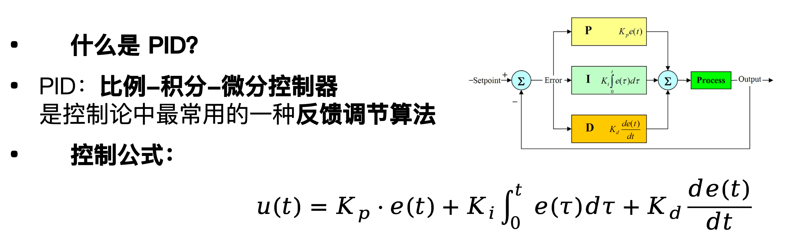
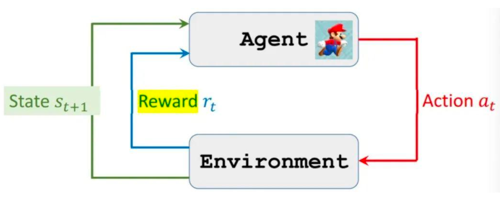
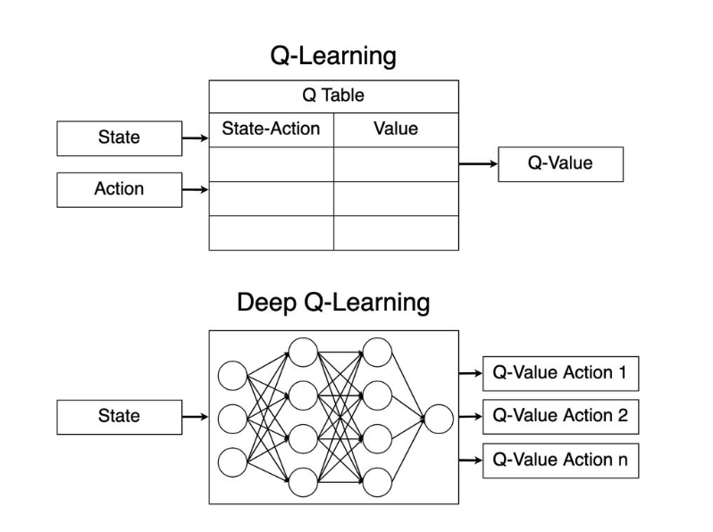

# 03. 控制论与强化学习

## 行为主义与控制论

### OSI指标

OSI：On-Schedule Indicator（进度占比指标）

$OSI = \frac{用户截止今日已产生费用}{总成本订阅费 \times \frac{d}{D}}$

| OSI 数值        | 状态判断       | 控制建议                 |
| --------------- | -------------- | ------------------------ |
| $OSI < 1$       | 使用偏保守     | 可继续使用大模型         |
| $OSI \approx 1$ | 使用刚好       | 保持当前模型策略         |
| $OSI > 1$       | 使用超前、超支 | 应降级模型，减缓成本上涨 |

###  

### 智能控费机制： PID控制器

| 模块 | 含义                  | 控制作用                                       | 智能意义   |
| ---- | --------------------- | ---------------------------------------------- | ---------- |
| P    | 比例控制 Proportional | 当前偏差越大，控制响应越强（快速调整）         | 误差过大   |
| I    | 积分控制 Integral     | 考虑历史累计误差，消除长时间偏离（稳定性增强） | 持续不消失 |
| D    | 微分控制 Derivative   | 感知误差变化趋势，抑制突发波动（提前反应）     | 快速放大   |

| 符号       | 含义                                               |
| ---------- | -------------------------------------------------- |
| u(t)       | 控制输出（决定调节幅度）                           |
| e(t)       | 当前误差：OSI 目标值 − 实际 OSI                    |
| Kp, Ki, Kd | 三个参数：分别控制反应速度、累积偏差修正、抑制振荡 |

第一代自动控费系统，局限性也很明显：

- 依赖调参，难以泛化
- PID参数无法一套通吃
- 人工调参成本高、周期长、易出错
- 智能被动响应，缺乏预测性
- 多目标平衡难：体验 vs 成本 vs 留存

## 强化学习入门

- 强化学习采用 **Actor-Environment** 架构：
-  **智能体**（Agent）与**环境**不断交互，根据**奖励**（Reward）更新策略
-  不再需要“人来告诉你该做什么”
-  只需能衡量行为好坏的**奖励信号**（reward）

强化学习依赖的不是标签而是环境反馈：

| 行为结果     | 奖励（Reward） |
| ------------ | -------------- |
| 用户体验提升 | +1             |
| 成本超预算   | -1             |
| 用户中途流失 | -5             |
| 达成留存目标 | +10            |

通用RL框架中的核心角色

| 元素   | 强化学习术语 | 推理控费中的具体含义                           |
| ------ | ------------ | ---------------------------------------------- |
| Agent  | 智能体       | 控制模型切换和分流的策略模块                   |
| State  | 当前状态     | 系统运行指标，如 OSI 值、用户负载、预算进度等  |
| Action | 动作选择     | 决策：是否切换模型？使用大模型 or 小模型       |
| Reward | 环境奖励     | 综合指标：用户体验得分 - 成本惩罚              |
| Policy | 策略函数     | 状态到动作的映射规则，即“看到什么，该如何行动” |

#### Q-learning

- 核心思想：用试错交互学习长期价值

- 从 PID 到 Q-Learning，本质上是从“误差优化”思维到“期望优化”思维的转化。

- 通过与环境反复交互，学习在每种状态下采取不同行动所能带来的长期累积收益。

- 这种收益被称为 Q 值（Quality Value），定义为：

  “在状态 s 下采取动作 a，未来总共能获得多少奖励”

- Q-Learning 不依赖人工标签或预设规则，而是完全基于环境反馈，自主修正行为偏好，持续优化策略。

三个核心状态:

- 状态（State）系统循序的上下文快照
- 动作（Action）可选的推理服务策略
- 奖励（Reward） 策略优化的方向指引

#### Q 表

Q表是一个二维表格，记录所有**状态-动作对的长期** KPI 收益估计：

Q: S × A → R

| 状态（OSI，用户等级，时间段） | A1：Qwen-32B | A2：Qwen-8B | A3：Qwen-8B-int8 |
| ----------------------------- | ------------ | ----------- | ---------------- |
| （高，高，月初）              | 8.2          | 7.4         | 3.5              |
| （中，普通，月中）            | 4.1          | 6.0         | 6.5              |
| （低，高，月末）              | 2.3          | 3.1         | 6.8              |

- 每一格 Q(s, a) 表示：在状态 s 下选择动作 a 的长期价值
- Q 表通过持续更新，逐步形成对不同情境下的“最优动作偏好”

每次与环境交互后，Q 表会更新某个“状态–动作”对的估值：

$Q(s,a) \leftarrow Q(s,a) + \alpha \left[ r + \gamma \max_{a'} Q(s',a') - Q(s,a) \right]$

---

| 项                              | 工程含义                                                     |
| ------------------------------- | ------------------------------------------------------------ |
| $Q(s,a)$                        | 当前估计：系统原本“以为”这个动作在此状态下值这么多           |
| $r$                             | 当前的即时回报：本次实际的控费结果（如体验好坏、成本高低）   |
| $\max_{a'} Q(s',a')$            | 对未来所有回报的折现估算：如果现在进入新状态，下一步最聪明的做法能带来多少回报 |
| $r + \gamma \max_{a'} Q(s',a')$ | 总回报估算：当前行为“应得的”长期回报（包含现在 + 将来）      |
| $\alpha$                        | 学习率：控制新经验对旧判断的修正幅度，值越大越“相信最近发生的事情” |
| $\gamma$                        | 折扣因子：越接近 1 越重视长期回报，越接近 0 越偏向短期反馈   |

---

为什么 Q-Learning 要用这种更新方式？

​                               $\text{总回报估算} - \text{当前估计} = \left[r + \gamma \max_{a'} Q(s',a')\right] - Q(s,a)$

这个差值作为更新信号，也叫 TD 误差（Temporal Difference Error）：

​                              $\delta = \left[r + \gamma \max_{a'} Q(s',a')\right] - Q(s,a)$

你原来以为它值 $Q(s,a)$，但现在看来它值更多（或更少），就补上这个差值 $\delta$，让“想象”逐步贴近“现实”。

#### Q-learning的缺点

| 问题             | 说明                                                         |
| ---------------- | ------------------------------------------------------------ |
| 状态空间爆炸     | 状态维度（如：用户画像、时间进度、预算进度、行为上下文）组合数量呈指数级增长 |
| Q 表不可扩展     | 传统 Q-learning 使用 Q-table 显式存储每个状态-动作对，难以扩展到百万级状态空间 |
| 无法泛化         | Q 值仅对“见过”的状态-动作对有效，不能处理“相似但没见过”的场景 |
| 无法处理连续状态 | 如时间、预算、token 密度等连续变量，无法离散化建表处理       |

### DQN = Q-learning + 深度神经网络

**从查表到函数拟合。** DQN不再依赖离散的表格，而是用一个深度神经网络来直接拟合状态到动作价值的函数。

## ReAct智能体

ReAct = Reasoning + Acting, 是一种结合大语言模型能力与工具调用的智能体架构，能够像运营人员一样进行分析、规划、执行。

| 组件               | 功能描述                                     |
| ------------------ | -------------------------------------------- |
| 🧠 自然语言理解引擎 | 理解策略需求、系统日志、用户行为和业务目标   |
| 🔧 外部工具接口     | 调用数据 API、监控平台、流控平台、告警系统等 |
| 🧩 多步推理模块     | 支持 Chain-of-Thought 推理与策略生成         |
| 📄 报告生成模块     | 生成运营分析报告、策略建议、扩容计划等       |

