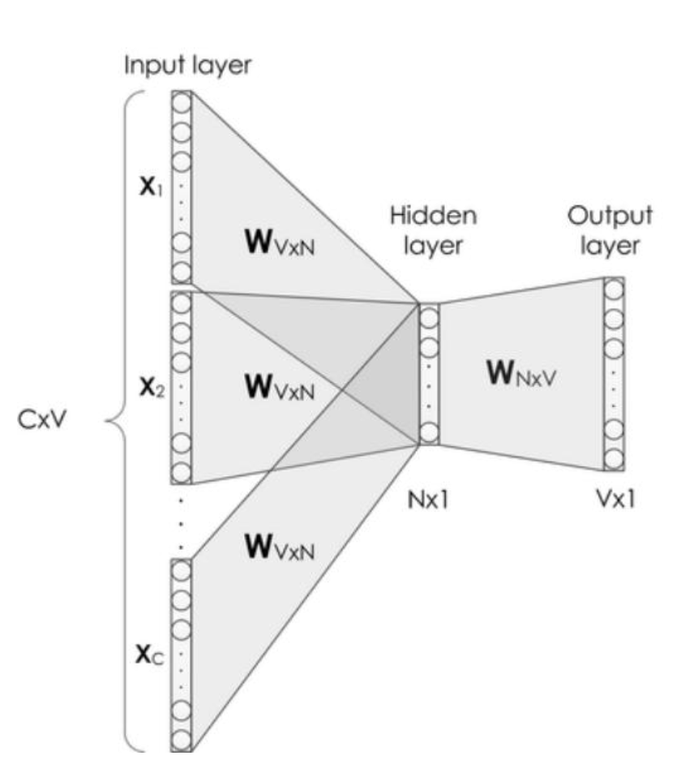
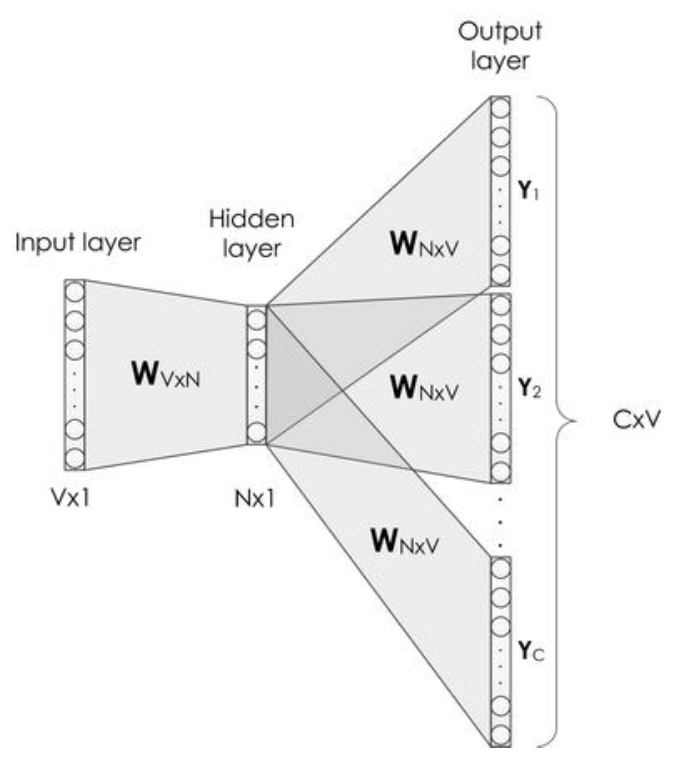
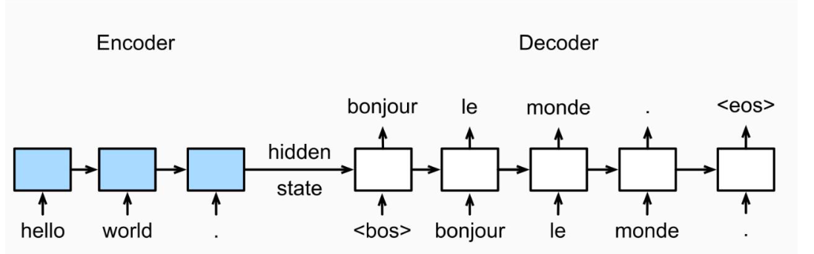
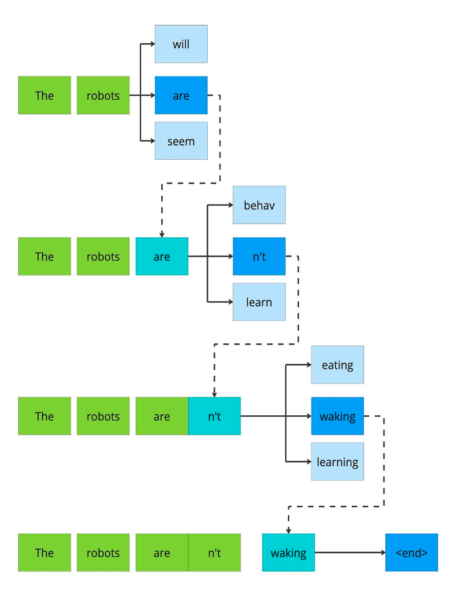
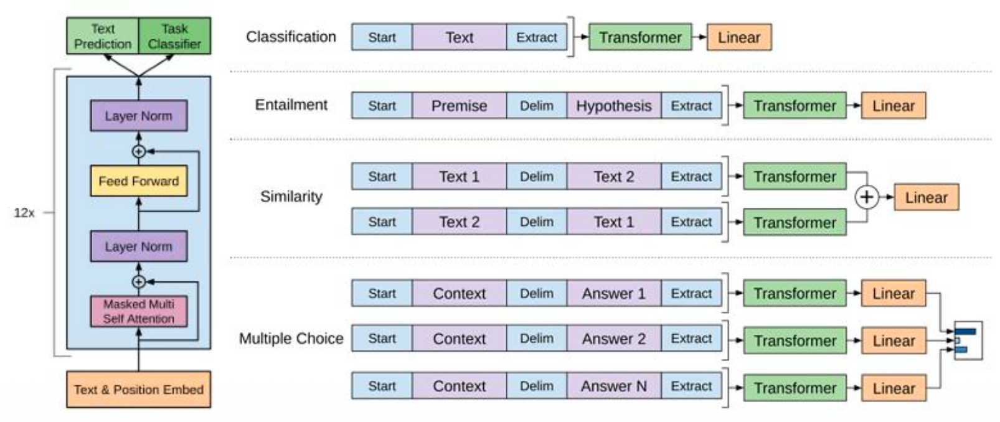
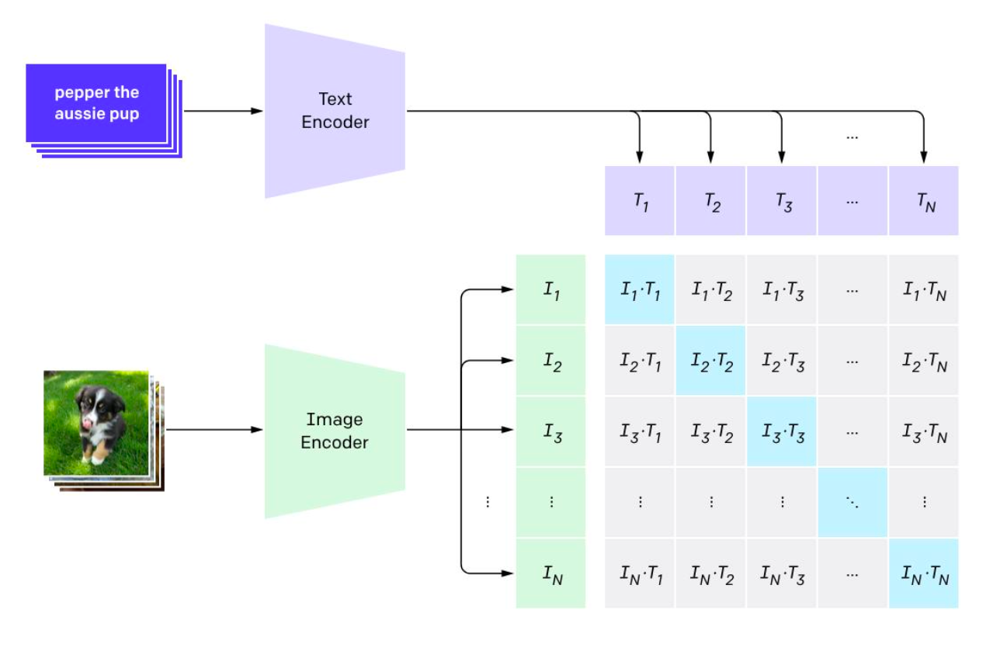
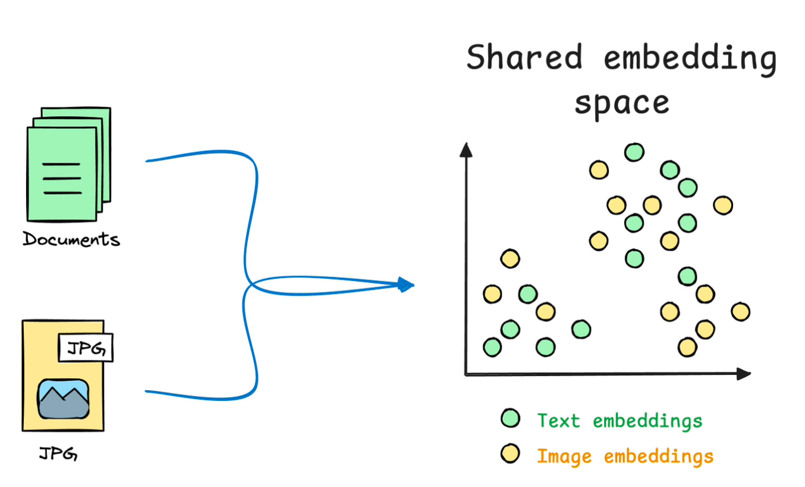

# 06 Transformer 与大模型


## 自监督学习


我们如何让机器理解世界？

- 文本：「阳光」 → [0.12, 0.85, −0.23, …]
- 图像： 猫的照片 → [0.91, −0.47, 0.33, …]
- 用户行为： 你在社交网络上的行为 → [0.27, 0.68, 0.14, …]
- 核心目标：将世界上所有事物，无论是具体的还是抽象的，都转化成计算机可以理解和计算的数学对象——向量。
- 这个过程，我们称之为 表示学习（Representation Learning）


**海量原始数据**（文本、图片、语音）触手可及，**精确标签数据**极其稀缺 & 昂贵。所以**自监督学习**就出现了，它的核心目标是**在大规模无标签数据上进行预训练（Pre-training）**，学到语言、图像、行为等的**通用表示与能力**。


#### CBOW： 根据上下文预测中心词

「看周围，猜中心」，CBOW 是“从语境总结语义”。

输入：["今天","天气","____","晴朗"]

输出：预测中心词是 "非常"




#### Skip-gram: 根据中心词预测上下文词

「看中心，猜周围」，kip-gram 是“从语义推测语境”。

• 输入：["非常"]

输出：预测周围词是 "今天","天气","晴朗”





## 注意力机制

对于CLM（Causal Language Modeling因果语言模型），为了准确预测下一词，模型必须学会：

• **语法规律**（词法、句法结构）

• **上下文理解**（主语-谓语一致、代词指代）

• **事实知识**（“巴黎”是法国首都）

• **因果逻辑**（“因为…所以…”）

• **社会常识与语用推理**（“我们一起去…”大概率不是“吵架”）


#### Encoder-Decoder 架构

 更显式的记忆建模机制：**Encoder-Decoder（Seq2Seq）架构**用于显式建构输入语境与目标输出之间的对齐映射。





**基本结构：**

 ➤ **Encoder：**

 将**输入序列**编码成一个连续的向量表示（通常为上下文表示）

-  输入：如一句话“我今天很开心”
-  输出：一个压缩后的上下文向量或一组表示（隐藏状态序列）

 

➤ **Decoder：**

 根据**编码结果生成目标结果**

-  输入：编码器输出
-  输出：任务的输出（例如，输入的语种 / 输入的翻译 /输入的情感 …）


问题：

**隐藏状态（Context Vector）容量有限**→ 在长文本中容易“遗忘”前文信息

 Decoder 在处理长输入时→ 记忆模糊、上下文稀释


### 注意力机制

**注意力机制的本质：查询-键-值（QKV）模型**。分4个步骤：

**1. 生成“搜索词”（ formulating the Query）**： 

解码器根据当前的需求（隐藏状态 h_z），生成一个查询向量 q_z，
 目的是将 h_z 投影到 q_z 才能和 k_t 在同一个语义空间，让他们的空间距离可比，
 类似于我们用 Embedding 模型投影到语义空间。


**2.并行相似度匹配（Similarity Matching）**

将这个“搜索词”向量 q_z，通过一次大规模的矩阵运算，
与“向量数据库”中所有的键向量（Key）k_t 进行并行匹配。


**3.按相关性“软排序”（"Soft" Sorting by Relevance）**

上一步得到的原始分数会通过一个 Softmax 函数，
被转换成一个概率分布（即注意力权重）。


**4.按权重提取内容（Weighted Retrieval）**

最后，根据上一步“排序”得到的权重，
对数据库中每个“键”所对应的“值”向量（Value）v_t 进行加权求和。


通俗来讲：**Attention = 从一堆信息里挑重点**


### 注意力机制到自注意机制的进化

**RNN + Attention 的局限**：

**1.顺序计算限制：**RNN 必须按时间顺序逐步生成隐藏状态 h_t，每一步都依赖前一步结果。无法并行，导致**长文本处理效率低**，计算时间随序列长度**线性增长**。

**2. 编码-解码分离：**：Encoder 负责构建“知识库”（Key + Value），Decoder 负责查询（通过 Query）。但 Encoder 与 Decoder 内部仍沿时间维度单向流动信息，限制了跨时间步的灵活信息交互与并行计算能力。


**Transformer：打破顺序依赖，实现高效并行**

利用自注意力机制（Self-Attention）一次性计算序列中所有位置的表示，无需等待前一步计算，极大提升了训练与推理效率。


#### Encoder 自注意力（Self-Attention）

每个位置的表示向量同时作为 Query、Key 和 Value。通过上下文中其他位置的内容信息，构建我在全局中的一个知识条目，包括：

• 其他输入中，谁的内容与我最相关？

• 我在整个输入内容全局中的角色定位是什么？


#### ️ Decoder 自注意力

Decoder 也使用自注意力，目的是看一下前面已经生成了什么。在 Decoder 的每一层，自注意力之后，增加一个跨注意力层，**Decoder 的 Query 向量**用于查询 Encoder 输出的 Key-Value对，这是一个外部检索过程，Decoder 通过跨模块查询获取编码后的上下文信息，支持生成更准确的输出。




### 如果只保留Decoder会怎么样？

**核心转变：** 系统不再受知识库 (Encoder) 的直接约束。

**行为：**内容完全依赖于“前缀（Prompt）”，并以此为起点，在自身内部知识的引导下，不断地、连贯地生发与成长。


**这正是 GPT-1 的基本逻辑。**通过**极大规模的参数**和**海量的预训练**，让模型仅依靠这两大“内部约束”成满足前缀要求的高质量内容。这一思想直接开启了现代大语言模型的时代。


**同一个预训练好的模型**，几乎不做任何结构改动，只需在不同下游任务的少量标注数据上进行微调（Fine-tuning），就能取得当时顶级（State-of-the-art）的效果。


不同任务 = 不同输入拼接方式:





## 多模态大模型


### 图文对比学习（Contrastive Learning）

语义对齐 = 让图片编码器 & 文本编码器输出到 **同一个向量空间**，并且

🔹 匹配的图文 → 距离近
 🔹 不匹配的图文 → 距离远





##### 🧩 第一步：把图片 & 文本分别编码成向量

图片 → Image Encoder（CNN / ViT）
 文本 → Text Encoder（Transformer

得到两个向量：

```
image ->  zi
text  ->  tj
```

二者维度相同，例如：

```
zi, tj ∈ R^512
```

这是“进入同一语义空间”的关键


##### ✍️ 第二步：在一个 batch 内两两做相似度矩阵

论文中常用 **余弦相似度**


|      | T1    | T2    | T3    | …    | TN   |
| ---- | ----- | ----- | ----- | ---- | ---- |
| I1   | I1·T1 | I1·T2 | …     |      |      |
| I2   | I2·T1 | I2·T2 | …     |      |      |
| …    | …     | …     | …     |      |      |
| IN   | IN·T1 | …     | IN·TN |      |      |

其中：

- 对角线 = 正样本（真实匹配）
- 其他 = 负样本


##### 🎯 第三步：优化目标（对比学习损失）

核心目标：

✔ 拉近匹配图文距离
 ✔ 推远不匹配图文距离

使用 **InfoNCE / Contrastive Loss**


分两部分：

###### 🔹 图 → 文（image-to-text）

```
每张图片 只希望匹配到它对应的文本
```

###### 🔹 文 → 图（text-to-image）

```
每句文本 只希望匹配到它对应的图片
```

最终 loss：

```
L = L(i→t) + L(t→i)
```

这样模型会同时学到：

- 看图片 → 找到描述它的文本
- 看文本 → 找到对应图片


