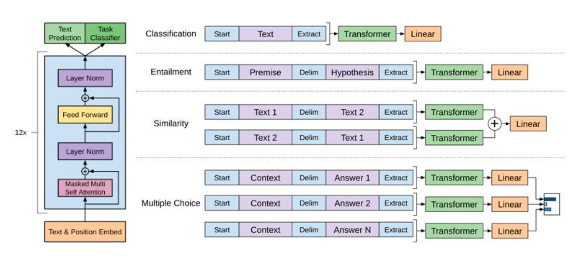
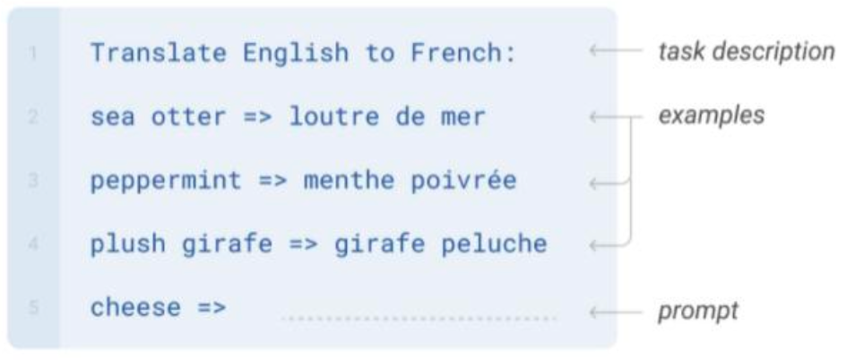
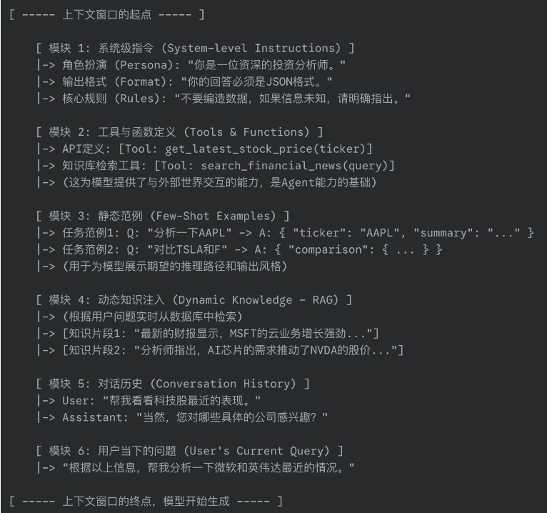
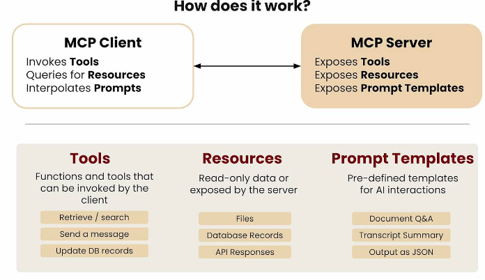
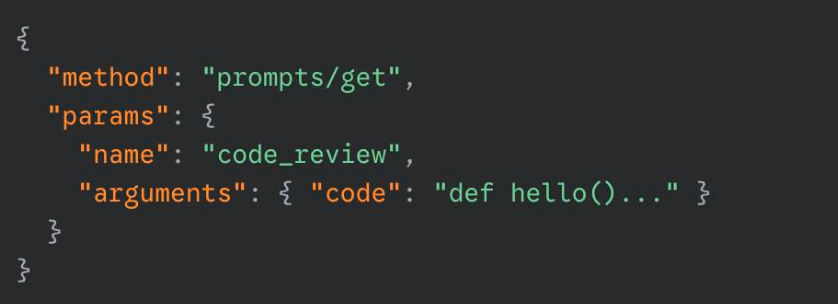
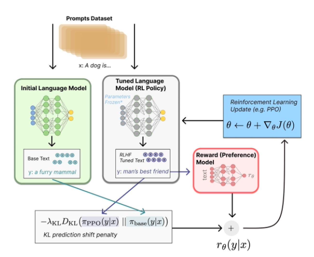
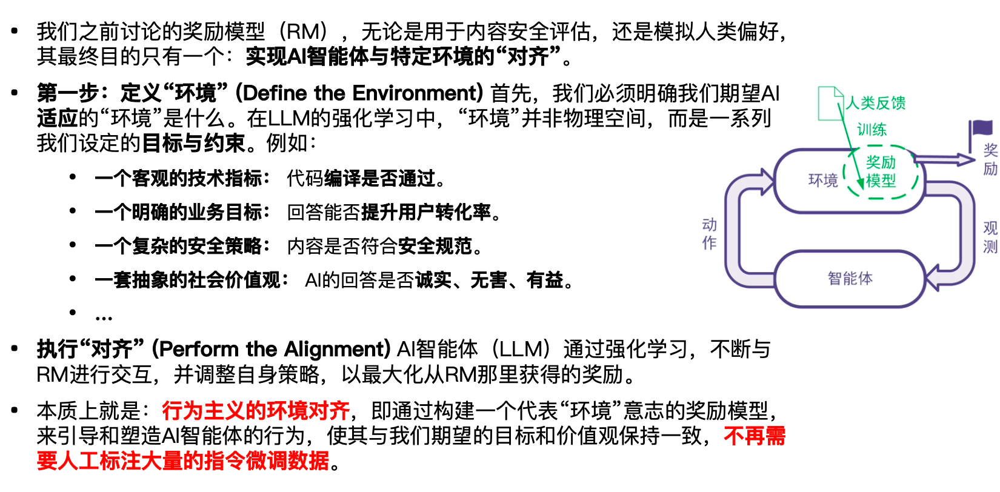

# 07 进阶LLM

 

## LLM监督微调

LLM 的指令耿穗能力是后训练阶段设计出来的：


| 方法     | 分类头微调（传统迁移学习）                                   | 少样本提示（Few-Shot Prompting）                             | 零样本提示（Zero-Shot Prompting）                            |
| -------- | ------------------------------------------------------------ | ------------------------------------------------------------ | ------------------------------------------------------------ |
| 服务角色 | 工程师（The Engineer）                                       | 工程师（The Engineer）                                       | 用户（The User）                                             |
| 核心动作 | “改造”：为模型加装一个任务头，通过专门数据进行训练，将其打造成特定领域的判断专家。 | “举例”：在提示中提供一两个完整范例，让模型快速“领悟”任务模式，成为一个灵活解题者。 | “对话”：直接下达指令，通过巧妙的提示词（Prompt）引导模型利用其已有知识解决问题。 |
| 核心目标 | 目标：追求单一任务的极致性能。<br> 权衡：成本高，泛化能力弱。 | 目标：通过少量示例精确引导，提升即时任务的准确率。<br> 权衡：需要设计有效范例。 | 目标：即时、零成本地解决多样化问题。<br> 权衡：对模型自身能力依赖强。 |
| 经典案例 | GPT-1 用于文本分类                                           | GPT-3、FLAN                                                  | GPT-3.5 / GPT-4 的开箱即用                                   |


### 分类头微调（传统迁移学习）

过程：高效训练 (Efficient Training)

-  **“冻住”模型主体，仅“激活”并训练头部的参数，极大节省计算资源。**

  

 最佳应用 (Best For):

-  需要明确“是/否”或“属于哪一类”的**判别类任务**。
-  这是一种高效、快速的适配手段，它将LLM强大的通用语义能力，像搭乐高一样精准迁移到特定的判断任务上。




##### 左边是「冻结的 Transformer 主体」

- 一层层 Self-Attention / FFN
- **不训练**
- 负责通用语义理解

顶层接：

- Task Classifier（线性层）
- Text Prediction Head


##### 右边是「不同任务的输入适配方式」

| 任务类型        | 输入结构               | 输出方式             |
| --------------- | ---------------------- | -------------------- |
| Classification  | Start + Text + Extract | Transformer → Linear |
| Entailment      | Premise + Hypothesis   | Linear 分类          |
| Similarity      | Text1 + Text2          | 语义向量 + 线性      |
| Multiple Choice | Context + Answer1..N   | 选择概率             |


### Few-Shot Prompting 少样本训练

Language Models are Few-Shot Learners（GPT-3）

将模型微调与推理的三大要素，系统性地“编码”到语言模型原用于生成的**输入前缀 (Input** **Prefix)** 中。我们可以将这个输入前缀的构建过程，理解为一个清晰的公式：


输入前缀（Prompt）的结构
**Prompt = 任务描述 + 少量样本 + 用户具体输入**

将以下英文短语翻译成中文，并保持简洁。（任务描述）

英文：sea otter，  中文：海獭  （少样本示例）

英文：A leopard can’t change its spots. （用户具体输入）

中文：？


示例输出：

> 江山易改，本性难移





### Zero-Shot Prompting 零样本提示

- 交互范式的转变：从“模板编程”到“自由提问”
- 这一转变的基石，源于 OpenAI 在 InstructGPT 等早期工作中，对**监督微调（SFT）阶段**的精心设计。


#### 第一步：采集真实的、多样化的用户指令 (Prompts)

- **来源 (Source):** 并非凭空创造或使用现有学术数据集，而是直接从早期 **OpenAI API** 的真实用户使用场景中进行采样。
-  **价值 (Value):** 这保证了指令的**多样性**和**实用性**，覆盖了从“写一首关于秋天的诗”这样的开放式生成，到“解释这段代码的功能”这类封闭式问答的广泛需求。


#### **第二步：雇佣人类专家，撰写高质量的示范回答 (Demonstrations)**

- **执行者 (Executors):** 雇佣并培训了一批专业的标注人员（Labelers）。
-  **核心任务 (Core Task):** 要求标注人员针对采集到的用户指令，**像一位尽职尽责的助手一样，精心撰写**出他们认为最理想的、最有帮助的回答。
-  **关键原则 (Key Principle):** 追求的是**意图对齐 (Intent Alignment)**，而不仅仅是事实正确。回答需要真正理解并解决用户的潜在问题，而不仅仅是给出字面答案。


#### **第三步：用“人工范例”进行监督微调**

- **数据格式 (Data Format):** 将上一步收集到的 {用户真实指令, 标注员示范回答} 数据对，作为“黄金标准”的训练数据。
-  **训练过程 (Training Process):** 在强大的预训练模型（如 GPT-3）的基础上，用这些高质量、纯人工的对话数据进行微调。模型的目标，就是学习模仿这些专家级的回答。


#### 第四步：**最终成果与机制解析 (The Result & Mechanism):**

- 通过这个SFT过程，模型系统性地学习了如何**理解并遵循“非结构化”的自然语言指令**。它的能
- 力不再局限于识别 [任务-样本-输入] 这样的刻板模板，而是能够直接从用户的日常提问中**推断真实意图**。
- 这正是后来零样本（Zero-Shot）强大能力的基石，也是让大模型能够真正走向公众、提供实用价值的关键一步。


### **上下文工程 (Context Engineering)**

相比于“提示词工程 (Prompt Engineering)”，上下文工程 (Context Engineering)”这个术语富有更多内涵。我们思考的不再是孤立的提示语模板，而是如何将模的

“上下文窗口 (Context Window)”看作一个可编程的、结构化的逻辑空间。一个精心设计的“上下文”不再是一段简单的文本，而是一个由多个逻辑模块动态组合而成的“超级提示词”。





- **我们身份的演进：** 我们的工作，已不再是那个反复打磨字句的“提示词工匠”,我们正在成为，那个设计信息流、搭建系统能力的“上下文架构师”。
- **新角色的核心任务 (The Core Task of the New Role):**我们的日常，将围绕“**如何智能地获取、筛选、并动态组织**”前面提到的那些上下文模块（人设、任务、知识、工具…）来设计和构建智能系统。


这时，我们遇到了一个根本性的问题：大语言模型本身，作为连接主义的产物，擅长的是**理解和生成**，它无法**主动、可靠地从外部世界获取**这些结构化的上下文。


 它能读懂我们递给它的“书”（上下文），但它自己不会“去图书馆找书”， 这，必须依赖符号主义（Symbolism）的经典利器：**专家系统 (Expert Systems)**。


在现代的LLM应用架构中，专家系统扮演着“**上下文调度中心**”或“**首席信息官**”的角色。它的职责就是：

-  **连接**外部世界（数据库、API、知识库）。
-  根据预设的**规则和逻辑**，精准地**获取、筛选并结构化**所需的上下文。
-  最终，将这个完美的“上下文包裹”，递交给LLM进行处理。


## LLM与专家系统


**1. LLM 的核心身份：被动的“上下文消费者”**

- **角色定位：** 连接主义的产物，精通“理解”而非“执行”。


**2. 能力边界：**

- **擅长：** 理解、模仿和续写**给定的**上下文信息。
- **缺失：**
  - **主动性：** 无法自行从外部世界（数据库、API）获取信息。
  - **可靠性：** 无法确保严格遵循复杂的指令结构。


为解决上述问题，一个旨在**用符号主义为连接主义建立秩序**的开放标准 **MCP** 应运而生。


**模型上下文协议” (Model** **Context** **Protocol，MCP)**

- **定位:** 一个开放的、可标准化的双向连接协议。
-  **使命:** 统一LLM 应用与外部世界的交互方式，正如 USB-C 统一了所有电子设备的物理接口。


#### 良好的上下文工程需要哪些要素？


**1. Prompt 提示词（逻辑分区）**

- **角色：** 思考的“框架”和“骨架”。（强调**结构性**）
- **功能：** 定义了任务的逻辑分区，如人设、任务指令、历史记录等。这是确保 AI 理解你意图的关键。


**2. Tools 工具（行动空间）**

- **角色：** AI 与外部世界交互的“手脚”。（强调**交互性**）
- **功能：** 允许 AI 调用外部 API 或执行特定动作，例如发送邮件或获取实时数据。


**3. Resources 资源（实时状态）**

- **角色：** 挂载数据和文件的“神经”。（强调**同步性**）
- **功能：** 提供 AI 所需的外部数据，包括代码文件、数据库、文档等， 确保 AI 基于最新、最全的信息进行判断。




#### Prompt 要素：上下文的“逻辑分区”


**如何“发现(List)”和“获取(Get)”一个Prompt？**

##### （1）发现（prompts/list）

**目标：** 客户端向服务器请求，获取所有可用的“快捷指令”列表。

**交互流程（简化版）：**

- **客户端发送请求：**
   method: `"prompts/list"`
- **服务器返回列表：**
   （返回可用提示词 / 快捷指令清单）


##### （2） **获取并执行 (prompts/get)**

**目标:** 用户选择了 code_review 指令并提供了参数（代码），客户端据此向服务器请求构建好的、最终给LLM的上下文。

- **客户端发送请求 (已填充参数):**





#### Tool 要素： 赋予AI行动的能力 

Tools 是MCP协议提供的一种**标准化方式**，让应用（服务器）能够向 AI 暴露一系列可供其**自主调用**的外部功能。AI在理解用户任务后，会自行打开工具箱，分析哪个工具最适用（如“天气查询器”、“计算器”、“数据库接口”），然后拿起并使用它。


**核心价值：** 让 AI 从一个被动的“知识问答者”，进化为一个主动的“世界交互者”，能够为了解决问题而采取实际行动。


**1. 用户提出需求**

- “我应该带伞去东京吗？”


**2. LLM 推理并决策**

- “要回答这个问题，我需要知道东京现在是否在下雨。我应该使用 get_weather 工具。”


**3. 系统请求人类批准（Human in the Loop）**

- “AI 正在尝试执行以下操作：调用工具：get_weather(location: 'Tokyo')”【允许】 【拒绝】

  

**4. 用户授权后，系统执行工具**

- 用户点击【允许】后，工具被安全调用。


**AI 如何理解工具？靠标准化的“使用说明书”**

- AI 之所以能够准确地知道如何使用一个工具，是因为每个工具都提供了一份机器可读的、名为 **inputSchema** 的“说明书”。


**工具说明卡：天气查询器**

- **名称（name）：** get_weather
- **标题（title）：** 天气信息提供者
- **描述（description）：** 获取一个地点的当前天气信息
- **参数（inputSchema）：**
  - **location**
    - 类型：string（文本）
    - 描述：城市名或邮政编码
    - 是否必需：是


####  Resources 要素： 为AI挂载一个文件系统


**超越静态读取：通过“订阅”实现世界与 AI 的实时同步**

- Resources 最具革命性的能力，不是简单的“读取”文件，而是可以“订阅”它。


##### **1. 传统的“读取”模式（PULL）**

- **AI：** “我想读取一下 main.rs 文件的内容。”
- **系统：**（执行 resources/read）返回文件内容。（如果文件在这之后被修改，AI对此一无所知）


##### **2. MCP 的“订阅”模式（PUSH）**

- **AI：** “请订阅 main.rs 文件，它有任何变化就告诉我。”（执行 resources/subscribe）
- **……几分钟后，开发者修改并保存了 main.rs……**
- **系统：**（服务器主动发送 notifications/resources/updated 通知）
- **AI：**“我感知到 main.rs 已更新，我将基于最新版重新进行分析。”


##### **重大意义**

- 这让 AI 从一个需要不断“轮询”世界的“提问者”，
   **进化为一个能够实时“感知”世界变化的“观察者”。**


#### **端到端实例：从用户输入到精准响应的完整旅程**

原生的、未经处理的用户请求：

> “分析一下谷歌最近的财报”


##### 第一步：系统通过 MCP 协议，进行模板的“发现与匹配”

###### **意图识别**

- 系统首先分析用户输入的意图。

###### **模板发现（Discovery）**

- 系统通过 MCP 协议，向“Prompt 模板库”发送一个 `prompts/list` 请求， 获取所有可用的模板列表及其描述。
- **返回列表（简化版）**

```bash
[
  { "name": "simple_chat", "description": "通用聊天" },
  { "name": "financial_analysis_v3", "description": "对公司进行深入的财务分析..." },
  { "name": "code_generation", "description": "生成代码" }
]
```


###### **智能匹配（Matching）**

- 系统将用户意图 `financial_analysis` 与返回的模板列表进行比对。
- **结果：** 发现 `financial_analysis_v3` 是最佳匹配。


###### **输出（OUTPUT）：一个被选中的、带有“占位符”的上下文框架（逻辑分区）**

- **【人设】** 你是一位顶级的金融分析师，风格严谨、注重数据。
- **【用户】** `{resource: identity_info}`
- **【历史】** `{resource: conversation_history}`
- **【工具】** 可用的工具列表：`{tools: tool_list}`
- **【任务】** 根据以上信息，完成任务：`{user_intent}`


##### 第二步：系统通过 MCP 协议，进行模板的“发现与匹配”

- 在这一步，系统的核心任务是读取已选中的上下文模板，并生成一份具体的、可执行的**“数据与工具采购清单”**。
- 系统会扫描模板中的每一个占位符。由于占位符采用了**显式类型**（如 `resource:` 或 `tools:`），系统能够精准识别其类型和具体名称。


###### **输出（OUTPUT）：一份具体、可执行的“需求清单”**

**资源需求（Resources）**

- `identity_info`：获取用户的身份和画像信息。
- `conversation_history`：获取当前会话的历史记录。

**工具需求（Tools）**

- `tool_list`：获取与用户意图（财报分析）相关的工具列表。


##### **第三步：获取资源（由 MCP 客户端执行）**

- 在这一步，作为“上下文编排器”的 **MCP 客户端**，将执行“需求清单”， 向不同的 **MCP 服务器** 发起一系列标准化请求，采集所有需要的“原材料”。


**向用户服务（User Service）**

- 客户端发送 `resources/read` 请求，以获取 `identity_info` 资源。

**向会话服务（Session Service）**

- 客户端发送 `resources/read` 请求，以获取 `conversation_history` 资源。

**向工具服务（Tool Service）**

- 客户端发送 `tools/list` 请求，以获取所有可用工具并进行筛选。

**从初始输入**

- 客户端处理用户的原始输入，提取 `user_intent` 的核心文本。


**统一协议带来的架构优势**

通过统一的 MCP 协议：

- 客户端无需关心每个后端服务的具体实现，
- 它只需通过标准化的方式“索要”数据，
- 而各个服务器则负责“提供”数据。

这实现了系统的**高度解耦与模块化**。


##### **第四步：构建上下文，生成“超级提示词”**

在这一步，系统的核心任务是将第三步获取到的所有“原材料”，精准地“注入”到第一步选定的“模板”中，最终生成一个信息完整、可直接交付给 LLM 的“超级提示词”。

**1.模板框架**

```
【用户】
{resource: identity_info}

…

【任务】
…{user_intent}

```


**2. 真实数据包**

- **identity_info：**

```
{ "id": 789, "risk_profile": "稳健型", ... }
```

- **conversation_history：**

```
[ ... ]
```

- **tool_list：**

```
[{ "name": "get_stock_price", ... }]
```

- **user_intent：**

```
“分析谷歌的最新财报”
```


**端到端实例：从用户输入到精准响应的完整旅程（最终呈现）**


**→ 一个高度个性化、情境感极强的“超级提示词”**

- ```
  - **【人设】**
     你是一位顶级的金融分析师，风格严谨、注重数据，给出审慎的投资建议。
  - **【用户】**
     当前用户信息：客户ID 789，风险偏好：稳健型，投资组合中持有 100 股 GOOGL。
  - **【历史】**
     空白
  - **【工具】**
    - `get_stock_price(ticker: string)`：获取最新股价的工具。
  - **【任务】**
     根据以上信息，完成任务：
     **分析谷歌（Alphabet）的最新财报。**
  ```


##### 第五步： 执行上下文

调用 LLM 执行良好逻辑分区构建的上下文提示。


(1)第一步：基于模板，重建上下文

在获得工具调用结果后，系统会再次基于 Prompt 模板，
构建一个更新后的、信息更完整的上下文。

更新后的上下文示例

```
【人设】
你是一位顶级的金融分析师，风格严谨、注重数据，给出审慎的投资建议。

【用户】
当前用户信息：客户 ID：789
风险偏好：稳健型
当前持仓：100 股 GOOGL

【历史】
Action: get_stock_price[GOOGL] Observation: $185.50

【工具】
get_stock_price(ticker: string)：获取最新股价的工具。

【任务】
根据以上信息，完成任务：分析谷歌（Alphabet）的最新财报。
```


第二轮输出（Final Answer）

```
好的，John。根据谷歌最新的财报，其核心广告业务保持稳健，
云业务同比增长 25%，表现明显强于市场预期。

综合考虑以下因素：

当前股价：$185.50
您的风险偏好：稳健型
当前持仓：100 股

我的建议是：持有并观望。
财报质量良好，但基于您的风险偏好，不建议在当前位置立即加仓。

可以设置一个提醒：
若股价回调至 $175 附近，再考虑逐步增加头寸。
```


## LLM 与智能代理

**核心思想：让模型在“试错”中学会如何行动**

与直接告诉模型“正确答案”的监督学习不同，强化学习的核心是设定一个**目标（奖励）**，然后让模型通过与**环境**的无数次交互，自主学习如何采取行动才能最大化奖励。


**LLM 的强化学习循环 (The RL Loop for LLMs)**

在这个循环中，LLM扮演了“智能体”（Agent）的角色。

- **行动 (Action):** LLM (智能体) 生成一段文本（例如一个回答、一个故事、一段代码）。
- **奖励 (Reward):** 这个分数就是**奖励信号**。高分代表“好”的行为，低分代表“坏”的。
- **学习 (Learning):** 使用 PPO 等强化学习算法，根据奖励信号，微调LLM的生成策略，使其未来更有可能产生能获得高分的“行动”。


**在“试错”中寻找最优策略：**与直接给予“正确答案”的监督学习不同，强化学习的核心是设定一个目标（奖励），然后让模型在与环境的无数次交互中，自主探索最大化奖励的行为模式。


#### 上线后的LLM如何继续学习

```
                                          智能体（Agent）— LLM
                                                ⬇
                                          行动（Action）
                                          LLM 生成一段回答

                                                ⬇
                                          环境（Environment）— 评估系统
                                          对回答进行评估，并给出分数

                                                ⬇
                                          奖励（Reward）
                                          分数作为奖励信号

                                                ⬇
                                          学习（Learning）
                                          调整生成策略，使其更倾向于获得高分的行动
```


 **关键问题：“奖励”从何而来？**

“环境”的设计，直接决定了AI优化的方向。它可以是任何能提供清晰、量化反馈的系统。


**基于模型的环境** 

-  **目标:** 生成**没有内容安全风险**的文本。
-  **奖励模型:** 一个安全风险评估服务，它会对生成的文本进行打分。
-  **奖励信号:** 安全风险分数（分数为 0-1，分数越接近0代表越安全），奖励与低风险分数正相关。
-  **特点:** **适用于主观、复杂且难以用简单规则定义的约束。**


```
                                        智能体（Agent）— LLM
                                               ⬇
                                        行动（Action）
                                        LLM 生成一段文本

                                               ⬇
                                        环境（Environment）— 安全风险评估服务（RM）
                                        对文本进行评估，输出一个介于 0–1 的风险分数

                                                ⬇
                                        奖励（Reward）
                                        奖励 = 1 − 风险分数
                                        风险分数越低，奖励越高
                                        高奖励代表“好”的行为

                                              ⬇
                                        学习（Learning）
                                        根据奖励信号，微调 LLM 的生成策略，
                                        使其在未来更有可能生成 高奖励（低风险） 的“行动”。
```


一个简单的例子：


> ###### **场景描述**
>
> - LLM 生成了一段**可能包含敏感词汇**的回答。
>
> 
>
> ###### **风险评估**
>
> - **安全风险评估服务（RM）** 对该回答进行打分，
>    判断其风险较高，给出 **0.8** 的风险分数。
>
> 
>
> ###### **奖励计算**
>
> - 系统计算奖励：
>    **Reward = 1 − Risk = 1 − 0.8 = 0.2**
> - 这是一个**非常低的奖励信号**。
>
> 
>
> ###### **策略更新（学习）**
>
> - **强化学习算法（如 PPO）** 接收到这一负面反馈，
>    立即对 LLM 的生成策略进行调整。
> - 结果是：
>    在未来遇到相似情境时，**生成包含该类敏感词汇回答的概率将显著下降**。
>
> 
>
> ###### **核心价值：跳出“正确答案”的框架**
>
> - 通过这一闭环：
>   - LLM 不再依赖一个庞大、人工标注的“安全回答数据集”
>   - 而是依赖一个**能够客观评估行为好坏的奖励模型（RM）**
> - 模型可以通过**不断试错 + 奖励反馈**：
>   - 自主学习
>   - 逐步内化那些**难以用明确规则描述的“内容安全”约束**


#### RLHF 详解： 大模型的价值对齐




##### **基于奖励模型（Reard Model, RM）的强化学习流程**

###### **总体目标**

- 根据 **RM 的打分**，持续微调大语言模型，使其生成的回答能够获得更高的**“人类偏好”**分数。


###### **基本流程**

- **大语言模型（Agent）：**
   接收一个用户输入的**指令**。
- **生成回答（Action）：**
   大语言模型根据指令生成一个回答。
- **RM 打分（Reward）：**
   将 **（指令，回答）** 对输入到奖励模型（RM）中，得到一个评分（Reward）。


##### **两种典型情况**

###### **情况 A：高奖励（High Reward）**

- **动作：** 强化（Reinforce）

- **描述：**
   通过梯度更新，识别并**加强**生成该“好”回答的内部决策路径（即一系列词的选择）。

  结果是：
   模型在未来更有可能沿着相同或相似的路径，生成**同类型的高分回答**。


###### **情况 B：低奖励（Low Reward）**

- **动作：** 削弱（Penalize）

- **描述：**
   通过梯度更新，**削弱**导致该“坏”回答的决策路径。

  结果是：
   模型在未来会主动**规避这种路径**，从而降低生成低分回答的概率。



