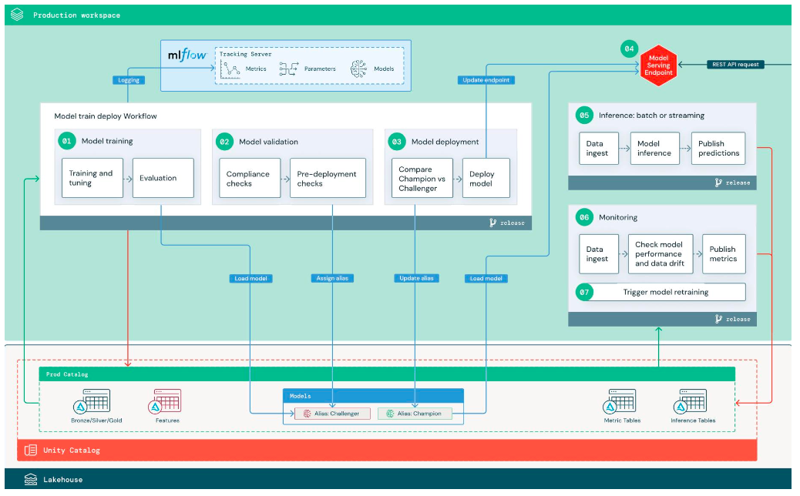
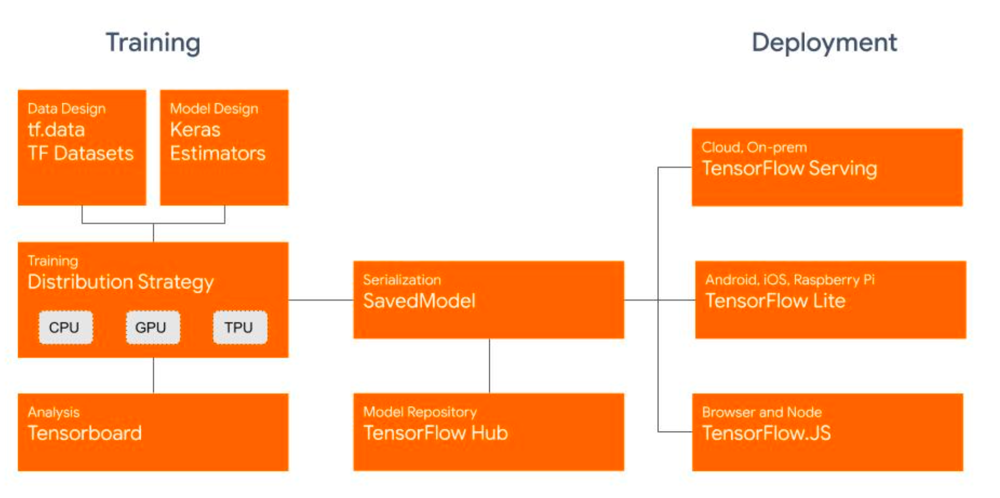
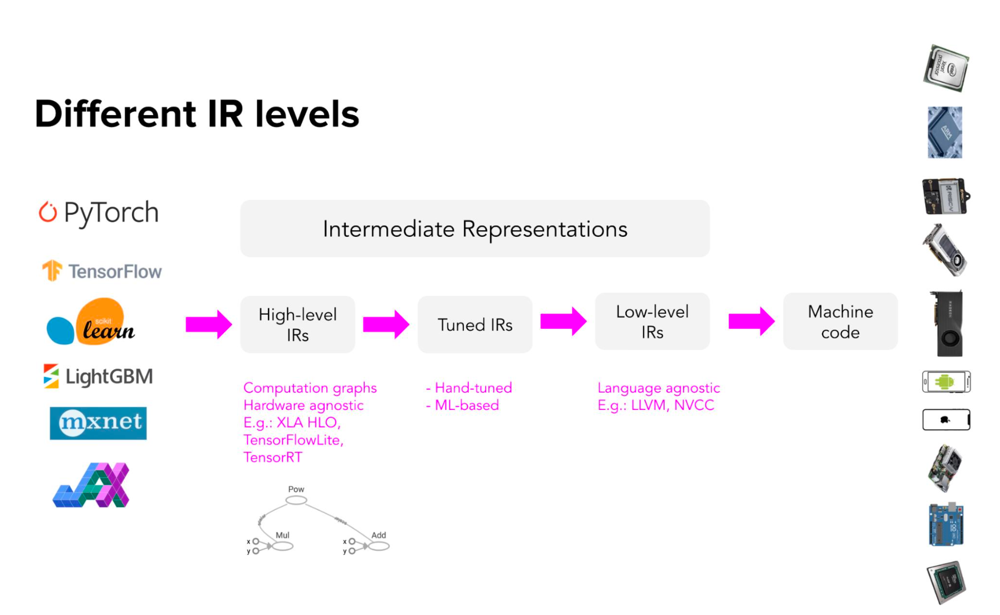
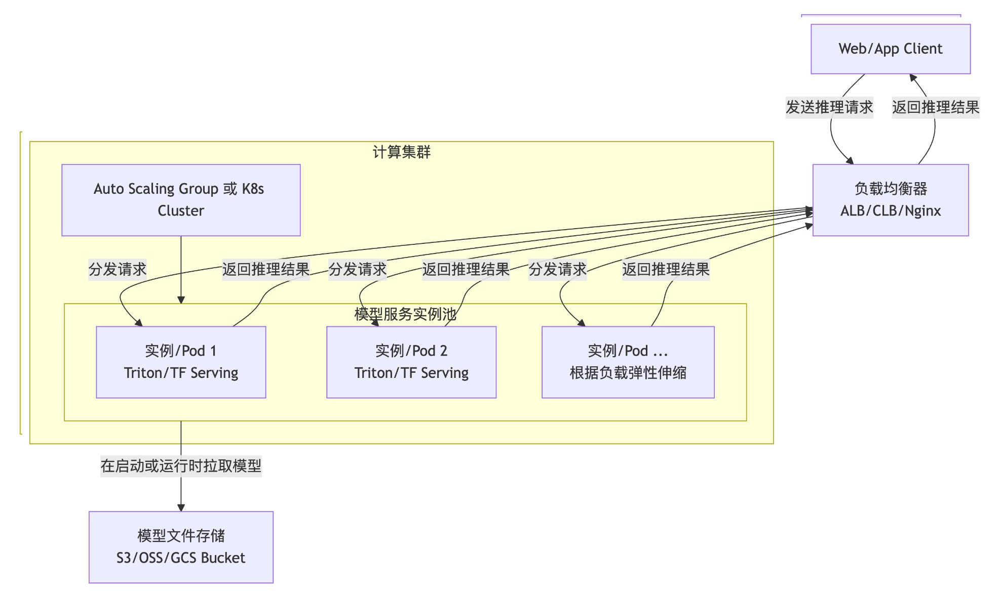
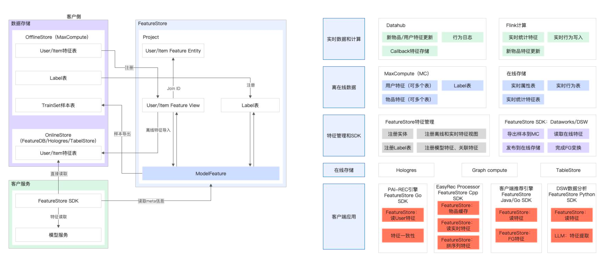
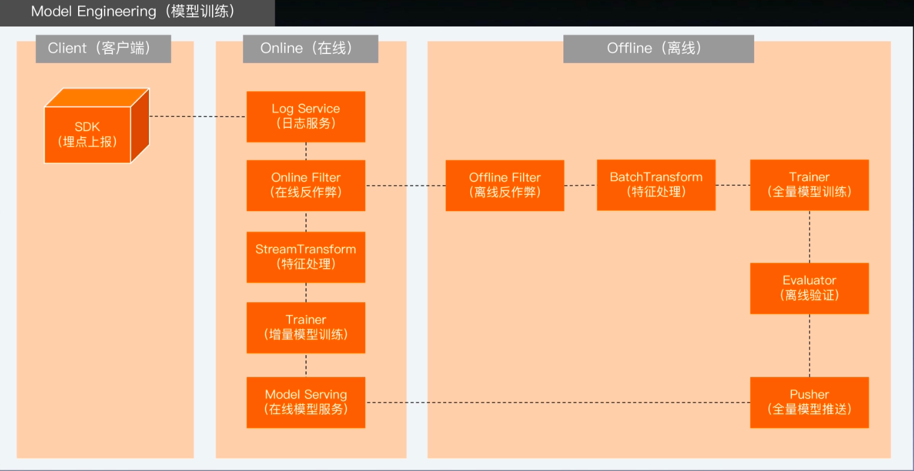
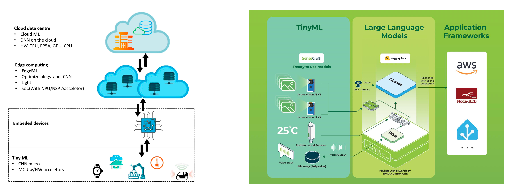

# 08 模型的部署与推理优化

 我们完成了一个出色的 CTR 预估模型，验证集上的 AUC 指标非常漂亮。训练好的模型文件（.pkl, .h5, .pth）也已妥善保存在本地。

**然而，新的问题接踵而至：**

 **规模化挑战**

 如何让我们精心训练的模型，去支撑公司每天**数亿次**的广告请求？

 **性能挑战**

 当“双十一”的流量洪峰到来时，我们这台开发机能撑得住吗？系统的响应速度会是多少毫秒？

 **协作挑战**

 如何让业务后台的同事轻松调用它，而无需在他的服务器上重复安装一遍我们复杂的 Python 环境和依赖库？ 这，就是我们今天要解决的核心命题：**模型部署 (Model Deployment)**

## 模型训练和模型部署的区别

| 特征         | 模型训练（Training）                                     | 模型部署（Deployment）                                       |
| ------------ | -------------------------------------------------------- | ------------------------------------------------------------ |
| **核心目标** | 追求极致精度（Accuracy、AUC、F1-Score 等离线指标）       | 追求综合效能（低延迟 Latency、高吞吐 Throughput、稳定性 Stability、资源效率） |
| **工作环境** | 静态、可控（Jupyter、实验室服务器、固定的数据集）        | 动态、复杂（生产环境，面对真实、不可控的用户请求）           |
| **最终产出** | 模型权重文件（.pth、.h5、.pb 等静态文件）                | 可扩展、高可用的在线服务（一个持续运行、可被调用的系统）     |
| **核心比喻** | 在研发中心，倾尽全力打造一台性能炸裂的 F1 赛车发动机原型 | 将发动机装进一台量产车，确保它能在各种路况下（高并发、网络抖动）稳定、安全、经济地长途奔袭 |

#### 第一站： 云端计算 - 集中式智能

**核心模式：** **集中算力 × 海量数据**。数据与计算高度集中在云端数据中心。

####  **第二站：边缘计算 —— 近场实时智能**

 **演进驱动力：** 云计算在**①网络延迟、②带宽成本、③数据隐私**这三方面的固有瓶颈。

**核心模式：** **就近处理 × 实时响应**。计算能力下沉到靠近数据源的物理网关或设备上。

**典型应用：**

- 工厂流水线的**实时瑕疵检测**
- 智慧交通路口的**车辆检测与信号控制**
- 大型商场的**客流实时分析**

#### **第三站：具身智能 —— 泛在自主智能**

• **演进驱动力：** 在**①断网可用、②极致实时、③高度自主**的场景下，依赖网络的边缘计算仍无法满足需求。

**核心模式：** **终端自主 × 物理交互**。智能完全嵌入终端设备，直接感知并与物理世界互动。

**典型应用：**

- **自动驾驶汽车**的端到端控制模型
-  **自主导航机器人**（如扫地机器人、仓库机器人）
-  智能手机的**本地 AI 功能**（如人脸解锁、实时翻译）

### **部署优化的“铁三角”：三大核心性能指标**

 **进入生产环境，模型的评估维度不再仅仅是 AUC。服务的快、多、省，成为决定成败的关键。**

**1. 延迟 (Latency): **

**定义：** 处理**单个**预测请求所需的时间，通常以毫秒 (ms) 计。

 **为何重要：** 直接决定终端用户的实时体验，是交互类应用的生命线。

 **关键场景：**

-  **自动驾驶：** 毫秒级的延迟差异，是安全与事故的区别。
-  **实时语音识别：** 过高延迟会让对话体验支离破碎。
-  **在线搜索推荐：** 用户几乎没有耐心等待一个缓慢的搜索结果。

**2. 吞吐量 (Throughput):**

 **定义：** **单位时间内**系统能够成功处理的请求总数，常用 QPS (Queries Per Second) 衡量。

 **为何重要：** 衡量系统的总处理能力，直接关系到服务容量和单位成本。

 **关键场景：**

-  **电商大促：** “双十一”期间，推荐系统需应对每秒数十万次的峰值请求。
-  **信息流推荐：** 需同时为海量在线用户提供个性化内容。

**3. 资源占用 (Resource Usage):**

**定义：** 服务运行时所消耗的计算和存储资源（如 CPU、内存、GPU 显存、功耗）。

**为何重要：** 直接决定部署成本。在端侧设备上，更是决定模型能否运行的“生死线”

**关键场景：**

-  **云端部署：** 更低的资源占用，意味着用更少的服务器支撑同样的流量，直接降低成本。
-  **手机端部署：** 必须在极其有限的内存和功耗预算内运行，否则会导致手机发热、卡顿。

### 解剖部署系统

 **模型部署，远不止将一个 .pth 文件复制到服务器上。**它是一个将 **[模型文件 + 推理代码 + 依赖库 + 运行环境]** 进行打包、封装，并最终构建成一个可观测、可扩展的**完整工程化系统**。

一个典型部署服务的技术分层

• **编排与运维层 (Orchestration & Operations)**

• **作用：** 确保服务集群的可靠、弹性和可观测性，实现自动化管理。

• **关键技术：** **Kubernetes** (容器编排), **Prometheus** (监控), **CI/CD** (自动化流程)

### 典型的部署服务的技术分层

#### 服务与接口层（Serving & API） 

- 作用：将模型能力封装为标准的API接口（如Restful, gRPC），供外部应用调用。
- 关键技术：TensorFlow Serving/ TesnorFlow Lite

#### **推理与优化层 (Inference & Optimization)**

- **作用：** 加载模型权重，高效执行推理计算，并通过编译优化等手段压榨硬件性能。
-  **关键技术：** **PyTorch / TensorFlow** (核心推理引擎), **TensorRT / ONNX Runtime** (性能优化)

深度学习模型会从高层框架代码，逐步转换成多层中间表示（IR），再经过优化与编译，最终生成能在不同硬件上高效运行的机器码。
核心目的：通过分层IR实现跨硬件适配 + 性能优化

##### (1) 模块一：云端计算-集中式智能与在线学习

在云端侧，模型追求的是**极致的规模化与自动化**。

**海量并发请求（Massive Concurrency）**

- 在推荐、广告、搜索等核心业务中，系统每秒需要处理从数万到数百万次不等的预测请求。 这是对系统容量的终极考验。

**模型快速迭代（Rapid Iteration）**

- 业务驱动下，模型更新速度极快。在新闻流、广告系统等在线学习场景下，模型甚至需要实现分钟级、乃至秒级的更新上线。

**计算资源“无限”（Virtually "Unlimited" Resources）**

- 可按需调用大规模 CPU 集群与顶级 GPU（如 A100、H100）。在这里，算力通常不是瓶颈， **如何高效利用以控制成本，才是关键。**

但是也有挑战：

**挑战一：极致的吞吐量（Extreme Throughput）**

- **问题：** 如何构建一套架构，在**成本可控**的前提下，将系统的 QPS（每秒查询数）推向极限？这直接关系到公司的营收能力和服务器成本。

**挑战二：严格的延迟约束（Strict Latency）**

- **问题：** 即使在高并发下，如何依然保障每个用户都能获得**毫秒级**的响应体验？ 超时或延迟过高，会直接导致用户流失。

**挑战三：复杂的模型生命周期管理（Complex Model Management）**

- **问题：** 如何实现新模型的**无缝、安全上线（热更新）**？如何部署多个模型版本进行 **A/B 测试** 以科学评估效果？ 当新模型出现问题时，又该如何**秒级回滚**到旧版本？

解决方案：

##### Triton

##### (1)完美应对“复杂的模型管理”：

- **模型版本控制 & 热加载（Versioning & Hot-Reloading）**：
   无需中断在线服务，仅通过修改配置文件，就能安全地加载新模型、卸载旧模型，或在多个版本间自由切换，轻松实现**无缝更新与快速回滚**。
- **A/B 测试流量切分（Traffic Splitting for A/B Tests）**：
   可方便地配置流量策略，例如“将 10% 的实时流量导入 v2 版本的新模型，其余流量走 v1 稳定版”，为科学评估模型效果提供原生支持.

##### (2) **极致优化“吞吐量”与“延迟”**：

- **动态批处理（Dynamic Batching）**：

   这是 Triton 的“杀手锏”功能。它能在后台自动将短时间内到达的多个独立请求“凑”成一个批次（Batch）再送入 GPU，通过充分利用 GPU 的并行计算特性，将吞吐量成倍提升。

- **并发模型执行（Concurrent Model Execution）**：

   能在同一块 GPU 上同时运行多个不同模型，或同一个模型的多个实例，将昂贵硬件的利用率推向极限。

**(3)简化异构环境的运维**：

**多框架后端支持（Multi-Framework Support）**：
 同一个 Triton 服务，可以同时加载和运行 TensorFlow、PyTorch、ONNX、TensorRT 等多种格式模型，帮助团队统一推理服务技术栈。

## 云计算

(1)**弹性伸缩 (Auto Scaling) —— 从容应对流量的潮汐**

- **痛点：**
   业务流量在一天内可能存在百倍的峰谷差异。固定数量的服务器，要么在高峰期被压垮，要么在低谷期造成巨大浪费。
- **解决方案：**
   利用 **Kubernetes HPA（Horizontal Pod Autoscaler）** 等技术，实时监控服务的 CPU/GPU 利用率或 QPS 指标。
  - 流量高峰时 → 自动增加服务实例（Pods）的数量以扩容。
  - 流量低谷时 → 自动缩减服务实例的数量以节约成本。
- **最终价值：**
   实现极致的成本效益与服务稳定性。

##### (2)自动化运维（MLOps） - 打通模型上线的“最后一公里”

- **痛点：**
   模型迭代速度再快，如果每次上线都需要数据科学家和运维工程师手动操作，不仅效率低下，而且风险极高。
- **解决方案：**
   将模型部署流程与 **CI/CD（持续集成 / 持续部署）流水线**（如 Jenkins、GitLab CI）深度集成。
  - 代码 / 模型更新 → 自动触发镜像构建 → 自动执行测试 → 自动发布到生产环境 → 自动切换流量。
- **最终价值：**
   实现模型**分钟级**的自动化、标准化、安全上线，将算法工程师从繁琐的运维工作中解放出来。

##### (3)**高可用保障 (High Availability) —— 构建“永不宕机”的健壮服务**

**痛点：**
 任何单台服务器或单个程序都可能因为硬件故障或软件 Bug 而崩溃，造成服务中断。

**解决方案：**

- **多副本部署：**
   在 Kubernetes 中轻松为服务运行多个相同的副本。
- **健康检查 & 故障自愈：**
   Kubernetes 会持续检查每个服务实例的“心跳”，一旦发现某个实例“死亡”，会**立即自动拉起一个新的实例**来替代它。
- **负载均衡：**
   由云厂商或服务网格（Service Mesh）提供的负载均衡器，会自动将请求流量分发到所有健康的实例上。

**最终价值：**
 从架构层面彻底避免“单点故障”，保障核心业务 **7×24 小时持续稳定运行**。

云原生生态的架构案例demo：

#### 个性化推荐的常规流程

##### 流程 1：召回（Recall / Candidate Generation）——「大海捞针」

**任务：**

面对包含**数亿甚至数十亿物品**（如新闻、商品、视频）的全量物料库，该阶段的目标是：在**极短时间内（通常 10–20ms）**，快速筛选出**几百到几千个用户“可能感兴趣”**的候选物品。

**技术手段：**

通常采用**多种策略并行召回**，使用相对轻量的算法，例如：

- 协同过滤（Collaborative Filtering）
- 用户标签匹配
- 热门物品召回
- 最新物品召回
   等策略组合，以保证覆盖率与实时性。

##### 流程 2：精排（Ranking）——「精雕细琢」

**任务：**

这是系统中**复杂模型发挥作用的核心环节**。会对召回阶段产生的**几百个候选物品**进行**高度个性化的精细打分**，例如预测：

- 点击率（pCTR）
- 转化率（pCVR）
- 停留时长等

常用模型包括：

- DeepFM
- DIN
- 以及其他 CTR 预估模型

**技术特点：**

该阶段通常需要调用：

- **模型推理服务（Inference Service）**
- **特征服务（Feature Service）**

##### 流程 3：重排（Re-ranking）与业务策略 ——「最终权衡」

**任务：**

模型输出的排序分数**并不是最终决策的唯一依据**。在该阶段，会在精排得分基础上，进一步融合**平台业务目标与产品策略**，对结果进行最终调整与控制。

核心目标是：

> 在“用户体验、内容生态、商业收益”之间取得平衡。

**常见策略设计：**

1. 多样性（Diversity）

避免首页或推荐列表中出现过多同类内容，提升用户浏览体验，防止信息茧房。

2. 新颖性（Freshness）

为**新发布的优质内容**提供合理曝光机会，避免内容被老内容长期垄断。

3. 商业广告（Monetization）

合理穿插广告内容，并结合：

- 广告竞价（eCPM）
- 广告质量
- 用户体验控制
   进行综合排序。

4. 去重（Deduplication）

过滤用户近期已浏览、已点击或高度相似的内容，避免造成打扰和疲劳感

##### 流程 4：日志上报（Logging）——「记录一切，以备进化」

**任务**

将本次推荐的完整“现场”信息与用户真实行为进行完整记录并上报，包括：

**系统侧信息：**

- 请求 ID
- 召回来源
- 使用特征
- 排序分
- 最终曝光列表

**用户行为数据：**

- 曝光（Impression）
- 点击（Click）
- 停留时长（Dwell Time）

这些数据将形成后续建模、分析和优化的基础。

**作用：**

日志系统是推荐系统的**生命线基础设施**，承担着：

- 📊 系统监控（如延迟、成功率、异常检测）
- 📈 效果分析（CTR、留存、转化等指标）
- 🔁 模型迭代（训练数据来源）
- 🤖 在线学习（实时反馈闭环）

**灵魂拷问：训练时用的特征，线上推理时能以完全相同的方式、在 10 毫秒内获取吗？**

**解决方案：构建特征服务 (Feature Service / Store)**

#### 特征工程

特征服务是一个连接模型训练与在线推理的**数据中间件**，旨在解决特征的： **①一致性，②可用性，③复用性**三大难题。

**1. 统一的特征定义层 (Definition Layer)**

-  **做什么：** 将特征的计算逻辑（如 avg_click_rate_7d）**代码化、版本化**管理。既可以生成用于训练的离线特征，也可以生成用于推理的在线特征。
-  **核心价值：** **从根源上杜绝训练-服务不一致 (Training-Serving Skew)** 的问题。

**2. 双引擎存储层 (Storage Layer)**

 **离线存储 (Offline Store):**

-  **技术：** 基于 **Hive / BigQuery** 等大数据仓库。
-  **用途：** 存储全量、T+1 的历史特征数据，供算法工程师进行探索、分析和**模型批量训练**。

 **在线存储 (Online Store):**

-  **技术：** 基于 **Redis / DynamoDB** 等高性能 Key-Value 数据库。
-  **用途：** 存储服务于线上推理的最新特征值，必须提供**毫秒级的查询延迟 (Low Latency)**。

**3. 持续的数据加工层 (Processing Layer)**

 **批量管道 (Batch Pipelines):**

-  **技术：** 使用 Airflow / Azkaban 等调度系统，定时运行 Spark / SQL 任务。
-  **用途：** **周期性地**（如每日一次）从业务数仓中计算非时变的特征（如用户画像），并同步写入在线/离线存储。

 **流式管道 (Streaming Pipelines):**

-  **技术：** 基于 **Flink / Spark Streaming**。
-  **用途：** **实时地**消费用户行为日志（来自 Kafka），计算窗口类的准实时特征（如用户近1小时点击次数），并高速写入在线存储。

#### 在线学习闭环

**核心诉求：我们必须让模型具备分钟级、甚至秒级的实时感知和学习能力。** **构建“服务-采集-训练-部署”的实时数据闭环。**

 **阶段 ①：实时数据采集 (Real-time Data Collection)**

 **做什么：** 线上的推荐/广告服务，将每一次**曝光 (Impression)** 的日志（包含了当时使用的特征快照）和用户后续的**反馈 (Feedback)** 日志（如点击、购买），毫秒级地发送到 **消息队列 如：(Message Queue) 如 Kafka**。

**阶段 ②：实时特征与标签拼接 (Real-time Feature & Label Join)**

 **做什么：** 这是在线学习中最关键、也最难的一步。使用 **Flink** 等流式计算引擎，消费 Kafka中的数据流，将用户的“反馈”行为（标签Label）与当时导致这个行为的“曝光”事件（特征Features）在流上进行**实时关联 (Join)**，从而构成一个有效的训练样本 (Features, Label)。

**阶段 ③：在线/流式训练 (Online/Streaming Training)**

 **做什么：** 拼接好的正、负样本流，被送入一个**7x24小时持续运行的训练器 (Streaming Trainer)**中。

 **用什么算法：** 不同于需要反复遍历全量数据的深度学习，在线学习常采用计算高效的增量式算法，如 **FTRL (Follow The Regularized Leader)**，来根据新样本实时、小步地调整模型参数。

**阶段 ④：模型增量推送 (Incremental Model Push)**

 **做什么：** 在线训练器会**周期性地**（例如每1分钟）生成一份新的模型文件或参数增量包。

 **如何部署：** 这份新模型通过自动化部署管道，被**推送并“热加载”(Hot-Reload)** 到线上的所有推理服务器中，无缝替换掉旧模型，从而完成整个闭环。

 我们刚才构建的强大云端系统，其每一次预测，都需经历一次从“终端”到“云端”的网络往返。但在某些场景下：

-  **物理定律的极限 —— 延迟 (Latency)：** 对于**自动驾驶**中障碍物的识别，或**工业流水线**上的瑕疵检测，系统必须在 **10毫秒以内**做出判断。云端固有的网络延迟，是无法跨越的物理鸿沟。
-  **经济成本的约束 —— 带宽 (Bandwidth)：** 如果要分析一个大型商场内上千个摄像头的高清视频流，以进行实时人流分析，将海量视频数据全部传回云端，其**带宽成本**将是天文数字。
-  **数据主权的法规 —— 隐私 (Privacy)：** 在**智能医疗、公共安全**等领域，法律法规严格规定包含个人信息的敏感数据**不得离开本地园区或设备**。智能计算必须在数据产生的地方完成。

## 边缘计算

边缘计算不只是算力下沉。边缘计算催生预训练模型。

**1. 产业场景的核心矛盾**

- **数据巨大，但标注稀缺**：工厂/商场/交通摄像头产生PB 级数据，却难以人工标注。
-  **场景碎片化**：每个产线、园区、路口环境不同，单点小模型难以迁移。
-  **实时上线需求**：新场景必须 **几天/几小时** 内适配，不可能重新训练大模型。

**2. 预训练的价值**

-  **通用表示**：大规模自监督/多模态预训练，抽取稳健的“底层语义”
-  **少样本适配**：边缘只需少量本地样本 → 微调/重标BN 即可达标。
-  **持续演进**：边缘设备采集样本 → 云端再训练 → 灰度热更新 → 迭代优化

**3. 工程范式**

-  **云端**：大规模预训练 + 行业化微调。
-  **中台**：蒸馏、量化、剪枝 → 轻量模型。
-  **边缘**：本地适配 (Adapter/LoRA/BN 重估)、联邦学习保障隐私。
-  **回流**：边缘采样日志 → 云端再训 → OTA 更新。

#### **边缘 × 预训练的数据飞轮**

**1. 云端预训练 (Cloud Pretraining)**

• 使用 PB 级无标注数据，做 **自监督 / 多模态** 预训练（视觉、时序、语音）。

• 输出通用语义表示 (Universal Representation)，可迁移到多个行业任务。

**2. 数据采集 (Edge Collection)**

• 边缘设备 7×24 小时运行，采集图像/视频/传感器日志。

• **本地预处理**：先做过滤、脱敏、特征提取，仅上传必要片段。

• 价值：减少带宽 & 保护隐私。

**3. 回流与再训练 (Feedback Loop)**

• 边缘日志回流云端（匿名化 & 策略采样）。

• 云端增量再训练 → 生成新模型 → **灰度热更新 (Hot Reload)**。

• 形成“**采集 → 训练 → 压缩 → 部署 → 回流**”的持续演进飞轮。

**4. 模型压缩 (Model Compression)**

• **蒸馏 (Distillation)**：大模型知识迁移到小模型。

• **剪枝 & 量化 (Pruning & Quantization)**：降低计算与内存消耗。

• **编译优化 (ONNX / TensorRT / OpenVINO)**：适配异构硬件

#### **蒸馏**

用大模型 (Teacher) 的输出（logits/中间特征）指导小模型 (Student) 学习。 保留大模型的“语义能力”，在轻量模型中实现近似性能。

 **关键方法**

-  **Soft Target Distillation**：利用 teacher 的 softmax 概率分布提升学生模型泛化能力。
-  **Feature Map Distillation**：对齐中间层特征，使学生模型“学会看世界的方式”
-  **Multi-Teacher Distillation**：多个大模型联合监督一个学生。

#### **剪枝**

去掉神经网络中 **无效/冗余的参数**，让模型更小更快。

 **剪枝方式**

-  **非结构化剪枝**：随机稀疏化权重，参数量减少但硬件加速效果有限。
-  **结构化剪枝**：直接去掉卷积通道 / attention 头，硬件友好。
-  **动态剪枝**：根据输入数据复杂度，动态决定保留/舍弃部分计算路径。

#### **量化**

将高精度浮点运算 (FP32) → 低精度整数 (INT8/INT4)，减少计算 & 内存占用。

**技术方式**

-  **Post-Training Quantization (PTQ)**：训练后量化，成本低。
-  **Quantization-Aware Training (QAT)**：训练过程中模拟低精度，更稳健。
-  **混合精度 (Mixed Precision)**：对关键层保留 FP16/FP32，其余层 INT8。

#### **编译优化**

模型压缩后，还需通过编译器/推理引擎进一步压榨硬件性能。

**核心工具链**

-  **ONNX Runtime**：统一中间格式，跨框架部署。
-  **TensorRT (NVIDIA)**：算子融合、动态批处理、内存优化。
-  **OpenVINO (Intel)**：针对 CPU/FPGA/NPU 加速。
-  **TVM / XLA**：自动化算子搜索与图优化。

### 具身智能

**端计算：**

**定义**：在 mW~百 mW、KB~MB 内存的微控制器/ASIC/NPU 上运行机器学习模型

 **价值**：

-  **低成本**：**传感器侧**即可运行
-  **低功耗**：几毫瓦到几十毫瓦，适合电池/可穿戴设备
-  **低延迟**：本地推理，**无需网络往返**
-  **隐私友好**：敏感数据不必上传云端

**典型任务**：关键词唤醒、简单分类/检测、异常检测、传感器数据预处理

**工程抓手**：模型**压缩**（量化/剪枝/蒸馏）、专用**算子库**（CMSIS-NN、TFLM）、极简部署

### 云边端

| 层级                          | 典型任务                                | 延迟     | 功耗   | 带宽       | 隐私        | 代表硬件 / 框架                      |
| ----------------------------- | --------------------------------------- | -------- | ------ | ---------- | ----------- | ------------------------------------ |
| 端（TinyML / 设备侧）         | 关键词唤醒、异常检测、人脸解锁          | 10–50 ms | < 5 W  | 无需上传   | 强隐私      | MCU / NPU / TFLite-Micro / CoreML    |
| 边（Edge Gateway / 局部集群） | 工厂瑕疵检测、智慧交通、商场客流        | < 10 ms  | 5–25 W | 局域传输   | 合规 / 隔离 | Jetson / FPGA / OpenVINO / TensorRT  |
| 云（Cloud DC / 集群）         | 推荐 / 广告 / 搜索、AIGC 服务、全局优化 | > 50 ms  | “无限” | 高带宽消耗 | 弱          | GPU / TPU 集群 / Kubernetes / Triton |

**端、边、云并不是竞争关系，而是协同分工**。端侧强调低延迟和隐私，边缘负责实时性和在地适配，云端则承担全局性和规模化。后续的遥操作、自动驾驶、人形机器人，都会在这三层之间找到最优解。

### **遥操作：HITL（Human-in-the-Loop）**

**三种典型形态**：

-  **远程驾驶**：人类全程直接控制（适合早期或高风险场景）
-  **人在回路辅助（Tele-assist）**：系统自主为主，遇到长尾/低置信度场景时人类接管
-  **远程监控 + 稀疏干预**：大部分时间自动化运行，人类只在异常时介入

**系统组成**：

-  感知链路：多路视频/深度/传感器数据
-  通信链路：视频编码传输 + 控制指令回传
-  控制链路：远程操纵杆/手套/界面
-  冗余与安全：急停按钮、速度限制、双通道通信

#### **萝卜打车：HITL 的城市试验场**

**角色定位**：

-  自动驾驶系统遇到**长尾场景**（施工、交警指挥、突发障碍）
-  远程人类操作员接管，提供决策或指令

**目的**：

-  保证出行服务的 **连续性与安全性**
-  **沉淀稀有长尾场景数据**，形成高价值训练样本

**工程要点**：

- 多模态融合：视频 + 激光雷达/毫米波 → 压缩传输
- 低码率视频编码 + 网络冗余保障
-  预测式显示（减少延迟感）
-  共享控制（系统与人协同，而非完全切换）

