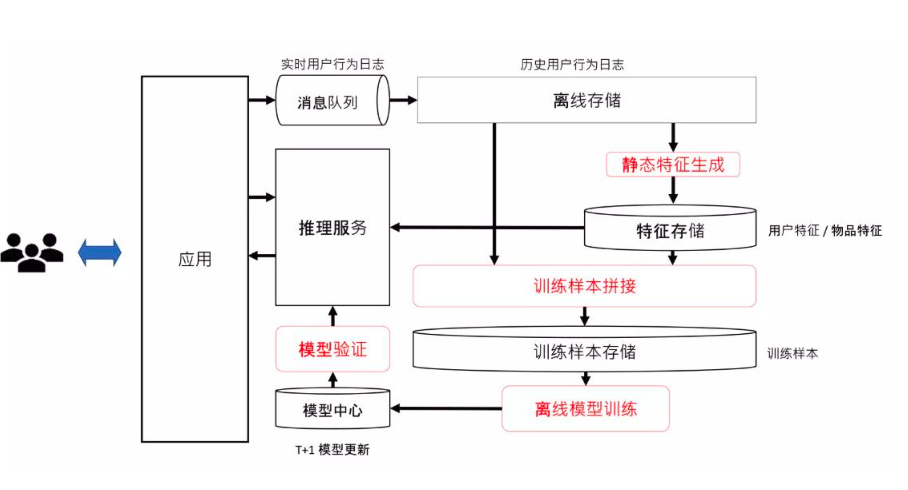
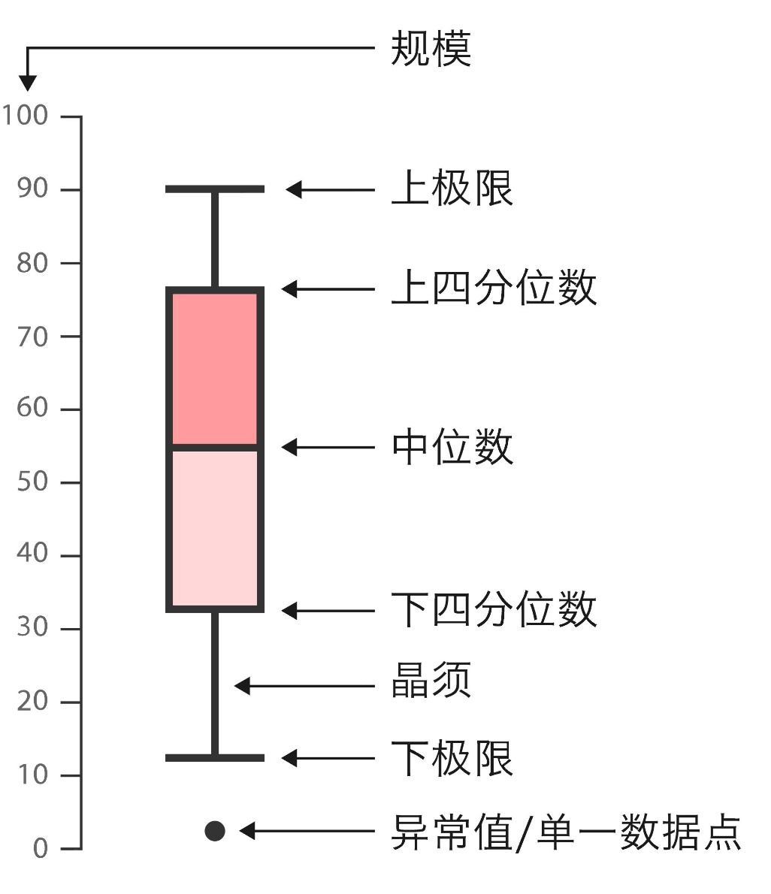
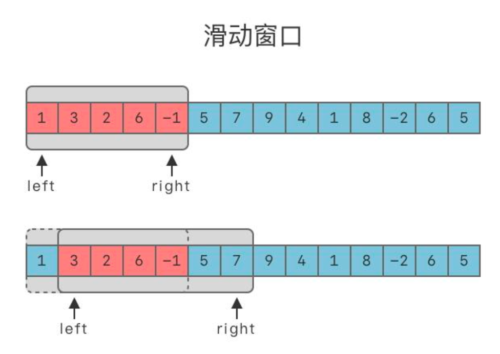
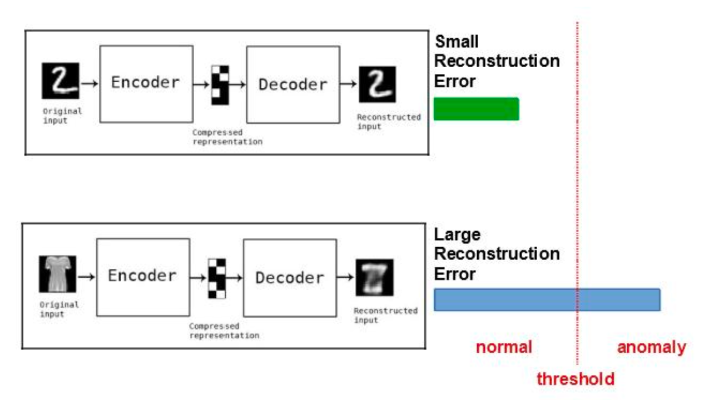
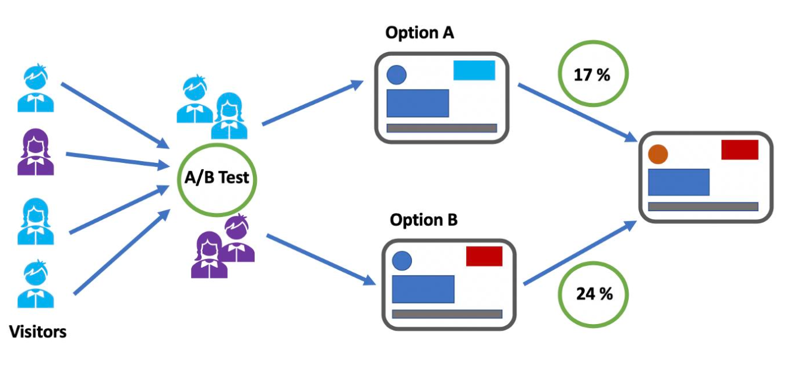

# 09 模型监控与自动化运维

模型 = 算法 + 数据 + 算力

- 算法和算力是放大器
- 数据质量决定了能放大到哪里

## 数据采集

### 业务日志数据

#### 采集方式

- 前端埋点：用户点击、页面停留时间（JavaScript SDK、App SDK）
- 服务端埋点：搜索请求、推荐结果、交易流水（服务器日志）
- 消息队列：Kafka、Flink → 支撑实时流式采集
- 数据落地：存入数据湖（HDFS、S3、Delta Lake）

#### 应用场景

- 推荐系统：基于点击 / 购买日志训练 CTR（点击率）预测模型
- 风控模型：基于交易日志识别异常行为
- 搜索排序：基于查询 - 点击日志优化排序策略

一个业务日志数据的数据流向：

### 传感器数据

传感器数据是由物理设备实时采集的环境或行为类信息，涵盖图像、语音、温度、位置等多类型数据，广泛应用于自动驾驶、工业监控、智能家居、医疗健康等场景。

**高吞吐压力**

大规模传感器并发采集会带来显著的存储资源占用与网络带宽负载，需通过分布式存储、数据压缩等技术缓解压力。

**时间同步问题**

多源传感器的采样往往存在异步性（如自动驾驶中摄像头、雷达的采样时间差），需通过时间戳校准、硬件同步等方案实现数据对齐。

**数据噪声干扰**

环境干扰（如电磁信号）、传感器自身误差会导致数据失真，需通过滤波算法（如卡尔曼滤波）、数据清洗流程提升数据质量。

**安全隐私风险**

传感器（如位置传感器、行为监测传感器）采集的数据可能包含敏感信息，需通过数据加密、匿名化处理等方式规避泄露风险。

### 公开数据集

公开数据集是由研究机构、企业或社区发布的标准化数据集，开放供用户使用，核心用途包括模型预训练、不同模型的性能对比、学术研究的基线实验等。

 **计算机视觉领域**

聚焦图像相关任务，典型数据集包括：

- ImageNet：用于图像分类任务，是计算机视觉领域的经典基准数据集；
- COCO：支持目标检测、图像分割等复杂视觉任务；
- Cityscapes：面向自动驾驶场景的城市场景图像数据集。

**自然语言处理领域**

服务于文本类任务，典型数据集包括：

- SQuAD：用于机器阅读理解（问答）任务；
- Wikitext：适用于语言建模任务的文本数据集；
- C4：大规模预训练语料库，常用于大语言模型的预训练。

**语音识别领域**

针对语音相关任务，典型数据集包括：

- LibriSpeech：英语语音识别的常用数据集；
- AISHELL：中文语音识别的主流数据集；
- TED-LIUM：基于 TED 演讲的语音语料数据集。

**推荐与行为建模领域**

用于用户行为分析与推荐系统，典型数据集包括：

- MovieLens：电影评分数据集，常用于协同过滤等推荐算法实验；
- Amazon Review Dataset：亚马逊商品评论数据集，可支撑评论分析、推荐建模等任务。

### 合成数据

由计算机程序或生成模型生成的虚拟数据，用于补充真实数据不足或难以采集的场景。 常见于自动驾驶、医疗、语音识别等稀缺/敏感场景。

**数据生成方式：仿真环境与数据增强 / 合成的解析**

###### 仿真环境生成数据

通过模拟真实场景生成数据，适用于真实数据获取成本高、风险大的领域，典型场景及工具包括：

1. **自动驾驶**：借助 CARLA、LGSVL、NVIDIA Omniverse 等仿真平台，模拟道路、车辆、天气等环境，生成大量驾驶场景数据；
2. **工业制造**：利用 Unity 仿真、Gazebo 等工具，复现产线流程、设备运行状态，生成工业场景数据；
3. **医学影像**：通过 3D 建模与模拟扫描技术，生成符合临床特征的医学影像数据，辅助模型训练。

###### 数据增强与合成的区别

两者均用于扩充数据量，但核心逻辑不同：

- **数据增强**：基于真实数据进行变换（如图片裁剪、文本同义替换），不创造新样本，仅丰富现有数据的多样性；
- **合成数据**：完全自主生成新样本，不依赖原始真实数据（如通过 AI 生成虚拟图像、文本），可按需定制数据特征。

### 数据采集策略设计

-  分层采样 (Stratified Sampling)：保证不同子群体均有覆盖
-  主动采集 (Active Collection)：利用模型不确定性选择优先采集的样本
-  代表性采样：选取多样化子集，避免过拟合于主流分布

 **案例**

短视频推荐系统

- 问题：热门视频多，长尾视频少 → 推荐偏差
-  解决：分层采样，保证长尾内容被采集并进入训练集

 风控模型

-  问题：欺诈样本稀少
-  解决：主动采集可疑交易，优先标注和训练

## 数据清洗：异常值检测与处理

#### 误差来源1：数据标注

标注质量直接决定了模型学习的 上限 和 方向。不一致的标注会让模型学习到混乱、甚至错误的信息。比如：标注规则模糊，任务主观性，标注员疲劳/错误，工具问题 。

解决方案：

- **制定清晰的标注规范 (Annotation Guideline)：**清晰定义每个标签的含义。正例与反例。边界情况。

- **引入共识机制 (Consensus Mechanism)**：同一份数据由多名（通常是 3 名）标注员独立标注。多数投票或走仲裁流程。

- **埋雷 / 黄金集测试 (Gold Standard Testing / Honeypotting)：**在正常的标注任务中，悄悄插入一部分 已知正确答案 的标准样本（即“地雷”或“黄金集”），实时、客观地评估每个标注员的准确率和专注度。

  

#### 误差来源2：采集异常

异常值是指数据集中与其他观测值显著不同的数据点。它们可能是由于测量错误、数据输入错误产生的，也可能是真实的、但非常罕见的事件。异常值会严重影响模型的参数估计，特别是对线性模型、均值等统计量敏感的模型。例如，一个极大的薪资数据会拉高整个团队的平均薪资。

解决方案：

##### (1)箱型图（Boxplot/iQR）

 应用场景

- 金融交易额：检测极端大额 / 小额交易
-  传感器监控：发现温度 / 电流的离群点
-  业务日志：快速发现超长 / 空数据行

 优缺点

-   简单直观，易于可视化
-  仅适用于低维数据，对高维复杂结构无效

##### (2) 滑动窗口

用一个 固定长度的时间窗口/样本窗口 来观察局部数据分布，在窗口内计算统计指标（均值、方差、分位数），发现突变点。

 案例

-  IoT 传感器：温度传感器在 5 分钟内连续飙升
- 支付系统：1 秒钟内交易量突然高于 99% 分位
-  网络流量：滑动窗口中突发带宽峰值 → 异常流量访问

优缺点

-  实时性强，计算简单，可嵌入流处理框架 (Flink, Spark Streaming)
- 窗口大小敏感（过小 → 噪声，过大 → 反应迟钝）
-  无法捕捉长期趋势或复杂模式

##### (3)在线聚类

将数据流动态分配到 k 个簇中心，新样本到达时 → 计算到最近簇中心的距离，如果距离过大 → 判定为异常，随着数据流入，簇中心不断更新（增量学习）。

- 电商推荐日志：绝大部分用户点击/浏览行为集中在常见模式，异常点击序列落在簇外 →可疑用户
-  工业设备监控：机器传感器数据按工况分簇，异常状态点 → 可能设备故障
- 实时广告流量：大部分请求簇在正常范围，突然出现远离簇的请求 → 可能是作弊流量

##### （4）自编码器

 基本原理

-  结构：输入 → 编码器 → 隐空间 → 解码器 → 重构输出
-  训练目标：最小化重构误差

 检测思路：

- 如果输入是“正常数据”
- 如果输入是“异常数据”，模型能很好地重构，重构误差会显著增大 → 判定为异常

工业设备：AE 学习正常振动信号 → 异常机械抖动重构误差大

#### 异常检测方法总结

|   类别   |                  核心思想                  |            优点            |          局限性          |            典型场景            |
| :------: | :----------------------------------------: | :------------------------: | :----------------------: | :----------------------------: |
| 统计指标 |       基于分布特征（IQR 等）识别异常       | 简单直观、计算轻量、易解释 | 仅适合低维，假设分布已知 |  电商交易额监控、温度范围控制  |
| 流式算法 | 在实时数据流上做窗口 / 聚类 / 在线模型检测 |  实时性强，可适应数据漂移  |    参数敏感、架构复杂    | 支付风控、IoT 传感器、网络流量 |
| 表示学习 |      深度模型学习正常模式，偏离即异常      |  处理复杂高维数据，精度高  | 训练成本大、需正常样本多 | 医疗影像、工业检测、金融反欺诈 |

实际工程中往往采用 分层检测策略：

• 第一层：统计筛选 → 去掉显而易见的噪声

• 第二层：流式监控 → 实时捕捉突发异常

• 第三层：深度模型 → 精细识别复杂异常

## 模型选择与微调

### 模型中心

 Hugging Face 的核心是模型中心，它为我们解决了“去哪里找模型”的问题。 海量选择与标准化:

-  **规模:** 拥有数十万个预训练模型，覆盖自然语言处理（NLP）、计算机视觉（CV）、语音、多模态等几乎所有领域。
-  **标准化:** 所有模型都遵循 Transformers 库的标准接口，加载、使用方式高度统一，极大降低了切换模型的成本。
-  **模型卡片 (Model Card):** 每个模型都附有详细的“说明书”，解释其训练数据、适用场景、潜在偏见和使用限制，这是负责任 AI (Responsible AI) 的重要实践。

##### transformers 库

- **是什么**：一个 Python 库，提供了 BERT、GPT、T5、ViT、Stable Diffusion 等主流模型架构的标准实现，可屏蔽 PyTorch、TensorFlow、JAX 等底层深度学习框架的复杂性。
- **核心价值**：通过统一的 API（如`AutoModel.from_pretrained()`），能轻松加载 Hub 上的预训练模型，快速完成推理或微调任务。

##### 标准化训练器（Trainer API）

- **定义**：transformers 库提供的高级 API，封装了模型微调的全流程（训练循环、优化器设置、学习率调度、分布式训练、混合精度训练、评估等）。
- **核心价值**：减少样板代码编写，开发者仅需聚焦数据准备与模型配置，即可快速搭建健壮、高效的训练流程。

##### accelerate 库

- **定位**：面向分布式训练的简化工具，只需修改少量代码，就能将训练任务从单 GPU 无缝扩展到多 GPU 或 TPU 集群。
- **核心价值**：降低分布式训练的技术门槛，实现训练资源利用的 “民主化”。

##### optimum 库

- **核心目标**：衔接`transformers`库与各类硬件加速技术，提升模型在不同硬件上的运行效率。
- 核心技术：
  1. **量化（Quantization）**：将模型的 FP32 浮点数权重转换为 INT8 等低精度整数，在精度损失极小的前提下，大幅压缩模型体积、提升推理速度。
  2. **图优化（Graph Optimization）**：借助 ONNX、OpenVINO 等工具优化模型计算图，去除冗余操作，进一步提升运行效率。

### MLOps 与在线学习闭环：打造持续进化的 AI 系统

模型上线不是终点，而是起点。我们需要建立一套 MLOps 流程，让模型能够根据线上反馈持续学习和进化。Hugging Face 生态为此提供了关键组件。Hugging Face 的布局远不止模型下载，它的各个组件环环相扣，为构建一个持续迭代的在线学习 (Online Learning) 或持续训练 (Continuous Training) 系统提供了强大的工具链支持。

#### Step 1: 训练与优化 (Training & Optimization)

-  **训练:** 使用 Transformers 库加载预训练模型，结合 Datasets 库加载和预处理我们自己的数据，进行微调。
-  **加速:** 使用 Accelerate 库，只需几行代码，就可以将训练脚本无缝地从单卡扩展到多卡、多机，甚至 TPU 环境，极大提升训练效率。
-  **优化:** 使用 Optimum 库，可以将训练好的模型进行量化 (Quantization)、剪枝(Pruning) 或转换为 ONNX 格式，使其体积更小、推理速度更快，为部署做好准备。

#### Step 2: 版本控制与协作 (Versioning & Collaboration)

-  Hub 作为 Git 仓库: Hugging Face Hub 的核心是一个基于 git 的系统。你可以像管理代码一样，对模型和数据集进行版本控制。
-  CI/CD for Models: 可以轻松地将模型训练集成到 CI/CD 流水线（如 GitHubActions）中。当新的标注数据准备好后，可以自动触发训练、评估流程，并将新版模型推送到 Hub。

#### Step 3: 评估与验证 (Evaluation & Validation)

-  **标准化评估:** 使用 Evaluate 库，可以方便地计算各种标准指标（如 BLEU, ROUGE,F1-score），确保模型迭代的可衡量性。
-  **交互式验证 (HITL):** 使用 Spaces (基于 Gradio/Streamlit) 快速搭建一个模型 Demo。这不仅用于展示，更是一个强大的内部验证工具。团队成员（如产品经理、标注专家）可以在界面上进行交互测试，发现模型的“坏案例 (failure cases)”。这些坏案例可以直接反馈到数据标注环节（连接了 Scale AI 的流程），形成数据增强的闭环。

#### Step 4: 部署与推理 (Deployment & Inference)

- **一键部署:** 对于验证通过的模型，可以使用 Hugging Face 的 推理端点 (Inference Endpoints) 服务，只需点击几下，即可将 Hub 上的模型部署成一个高可用的、自动扩缩容的 API 服务。这极大地降低了从模型到服务的工程门槛。

#### Step 5: 监控与数据回流 (Monitoring & Data Loop)

-  **线上监控:** 对部署的 API 端点进行监控，收集模型的预测结果，特别是那些低置信度(low-confidence) 的预测或用户反馈不佳的样本。
-  **数据回流:** 将这些从线上收集到的“疑难杂症”数据，自动回流到第一模块的数据池中，进行优先标注和审核。
-  **触发再训练:** 当积累了足够多的新数据后，自动触发新一轮的训练、评估、部署流程。

### 实际业务Demo：实时个性化推荐引擎（在线学习）

**业务目标：**为电商平台构建一个能实时响应用户行为变化的个性化推荐系统，提升用户粘性和商业转化率。

**传统推荐的挑战 (Challenges)**：

- 数据延迟 ：推荐模型每天只更新一次，无法捕捉用户当下的兴趣变化。用户白天的行为，要到第二天才能影响推荐结果。
- 冷启动问题：新用户或新商品没有历史数据，难以进行有效推荐。
- 处理能力瓶颈：用户行为数据量巨大（点击、浏览、加购），传统数据库和批处理框架难以支撑实时计算

**实时推荐的价值 (Value)：**

- 极致个性化: 根据用户最近几分钟甚至几秒钟的行为，动态调整推荐列表。
- 提升核心指标: 显著提升点击率 (CTR)、转化率 (CVR) 和用户停留时长。
-  商业机会发现: 快速响应热点事件和趋势，推送相关商品。

#### 推荐系统全流程：从数据到闭环

##### 1. 流程链路

数据采集 → 特征工程（批 / 流）→ 模型训练（离线）→ 模型部署与服务 → 在线推理与反馈

##### 2. 各环节核心说明

- **数据采集**：通过埋点实时捕获用户行为流（点击、曝光、加购等），为后续流程提供数据基础。

- **模型训练（离线）**：周期性（如每日）基于离线特征训练深度推荐模型（如 DLRM、Wide & Deep），产出模型基座。

- 部署与服务：

  - 将训练好的模型部署为在线预测服务；
  - 把离线 / 在线特征存入特征商店（Feature Store），支撑在线推理的高速查询。

- 推理与反馈（在线）：

  - 用户请求推荐时，从特征商店获取最新特征，调用模型服务生成推荐列表；
  - 用户行为（如点击）作为新标签实时回流至数据采集端，形成数据与模型迭代的闭环。

  

## 模型运维流程 ：科学发布流程构建

**A/B testing:** 

它的逻辑严谨而简单，分为四个步骤：

-  **分流 (Split)** 将**用户 (Users)** —— 而非“请求(Requests)” **固定地、随机地**分成互不重叠的A组（对照组）和B组（实验组）。
-  **实验 (Treat)** A组用户始终体验旧版本（Baseline），B组用户始终体验新版本（Variant）。
-  **衡量 (Measure)** 在整个实验周期内（例如一周），保持分组不变，持续收集并对比两组用户的**真实业务指标**（如CTR、转化率、留存率）。
-  **决策 (Decide)** 实验结束后，通过严谨的统计学分析，判断新版本带来的效果是真实的提升、无差别，还是负向影响，从而做出**数据驱动**的上线或放弃决策。

A/B测试的威力在于，它是衡量**因果性 (Causality)** 的黄金标准。通过确保两组用户除了“体验的版本不同”之外，其他所有条件（如用户画像、时间、市场环境）都高度相似，我们可以得出一个可靠的结论：**两组间最终的指标差异，就是由我们引入的“新版本”这唯一变量所“导致”的。**

需要避免的是 **r_id 分桶**。

#### A/B test 算法： 多臂老虎机 （**Multi-Armed Bandit**）

先用少量流量快速试探所有版本，然后**自动地、动态地**将绝大多数流量分配给当前表现最好的版本，同时保留一小部分流量继续“探索”其他版本，以防情况发生变化。

#### **何时用 A/B？何时用 Bandit？**

##### A/B 测试的核心适用场景：

A/B 测试的核心价值是提供**严谨、可复现的 “权威决策依据”**，适用于以下场景：

###### 1. 核心链路与重大发布

- 场景示例：改版交易 / 支付等核心流程、发布 App 大版本
- 适配原因：这类变更风险高、影响范围大，需要全方面的净效应评估报告，支撑管理层重大决策。

###### 2. 合规治理与科学研究

- 场景示例：评估金融风控策略的公平性、学术研究成果的评审 / 发表
- 适配原因：需满足严格的因果推断、统计显著性要求，保证结论的客观性与权威性。

###### 3. 需要 “定论” 的决策

- 场景示例：上线后难以修改的策略、作为长期技术架构基础的方案
- 适配原因：这类决策具有长期影响，需通过 A/B 测试获得 “唯一确切” 的结论，避免试错成本。

##### Bandit 算法的核心适用场景

Bandit 算法的核心价值是**在线学习、小步快跑式调优**，快速放大优质策略的价值，适用于以下场景：

###### 1. 策略空间巨大的探索

- 场景示例：测试推荐系统的多套召回 / 排序策略组合、UI 元素的多组颜色 / 文案搭配
- 适配原因：候选策略数量极多，需通过在线 “赛马” 机制快速迭代，筛选出最优方案。

###### 2. 追求极致的运营效率

- 场景示例：新闻推送、广告投放、首页商品推荐
- 适配原因：可在评估期内将流量向效果最优的版本倾斜，最大化 CTR/GMV 等指标，降低机会成本。

###### 3. 短期、高频的个性化场景

- 场景示例：生命周期短的头条新闻、需实时调整的动态场景
- 适配原因：其自适应能力优于静态 A/B 测试，能匹配内容 / 场景的高频变化需求。

#### **A/B与Bandit的混合式工作流**

**第1步：小流量 A/B —— 担任“守门员” (Gatekeeper)**

-  **做法**：在小流量上（例如 5% vs 5%）先进行一次固定比例的、标准的A/B测试。
- **目标**：**做准 (Measure Accurately)**。 核心是获得新策略效果的无偏估计，并验证其**没有灾难性的负向影响**（如系统崩溃、用户体验断崖式下跌、核心指标暴跌）。
-  **作用**：如同一道“安全门禁”。只有通过验证、确认不差于基线（甚至有正向信号）的策略，才有资格进入下一阶段的大规模推广。

**第2步：过门禁后切换 Bandit —— 开始“边跑边赚” (Optimize & Rollout)**

- **做法**：一旦策略通过了“门禁”验证，就将其切换为Bandit实验，并逐步扩大总流量池。
- **目标**：**边跑边赚 (Maximize Returns)**。 在更大规模的放量过程中，利用Bandit自动将流量倾斜给更优的版本，**最大化在线收益，最小化机会成本**。
- **关键**：此阶段必须设置好最小探索比例（如每臂不低于10%），以防过早收敛，错失更优解。

**第3步：关键期“冻结”策略 —— 启动“安全模式” (Safety Mode)**

-  **做法**：在双十一、黑五等业务高峰期，或监控到外部环境剧烈变化时，临时“冻结”Bandit的动态调权能力。
- **目标**：**稳定压倒一切 (Prioritize Stability)**。 冻结后，实验暂时退化为一个固定比例的A/B测试（采用冻结前的流量配比）。这可以防止算法在业务最关键的时期做出非预期的、有风险的流量调整。

## 模型运维流程：工厂纪律与安全护栏

#### 自动化安全护栏 (Guardrails): 系统的“熔断器”

无论是A/B测试、Bandit算法，还是混合式工作流，它们的成功运行都依赖于一个共同的基座：严格的工程纪律和自动化的安全护栏。

对核心的负向指标 (Guardrail Metrics) 设置不可逾越的红线。监控哪些指标？

- 系统性能：P95/P99 延迟、错误率、QPS。
- 用户体验：App崩溃率、用户投诉率、退订/取关率。
- 业务成本：单位推荐成本、关键API调用费用。

####  受控的放量步长: 避免“一步踏空”

严格限制实验流量的每日变化速率。

- 规则示例： 每日每个实验版本（臂）的流量占比变化不得超过20个百分点 (20pp)。例如，从10%增加到30%是允许的，但从10%直接跳到80%是严格禁止的。

#### SRM 持续监控: 实验的“心跳”

持续、准实时地检查实际进入各个实验组的样本（用户）比例，是否与预设比例（如50/50）存在统计上的显著偏离。为什么？ SRM (样本比例失配) 的出现，通常意味着底层分流逻辑存在Bug、数据上报丢失或存在样本污染。此时，实验的“随机”和“均衡”前提已被破坏。

处理原则： 一旦检测到SRM，必须立即暂停所有实验读数和决策，直到根本问题被排查和修复。

