# 11. 多模态学习


## 视觉生成模型


## 类比


类比理解：GPT 写句子 ↔ Diffusion 画图

| 维度     | GPT              | Diffusion      |
| -------- | ---------------- | -------------- |
| 输入     | 一段文本前缀     | 一幅含噪图像   |
| 输出     | 合理的下一段文字 | 合理的完整图像 |
| 模型核心 | 语言补全         | 图像补全       |
| 训练目标 | 预测下一个 token | 预测噪声       |
| 结果     | 连贯的语义内容   | 连贯的视觉内容 |


**从绘画比喻理解 Diffusion 的训练逻辑**。想象我们正在训练一个 AI 画家。他的训练方式不是简单地模仿作画，而是进行一种**反向练习**，他在成千上万幅油画上，学会**如何“擦掉”每一笔，然后再把它复原。**


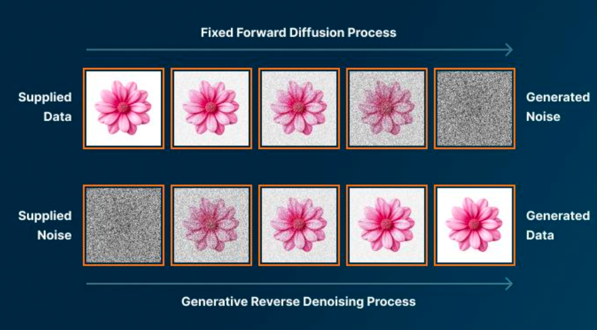


####  **阶段一：正向扩散——**“擦掉世界”

在训练中，我们让画家反复执行“破坏”动作：给他一幅完成的油画（原图像 X0）,他倒序地逐层用“清洗颜料”（噪声）覆盖画布,第一步擦掉一些线条；第二步再抹去颜色；一层层下去，直到整幅画被模糊、变灰、变成随机点阵。

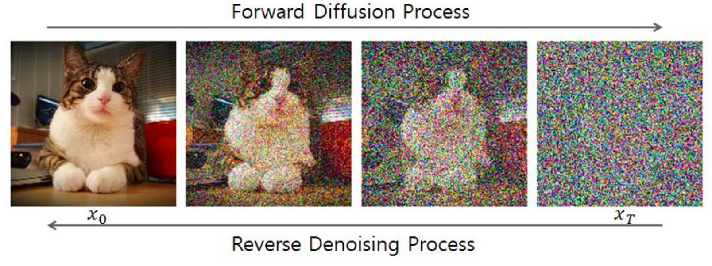


####  **阶段二：反向生成——**“复原世界”

从那张“被清洗干净”的噪声画布开始； 让他一层层恢复原作的每一笔；每复原一步，我们就告诉他——这次复原得对不对； 他通过无数次这样的练习，学会了“如何用正确的笔法画回去”。


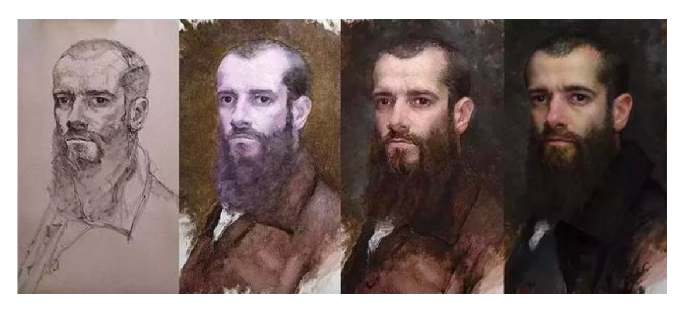


| 阶段     | 行为                 | 含义                     |
| -------- | -------------------- | ------------------------ |
| 正向扩散 | 擦掉画作、加入噪声   | 让模型理解“世界如何消失” |
| 反向生成 | 逐步复原画作         | 让模型学会“世界如何形成” |
| 训练目标 | 还原误差最小化       | 学习正确的“笔法”         |
| 生成阶段 | 从噪声或草稿出发作画 | 视觉补全、创意生成       |


## 从倒序绘画到数学模型

扩散模型分为两个阶段：

| 阶段 | 名称                          | 作用                         | 数学符号                     |
| ---- | ----------------------------- | ---------------------------- | ---------------------------- |
| 1    | 正向扩散（Forward Diffusion） | 不断加入噪声，使图像逐渐模糊 | $q(x_t \mid x_{t-1})$        |
| 2    | 反向生成（Reverse Denoising） | 学习如何从噪声中恢复清晰图像 | $p_\theta(x_{t-1} \mid x_t)$ |

- 让模型在“从噪声还原图像”的过程中，学会世界的概率分布。
- 换句话说，模型并不是在“背图像”，而是在学习：**“怎样从混乱中重建有序世界”**。


## 数学定义

#### 正向扩散


正向扩散过程定义为一系列条件高斯分布：
$$
q(x_t \mid x_{t-1}) = \mathcal{N}\big(\sqrt{1-\beta_t}\, x_{t-1},\ \beta_t I\big)
$$

- $\beta_t$：控制噪声强度的小常数（通常在 $10^{-4} \sim 0.02$ 之间）。

- $\sqrt{1-\beta_t}$：让图像信号保留一部分。

- $\beta_t I$：让每个像素独立注入随机噪声。


每一步的输出 = 保留少量旧信息 + 注入一点新随机性。


#### 反向生成


## 反向生成的数学定义

反向生成过程由一个可学习分布建模：

$$
p_\theta(x_{t-1} \mid x_t) = \mathcal{N}\big(\mu_\theta(x_t, t),\ \Sigma_\theta(x_t, t)\big)
$$

- 其中：

  - $\mu_\theta$：模型预测的「去噪方向」（均值）
  - $\Sigma_\theta$：生成时使用的方差（可以固定或学习）
  - $\theta$：模型参数（例如 U-Net 的权重）


## 多模态基础模型

**语言的世界 **

-  **代表模型：** GPT、BERT
- **基本单元：** **“词元” (Tokens)**
- **语言模型的困惑：** “我能理解文字，但看不懂图片。”。问题：无法处理视觉输入（**图片 = 未知符号**）。 例：它不认识 [一张图片]，因为这不是一个词元。


**视觉的世界 **

-  **代表模型：** CNN、ResNet、Diffusion

- **基本单元：** **“像素” (Pixels)**

- **视觉模型的困惑：** “我能看懂像素，却听不懂语言。”。 问题：无法理解语言描述或语义标签。例：它不理解 “

  **一只可爱的猫**” 这句话。


**关键问题：** 我们如何让模型知道文字“猫” 这个概念 和图像那一堆像素 指的是同一件事？我们需要一个模型，它的唯一任务是：

**让文字与图像在同一语义空间“对齐”（Alignment）**。


## CLIP

CLP (Contrastive Language Image Pairs)：CLIP 是一种把“图片”和“文字”映射到同一个语义空间里，通过对比学习让图文互相理解的模型。


我们想让模型学会：“这张图和这句话，是不是在说同一件事？”但人工标注太贵、太慢。于是我们给模型设计了一个“借口任务”：**大规模图文连连看**


##### **训练数据**

- 来源：从互联网上爬取 **(图片, 文本描述)**
- 特点：真实、多样、自然语言描述
- 没有人类精标，只依赖海量匹配

-  模型 通过规模学习“语义共现” 的统计规律 。


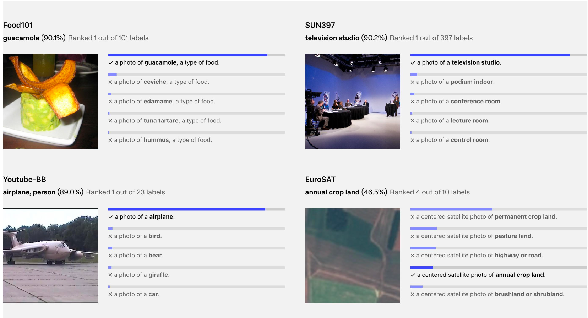


##### 训练机制：对比学习（Contrastive Learning）

在一个批次 (Batch) 中放入 **N 张图像** 和 **N 段文本**

模型有 **两个大脑**：

• 图像编码器（看图）

• 文本编码器（读字）

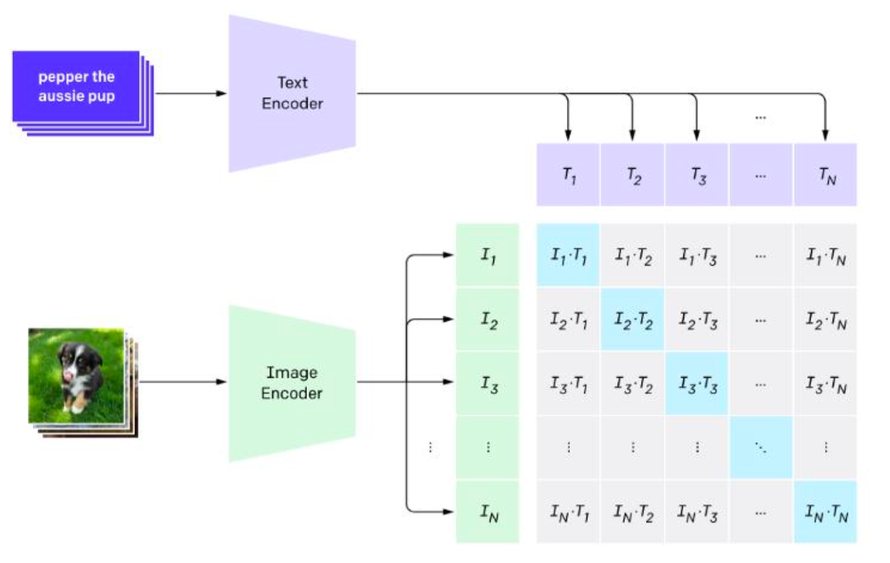

计算 N×N 个图文组合的相似度,找出其中 **正确的 N 对配对**, 它不是学“ 怎么分类”，而 是 学“ 什么东西该靠近”。 **结果：让图像和文字“对齐”在同一个语义空间。**CLIP 学会了让“像素”与“语言”共享理解。

-  **学习机制：对比学习的“拉近–推远”**
-  **奖励：拉近 (Pull Together)：** 如果 (图 A, 文 A) 是正确配对→ 模型调整参数，使它们的特征向量在“概念空间”中靠得更近
-  **惩罚：推远 (Push Apart)：** 如果 (图 A, 文 B) 是错误配对 → 模型会拉开两者距离。


模型会计算一个相似度矩阵：

|      | T1   | T2   | T3   |
| ---- | ---- | ---- | ---- |
| I1   | 0.9  | 0.2  | 0.1  |
| I2   | 0.1  | 0.85 | 0.3  |
| I3   | 0.05 | 0.4  | 0.88 |

此时目标是：
 👉 **对角线最大，其它都尽量小**


损失函数（通常是 cross-entropy / InfoNCE）会自动做两件事：

- 如果 I1 和 T1 相似度不够高 → **产生梯度 → 拉近它们**
- 如果 I1 和 T2/T3 相似度太高 → **产生梯度 → 推远它们**

所以：

- “奖励” = 正确配对被拉近
- “惩罚” = 错误配对被推远
   并不是人为写 if else，而是 **数学目标函数自然导出的结果**。


## Stable Diffusion ： CLIP如何成为Diffusion模型的“剧本”


#### Step1: 用户输入编写剧本

• **Prompt：**“一只宇航员在月球上骑马 ”，用户的自然语言描述，就是模型的“**创作指令**”。 但——这段文字不会直接进入画家手中，而是要 **CLIP 翻译成语义指令**


#### Step2: **CLIP / Text Encoder —— 理解与翻译**

在 SD 架构中：这一步通常由 **CLIP 的文本编码器（Text Encoder）** 执行。它把 Prompt 转化为一个固定长度的**语义向量**（Text Embedding）。这个向量在高维空间中表达 Prompt 的概念：“宇航员”,“夜色”等语义关系。


在实际实现中：Stable Diffusion v1 使用 **OpenCLIP / CLIP-ViT text encoder**（OpenAI CLIP 或 LAION 改进版）来将文字映射为向量。

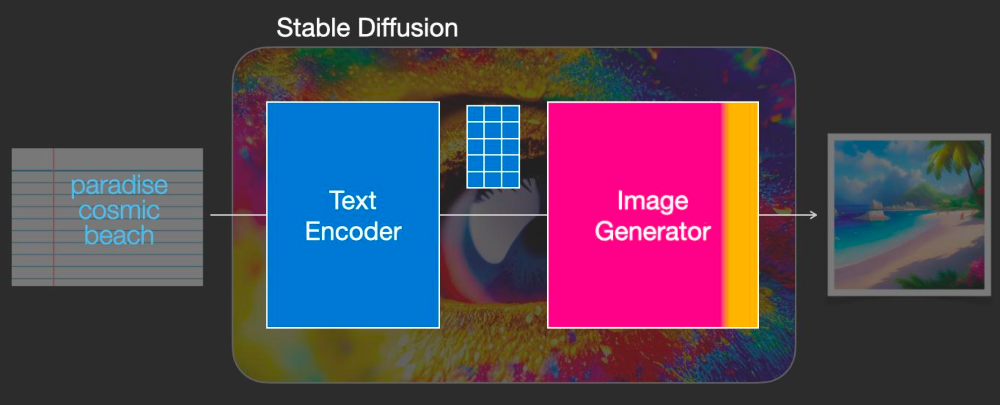


#### Step3: U-Net Diffusion 网络 -按剧本绘制

从一张完全随机的噪声图开始，逐步去噪、细化，直到得到清晰的图像。

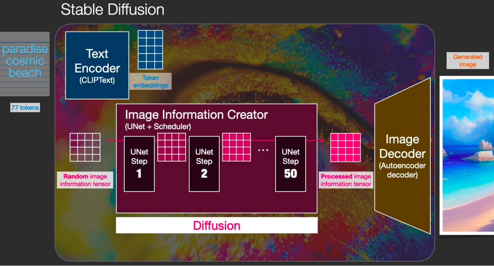

在每一步去噪中，真正“动笔”的，是 **U-Net 网络**。它的结构像一个 “U” 字：

-  左半边：逐层**压缩**（理解当前画面、提取全局特征）
-  右半边：逐层**解压**（重建细节、填补像素）


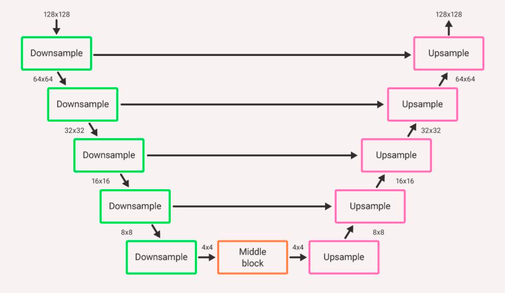

 它通过 **Cross-Attention** 与 **文本嵌入（token embeddings）交互**，让模型在绘制每一部分图像时都能“参考文字描述”。

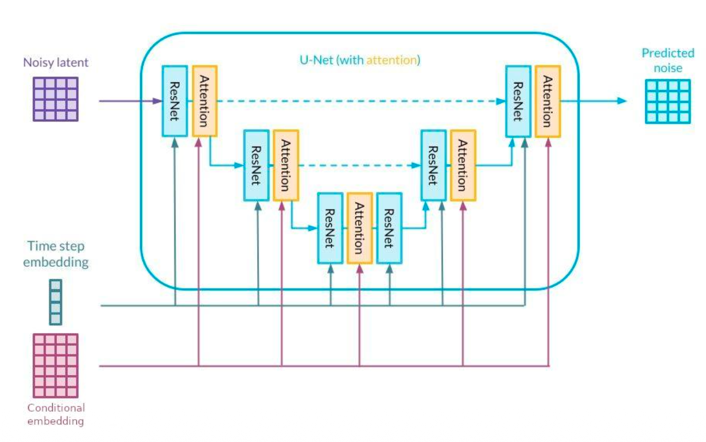

- Stable Diffusion 在 U-Net 内部加入了 **Cross-Attention 层**。这层的作用是把CLIP 生成的**文本向量作为“条件”送入每一次去噪步骤。
-  每当 U-Net 在预测噪声时，它都会抬头看看“导演剧本”——文本语义向量，然后再决定这一步的“笔触”该怎么下。


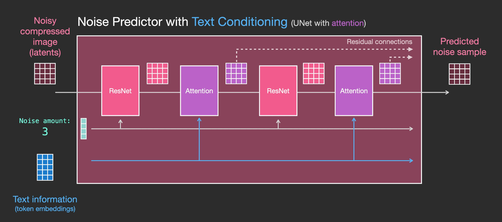


#### Step4: VAE 解码器 -从潜空间到真实图像

模型先在“语义空间”中迭代，再交给 VAE 把它画成高清成品。

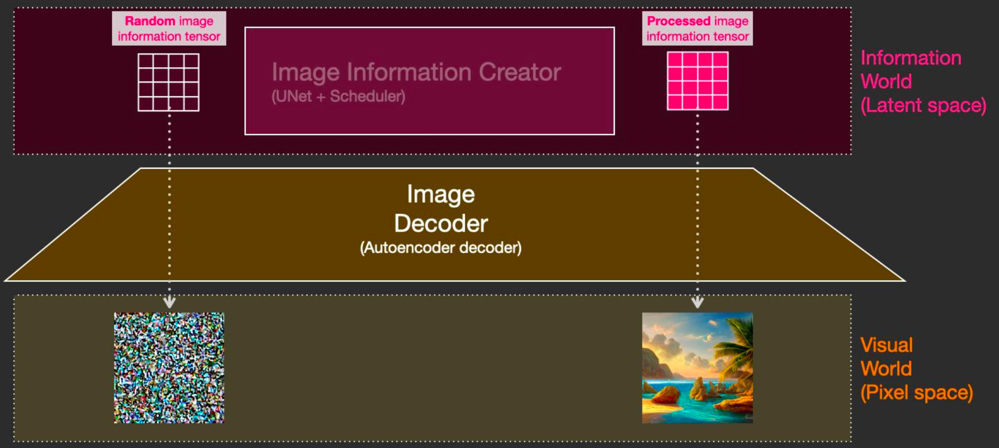 


因此 Stable Diffusion 的整体流程是：

```
Prompt → CLIP Text Encoder → 语义向量
             ↓
U-Net Diffusion (条件去噪，受语义控制)
             ↓
         VAE Decoder → 最终图像
```


## SAM

SAM () **Segment Anything Model**)，是 Meta（原 Facebook）在 2023 年提出的一种**通用视觉分割基础模型**，核心目标是：

> 让模型“看懂”图像，并能根据人类给出的简单提示（Prompt）去分割出对应的目标。

可以把它理解成：

> 视觉领域的「GPT + 分割能力」。


它的目标不是分割特定类别（如猫、车、人），而是实现 ——  “**你指哪，它切哪**”。无论是**点、框还是文字提示**，SAM 都能理解用户意图，并精准分割出对应区域。


##### 输入 1：一张图像（Image）

- 任何你想要从中“框选”物体的图片。

##### 输入 2：一个提示（Prompt）

- 告诉模型你想要“框选”什么。
- 这个提示可以非常灵活，包括以下几种形式：

###### 提示类型（Prompt Types）

- **点（Point）**
   在物体上点一下。
- **框（Box）**
   大致框出物体范围。
- **文本（Text）**
   输入例如：「一只猫」。


##### 输出（Output）

- SAM 会立即返回一个（或多个）**高质量掩码（Mask）**，准确地圈出你所提示的目标物体。


### SAM 的架构

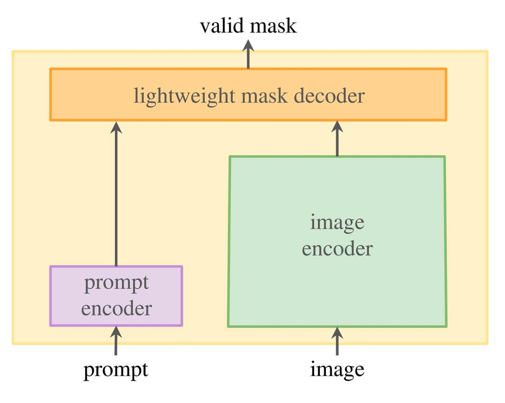


SAM 由三个核心组件构成：

-  **图像编码器 (Image Encoder)**
-  **提示编码器 (Prompt Encoder)**
-  **掩码解码器 (Mask Decoder)**


**SAM 面临的最大挑战：** 如何实现“实时交互”？

 **解耦 (Decoupling)** SAM 的架构设计就是为了解决这个问题。它将整个任务拆分为两部分：

-  **“重量级”的一次性计算：** 表示学习**，**先花时间把图像彻底“看懂”。
-  **“轻量级”的实时交互：** **跨模态**，无论用户提示什么，都能闪电般地给出结果。

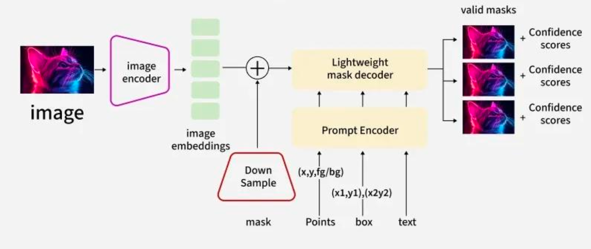


### （1）图像编码器（Image Encoder）

**类比：** 这就像为一张卫星照片（原始图像），预先计算并生成一份详细的“高精度地形图”（图像特征）。

这个过程是整个 SAM 中**最慢、最耗费计算力**的。SAM 的设计是：只算一次。无论用户后续交互多少次，这张“地形图”（Image Embedding）都会被重复使用，永远不需要重新计算。


### （2）**提示编码器 (Prompt Encoder)**

**目标：** 将用户的“指令”也转换为特征向量 (Embedding)。

SAM 必须能理解点、框、文字的多模态提示：

- **点 (Points) / 框 (Boxes)：** 使用简单的位置编码 (Positional Encoding)。这本质上是把 x, y 坐标转换成一个向量，模型一看就知道“哦，用户指的是这个位置”。
-  **文本 (Text)：** 使用一个预训练的 CLIP 文本编码器，将文字（如“一只猫”）转换为其对应的语义向量。


### （3）**掩码解码器 (Mask Decoder)**

 **目标：** 结合“图像”和“指令”，实时生成最终掩码。

 **实现：** 一个非常轻量级的解码器（基于 Transformer 结构）。

-  **输入 1：** 预先算好的“图像地形图”（Image Embedding）。
-  **输入 2：** 实时算好的“指令向量”（Prompt Embedding）。
-  **解码：** 解码器拿着“指令”，去“地形图”上进行高效查询（**通过注意力机制**），找出“指令所指的区域”。

**输出：** 最终的掩码 (Mask)。


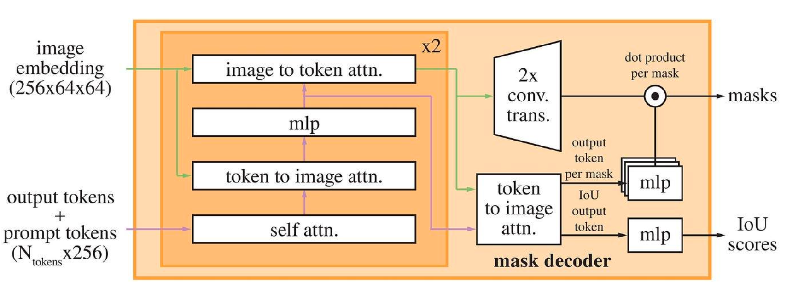


**一个新的问题：** 当用户在“一只猫的爪子”上点了一下，他到底想要什么？

- 爪子 (Part)？
-  这只猫 (Object)？
-  这只猫和它旁边的另一只猫 (Whole)？

一个“点”的指令是高度模糊的。


 **SAM 的解决方案：不猜测，全给你** SAM 的掩码解码器被训练为：**同时输出三个（或多个）候选掩码**。

-  **Mask 1 (部件):** 预测这是“爪子”。
-  **Mask 2 (物体):** 预测这是“整只猫”。
-  **Mask 3 (整体):** 预测这是“图中的所有猫”。


SAM 的强大能力，源自其史无前例的训练数据：**SA-1B (Segment Anything 1 Billion)**。


这个数据集由 SAM 的“数据飞轮”自动生成，它有三个核心特征：

-  **规模 (Scale)：** 绝对的海量
-  **质量 (Quality)：** 自动化生成但质量可控
-  **关键特征：** 类别无关 (Class-Agnostic)


## 多模态智能体


### 生成增强阶段 BLIP/BLIP2

不再只学习“图文配对”，而是教模型“看到之后，**用语言解释它看到的内容**”。 这标志着视觉模型从被动的表征器，走向主动的“语言生成者”。

️ 

**2架构核心：冻结视觉编码器 + 轻量桥接层 + 语言模型。**

(a) **冻结的视觉编码器** 

使用 ViT-L/16 预训练特征，将图像转化为 patch-level 视觉 embedding:

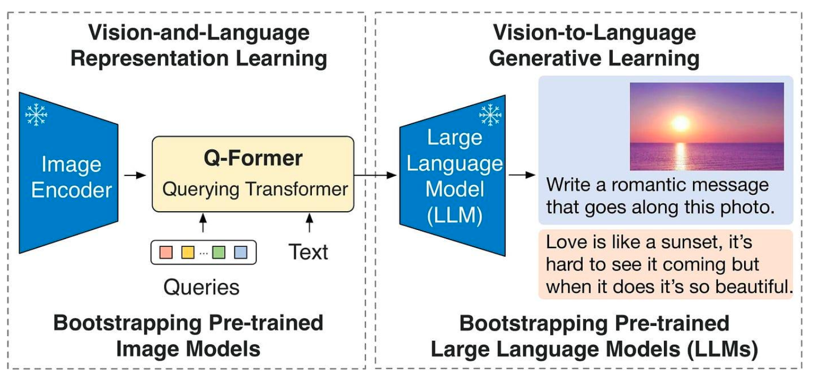


 **(b) Q-Former：跨模态桥接层（BLIP-2 的核心创新）**

**回顾：文字是如何被“token化”的**,在语言模型中，文本被拆分为一个个最小的语义单元（Token）。**那图像呢？—— 图像没有“词”**

图像本身是一个像素矩阵：
$$
I \in \mathbb{R}^{H \times W \times 3}
$$


语言模型无法直接理解这些原始像素，因为它没有“词汇表”去解释像素。于是，视觉模型（通常是 ViT）把图像划分为小块（patch）并编码为向量：

| 步骤 | 名称             | 说明                                                       |
| ---- | ---------------- | ---------------------------------------------------------- |
| 1    | 分块（Patchify） | 把图像分成 16×16 小块（例如：224×224 图像 → 196 个 patch） |
| 2    | 线性投影         | 将每个 patch 的像素映射成一个向量（如 768 维）             |
| 3    | Transformer 编码 | 学习每个 patch 的上下文关系，得到语义特征                  |


最终输出可以表示为一个特征序列：

$$
F = [f_1, f_2, \dots, f_N], \quad f_i \in \mathbb{R}^{768}
$$

其中：
- 每个 \(f_i\) 表示一个 patch 对应的特征向量  
- 整个 \(F\) 是图像的高层语义表示


这些 \(f_1, \dots, f_N\) 被称为「视觉 token（visual tokens）」。在语义层面上，它们等价于 NLP 中的「文字 token embedding」：

- 文本模型：token → embedding  
- 视觉模型：patch → embedding


##### 语言与视觉的根本区别

| 维度       | 语言                   | 视觉                      |
| ---------- | ---------------------- | ------------------------- |
| 表征方式   | 离散符号序列（token）  | 连续二维信号（像素阵列）  |
| 上下文结构 | 线性（左到右）         | 空间结构（上下左右）      |
| 模式信息   | 语义、语法             | 纹理、边缘、空间布局      |
| 建模方式   | 自回归预测（下一个词） | 局部相关（卷积 / 注意力） |


##### ViT 中视觉 token 的形成流程

| 步骤                            | 作用                                                |
| ------------------------------- | --------------------------------------------------- |
| 分块（Patchify）                | 以固定步长切分图像（如 16×16），保留空间邻接性      |
| 位置编码（Positional Encoding） | 为每个 patch 加入二维坐标（x, y），保留相对空间位置 |
| 自注意力（Self-Attention）      | 允许 patch 之间相互通信，学习纹理连续性与边界衔接   |


（1）**图像切块：从像素到patch token**

图像首先被均匀地分割为若干小块（patch），例如每块大小为 16×16 像素：

$$
224 \times 224 \times 3 \;\longrightarrow\; (16 \times 16 \times 3) \times 196\ \text{patches}
$$

最终得到一个序列形式的图像表示：

$$
F = [f_1, f_2, \dots, f_{196}], \quad f_i \in \mathbb{R}^{768}
$$
可以将每个 \(f_i\) 理解为一个「视觉单词（visual token）」：

- 每个 token 描述一个局部区域
- 编码了该区域的纹理、颜色、边缘等视觉特征
- 整个序列共同构成图像的语义表达


(2) **位置信息：保留空间连续性**

图像被切成 patch 后，原始空间顺序会丢失。  为了让模型理解「谁在左、谁在上」，ViT 为每个 patch 加入 **二维位置编码（2D Positional Embedding）**。


每个 patch 的最终输入表示为：

$$
h_i = f_i + P(x_i, y_i)
$$


其中P是编码 patch 在整张图像中的位置。这使得模型即使输入是线性序列，也能重建二维空间结构。就像每个 token 都带了一个“地理坐标” Transformer 才能知道哪些区域是相邻的。


（3）自注意机制

注意力权重可以表示为：

$$
A_{ij} = \text{softmax}\!\left(\frac{Q_i K_j^\top}{\sqrt{d}}\right)
$$

- \(A_{ij}\)：patch i 对 patch j 的关注程度  
- Q, K：由 patch embedding 线性变换得到的查询（Query）和键（Key）  
- d：特征维度，用于缩放防止数值过大


- 模型可以自由建立 **跨 patch 的连接关系**，不受卷积邻域限制
- 任意两个 patch 之间都可以直接交互信息

- 邻近 patch 可聚合纹理信息 → **保留边缘连续性**
- 远距离 patch 可建立长程依赖 → **捕捉全局轮廓**


（4）**感知边缘的原理**

在 ViT 中，边缘感知源于注意力权重矩阵的模式：

- 若两个相邻 patch 在边缘两侧，其特征差异大，注意力值会突变；
-  模型在训练中学会利用这些高梯度区域来识别边界；
-  多层注意力堆叠后，形成对形状、边界和区域的层级理解。

 实验表明：ViT 的注意力热力图在早期层对齐边缘，在高层对应语义轮廓（如“脸部边界”“桌面区域”）。


#####  **问题：语言模型如何读懂这些视觉 token？**

即便有了视觉 token，它们仍然存在两个问题：

-  数量太多（上千个，语言模型负担太重）
-  含义不清晰（patch 特征未聚合为语义概念

于是 ，**BLIP-2 提出了 Q-Former**，作为视觉到语言的“翻译层”：

Q-Former 使用少量可学习查询向量 (Query Vectors)，通过 Cross-Attention 从上千个 patch token 中“提取语义核心”

输出几十个“语义 token”，再交给语言模型处理。


#### Q-Former（Query-based Transformer）

Q-Former（Query-based Transformer）通过一组**可学习的 Query 向量**，在视觉特征上执行**交叉注意力（Cross-Attention）**，
实现语义压缩，提取最关键的视觉信息。

，

#### ViT 输出：patch 特征矩阵

图像经过 ViT 编码后，得到 patch 特征序列：

$$
F = [f_1, f_2, \dots, f_N], \quad f_i \in \mathbb{R}^{d_v}, \; N \approx 1000
$$
F：图像的高维视觉特征序列

N：patch 数量（通常上百到上千）

D：每个 patch 的特征维度


#### 初始化可学习 Query 向量

初始化 \(M\) 个可学习查询向量（learnable queries）：

$$
Q = [q_1, q_2, \dots, q_M], \quad M \in [32, 64]
$$
说明：

- 每个 qiq_iqi 是一个可训练参数向量
- 这些 Query 负责从大量 patch 特征中「主动提取」关键信息
- 相当于：**用少量 Query 压缩大量视觉 token**


可以将 Q-Former 理解为：

- ViT 提供「大量视觉细节」（上千 patch）
- Q-Former 提供「少数问题探针」（几十个 Query）
- Cross-Attention 让 Query 主动去“询问”图像：
  > 什么信息是重要的？


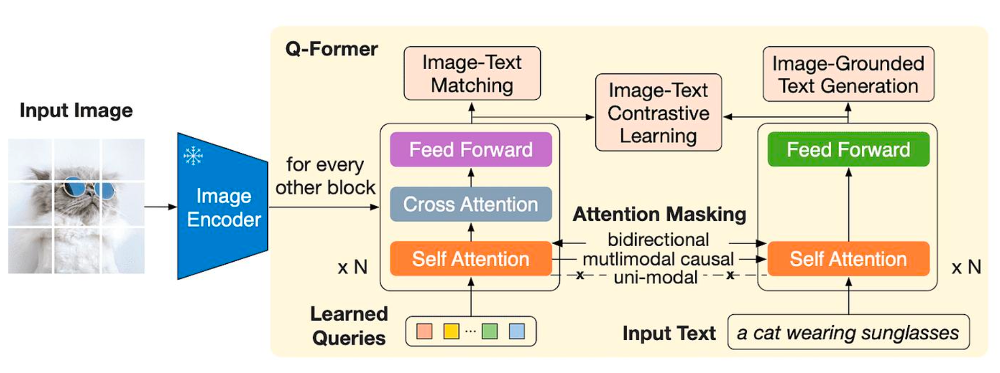


#### Cross-Attention 交互

每个查询向量通过多头注意力机制，从全部视觉特征 FFF 中进行“提问”。

这些 Query 关注的问题类似于：

- 「图中最关键的语义是什么？」
- 「有哪些与物体相关的特征？」
- 「有哪些与动作相关的特征？」
- 「有哪些与场景相关的特征？」

经过多层交互之后：

- 每个查询向量 q_i 会逐渐聚合出一类稳定的视觉语义信息。


### 训练流程

| 阶段           | 数据来源                  | 目标             | 损失函数                         |
| -------------- | ------------------------- | ---------------- | -------------------------------- |
| ① 图文预训练   | Web 图文对（COCO, LAION） | 学习图文语义对齐 | 对比损失（ITC）+ Captioning Loss |
| ② 生成任务训练 | VQA / Caption / VCR 数据  | 学习问答与推理   | Cross-Entropy 语言生成损失       |
| ③ 视觉指令微调 | 合成多模态指令集          | 对齐人类指令风格 | Instruction-tuned CE Loss        |


## **指令对齐阶段LLaVA / LLaVA-1.5**

**核心目标**：让视觉-语言模型像 ChatGPT 一样遵循人类指令。


- BLIP-2 已经让模型“看得懂并能描述”，但它还不会像 ChatGPT 那样，**理解用户的意图并多轮回应**。
-  LLaVA（Large Language-and-Vision Assistant）的目标是让多模态模型真正具备“指令遵循”与“对话式理解”能力。


它的核心思想是：把语言智能体（如 ChatGPT）的方法论移植到视觉领域，通过 **Instruction Tuning（指令微调）**，让视觉输入也能被语言模型理解并响应。


**架构设计：冻结视觉 + 对齐语言**

**总体结构**：[Image Encoder] → [Projection Layer] → [LLM Decoder]


**(a) 视觉编码器**

采用预训练的 **CLIP ViT-L/14** 作为视觉 backbone；将图像分割为 patch embedding，并输出高维视觉特征；编码器参数冻结，确保稳定的视觉语义空间。


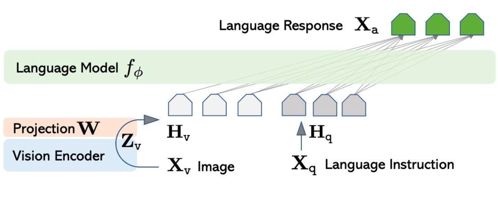


 **(b) 投影层（Projection Layer）**

- 一个轻量的 MLP，将视觉特征映射到语言模型的 token 空间；
-  视觉 token 作为输入前缀，与文本指令拼接输入到 LLM：
-  [<Image_Tokens>, <Text_Instruction_Tokens>]


️ **(c) 语言模型**

-  采用 **Vicuna-7B/13B** 或 **LLaMA**，
-  仅通过 **LoRA 微调**（低秩适配），学习图文对齐参数；
-  语言模型不需要大规模重训即可获得视觉理解能力。


### **训练策略：视觉指令对齐 (Visual Instruction Tuning)**

LLaVA 的核心创新不在架构，而在**数据构建与对齐方法**。


 **(a) 数据来源**

-  图像来自 COCO、VG、Flickr、GQA 等开源数据集；

-  文本指令与回答由 **GPT-4** 生成：GPT-4 读取原始 caption 或标注，模拟人类提问，生成 (Q,A) 对；

-  形成三元组样本：(image, instruction, answer)

  

**(b)训练阶段**

| 阶段            | 内容                                    | 目标                       |
| --------------- | --------------------------------------- | -------------------------- |
| ① 对齐预训练    | 使用 BLIP-2 架构学习图像-语言 embedding | 视觉特征 → 语言空间        |
| ② 指令微调      | 在 GPT-4 生成的图文指令集上 LoRA 微调   | 学习多模态对话与任务遵循   |
| ③ Chat 模式训练 | 加入多轮问答上下文                      | 学习对话连续性与记忆一致性 |


**(c) 训练目标函数**

-  Cross-Entropy 语言生成损失；
-  视觉输入通过 prefix token 影响语言预测；
-  优化目标：“在给定图像与指令条件下，生成自然、合理的回答。”


**(4)表现能力**

| 能力类型       | 示例                                     |
| -------------- | ---------------------------------------- |
| 多轮视觉问答   | “这张图片里有几只猫？哪只在沙发上？”     |
| 图像解释与推理 | “为什么这辆车停在斑马线上？”             |
| 文档与图表理解 | “请总结这张表格的趋势。”                 |
| 语义对齐任务   | “指出哪些水果是红色的。”                 |
| 跨模态推理     | “如果删除图中这个物体，场景会怎样变化？” |


**（5）影响与意义**

 **范式转折**：

-  LLaVA 把 “Instruction Tuning” 从文本领域扩展到视觉领域；
-  模型能理解人类意图，而不只是回答视觉问题。

 **工程突破**：

-  冻结视觉模块 + LoRA 微调，大幅降低训练成本；
-  能快速在多种 LLM 上扩展视觉能力。


## 统一多模态阶段 （VL model）

**时代特征**：从“配合”到“融合”。模型不再区分视觉与语言通道，而是共享同一个Transformer 主干。

**关键能力**：

-  原生分辨率输入（可处理文档、图表、UI）；
-  跨时间建模（支持视频理解）；
-  多任务统一（OCR、VQA、检索、描述、推理、动作决策）。


#### **VL 模型的演化逻辑**

| 阶段          | 能力核心           | 模型代表           | 创新焦点            |
| ------------- | ------------------ | ------------------ | ------------------- |
| I. 图文对齐   | 看懂配对关系       | CLIP               | 视觉-文本表征对齐   |
| II. 生成增强  | 能看能说           | BLIP, BLIP-2       | 视觉压缩 + 语言生成 |
| III. 指令对齐 | 能理解人类意图     | LLaVA              | 多模态指令微调      |
| IV. 模态融合  | 统一视觉与语言空间 | Qwen2.5-VL, Gemini | 原生输入 + 统一推理 |


