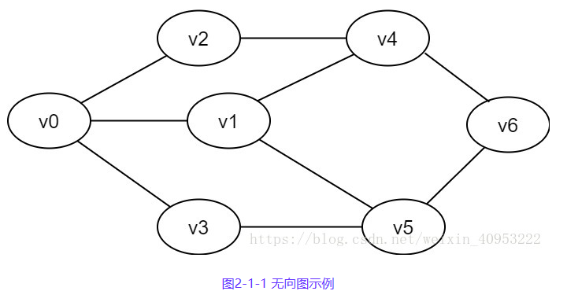

# Snowflake算法

## 简介

snowflake是Twitter开源的分布式ID生成算法，结果是一个long型的ID。其核心思想是：使用41bit作为毫秒数，10bit作为机器的ID（5个bit是数据中心，5个bit的机器ID），12bit作为毫秒内的流水号（意味着每个节点在每毫秒可以产生 4096 个 ID），最后还有一个符号位，永远是0。

## 代码

	public class IdWorker {
	
	    private long workerId;
	    private long datacenterId;
	    private long sequence;
	
	    public IdWorker(long workerId, long datacenterId, long sequence) {
	        // sanity check for workerId
	        // 这儿不就检查了一下，要求就是你传递进来的机房id和机器id不能超过32，不能小于0
	        if (workerId > maxWorkerId || workerId < 0) {
	            throw new IllegalArgumentException(
	                    String.format("worker Id can't be greater than %d or less than 0", maxWorkerId));
	        }
	        if (datacenterId > maxDatacenterId || datacenterId < 0) {
	            throw new IllegalArgumentException(
	                    String.format("datacenter Id can't be greater than %d or less than 0", maxDatacenterId));
	        }
	        System.out.printf(
	                "worker starting. timestamp left shift %d, datacenter id bits %d, worker id bits %d, sequence bits %d, workerid %d",
	                timestampLeftShift, datacenterIdBits, workerIdBits, sequenceBits, workerId);
	
	        this.workerId = workerId;
	        this.datacenterId = datacenterId;
	        this.sequence = sequence;
	    }
	
	    private long twepoch = 1288834974657L;
	
	    private long workerIdBits = 5L;
	    private long datacenterIdBits = 5L;
	
	    // 这个是二进制运算，就是 5 bit最多只能有31个数字，也就是说机器id最多只能是32以内
	    private long maxWorkerId = -1L ^ (-1L << workerIdBits);
	
	    // 这个是一个意思，就是 5 bit最多只能有31个数字，机房id最多只能是32以内
	    private long maxDatacenterId = -1L ^ (-1L << datacenterIdBits);
	    private long sequenceBits = 12L;
	
	    private long workerIdShift = sequenceBits;
	    private long datacenterIdShift = sequenceBits + workerIdBits;
	    private long timestampLeftShift = sequenceBits + workerIdBits + datacenterIdBits;
	    private long sequenceMask = -1L ^ (-1L << sequenceBits);
	
	    private long lastTimestamp = -1L;
	
	    public long getWorkerId() {
	        return workerId;
	    }
	
	    public long getDatacenterId() {
	        return datacenterId;
	    }
	
	    public long getTimestamp() {
	        return System.currentTimeMillis();
	    }
	
	    public synchronized long nextId() {
	        // 这儿就是获取当前时间戳，单位是毫秒
	        long timestamp = timeGen();
	
	        if (timestamp < lastTimestamp) {
	            System.err.printf("clock is moving backwards.  Rejecting requests until %d.", lastTimestamp);
	            throw new RuntimeException(String.format(
	                    "Clock moved backwards.  Refusing to generate id for %d milliseconds", lastTimestamp - timestamp));
	        }
	
	        if (lastTimestamp == timestamp) {
	            // 这个意思是说一个毫秒内最多只能有4096个数字
	            // 无论你传递多少进来，这个位运算保证始终就是在4096这个范围内，避免你自己传递个sequence超过了4096这个范围
	            sequence = (sequence + 1) & sequenceMask;
	            if (sequence == 0) {
	                timestamp = tilNextMillis(lastTimestamp);
	            }
	        } else {
	            sequence = 0;
	        }
	
	        // 这儿记录一下最近一次生成id的时间戳，单位是毫秒
	        lastTimestamp = timestamp;
	
	        // 这儿就是将时间戳左移，放到 41 bit那儿；
	        // 将机房 id左移放到 5 bit那儿；
	        // 将机器id左移放到5 bit那儿；将序号放最后12 bit；
	        // 最后拼接起来成一个 64 bit的二进制数字，转换成 10 进制就是个 long 型
	        return ((timestamp - twepoch) << timestampLeftShift) | (datacenterId << datacenterIdShift)
	                | (workerId << workerIdShift) | sequence;
	    }
	
	    private long tilNextMillis(long lastTimestamp) {
	        long timestamp = timeGen();
	        while (timestamp <= lastTimestamp) {
	            timestamp = timeGen();
	        }
	        return timestamp;
	    }
	
	    private long timeGen() {
	        return System.currentTimeMillis();
	    }
	
	    // ---------------测试---------------
	    public static void main(String[] args) {
	        IdWorker worker = new IdWorker(1, 1, 1);
	        for (int i = 0; i < 30; i++) {
	            System.out.println(worker.nextId());
	        }
	    }
	
	}